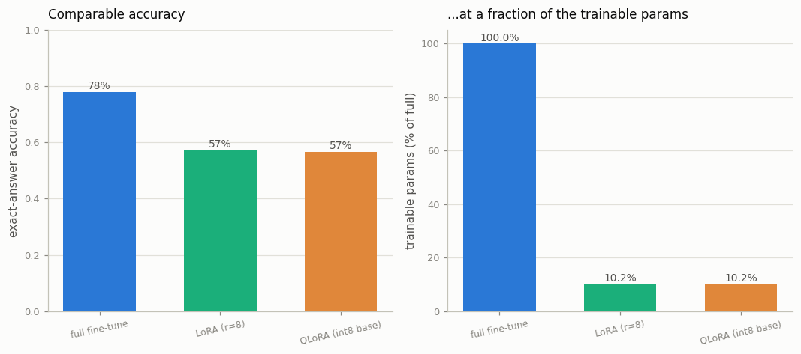

# LoRA / QLoRA

---

> Fine-tune a billion-parameter model without renting a cluster.

---

## ELI5 (Explain Like I'm 5)

- **The Big Idea:** Instead of updating all of a model's weights (expensive, huge), you
  freeze them and bolt on a tiny pair of small matrices next to each layer — the only
  thing you train. That's **LoRA**. **QLoRA** goes further and stores the frozen model in
  4-bit/int8 to save even more memory, while the little adapters stay full precision. You
  get most of the fine-tune, for a small fraction of the trained parameters.
- **Analogy:** Renovating a house by adding a few clip-on fixtures instead of rebuilding
  every wall. The structure (frozen base) is untouched; a handful of add-ons (adapters)
  change how it behaves.
- **Example:** A full fine-tune trains **789k** parameters and hits **78%**. LoRA trains
  just **80k** — **10%** of them — and reaches **57%**; QLoRA (int8 frozen base) matches
  LoRA at **57%**. Most of the gain, a tenth of the trainable parameters, and a
  cheaper-to-store base.

## Key Insight

This project repeats [SFT](/shared/glossary/#sft) with [LoRA](/shared/glossary/#lora) adapters, then with [QLoRA](/shared/glossary/#qlora) — which adds 4-bit [quantization](/shared/glossary/#quantization) — and compares quality and memory use against a full fine-tune. Instead of updating all the [weights](/shared/glossary/#weights), you train a small set of extra low-rank matrices and keep the original model frozen.

## Why This Matters

LoRA and QLoRA are what let you fine-tune a multi-billion-parameter model on a single consumer GPU. They turn customizing large models from a datacenter job into something anyone can do on one card.

## What's in this directory

| File | Role |
|------|------|
| `lora.py` | From-scratch `LoRALinear` (frozen base + rank-8 update, with an int8-base QLoRA option), compared against a full fine-tune on accuracy and trainable-parameter count |

```bash
python lora.py       # ~5 min on CPU
```

Reuses the shared task (`sft_lib`) and the GPT skeleton from
[project 08](../08-nanogpt-reproduction/README.md).

## How LoRA works (the whole trick)

```
a frozen linear layer:   y = W x                 (W is NOT trained)
LoRA adds a low-rank bump: y = W x + (B A) x · (alpha/r)
                                     └── A: r×in, B: out×r,  r = 8 ≪ in,out
```

Only `A` and `B` train; `W` stays frozen. Since `r` is tiny, `A` and `B` together are a
sliver of `W`'s size. **QLoRA** additionally stores the frozen `W` in int8 (emulated
here) — it's never updated, so quantizing it costs almost nothing in quality while
cutting the memory that dominates a large model.

## Results

**Most of the quality, a tenth of the trainable parameters.**



```
method               accuracy   trainable params   % of full
full fine-tune       0.780      788,736            100.0%
LoRA (r=8)           0.573       80,072             10.2%
QLoRA (int8 base)    0.568       80,072             10.2%
```

Two honest readings:

- **LoRA trades a little quality for a lot of cheapness.** Here full fine-tuning wins
  (0.78 vs 0.57) — at this *tiny* scale the low-rank bump genuinely has less capacity than
  updating everything. The trade is 10× fewer trained parameters (and, at real scale, far
  less optimizer memory — the [FSDP project 23](../23-fsdp-from-scratch-toy/README.md)
  showed AdamW state is ~8 bytes/param, all of which LoRA avoids for frozen weights).
- **QLoRA is nearly free on top of LoRA.** Quantizing the frozen base to int8 barely moves
  accuracy (0.573 → 0.568), because those weights aren't being trained — you only pay
  precision where it doesn't matter.

## Why the gap shrinks at scale (and why this is everywhere)

The LoRA-vs-full gap here is wide because a small model has little redundant capacity for
a rank-8 update to exploit. At billions of parameters the story flips: the base already
*has* the capability, fine-tuning only needs to *nudge* it, and that nudge is empirically
low-rank — so LoRA matches full fine-tuning on most tasks while training <1% of the
weights. Combined with QLoRA's 4-bit frozen base, that is what put fine-tuning a 65B model
on a single 24 GB consumer GPU — the result that made custom large models accessible to
everyone, not just labs.

## Things to try

- Raise the rank `r` from 8 to 32 and watch LoRA close the gap to full fine-tuning — more
  rank, more capacity, more trained params.
- Apply LoRA to *only* the attention projections (not the MLP) and see how much quality
  you keep for even fewer parameters — a common real-world choice.
- Compare the int8 QLoRA base against a 4-bit emulation and confirm quality holds — the
  frozen weights tolerate aggressive quantization because gradients never touch them.
