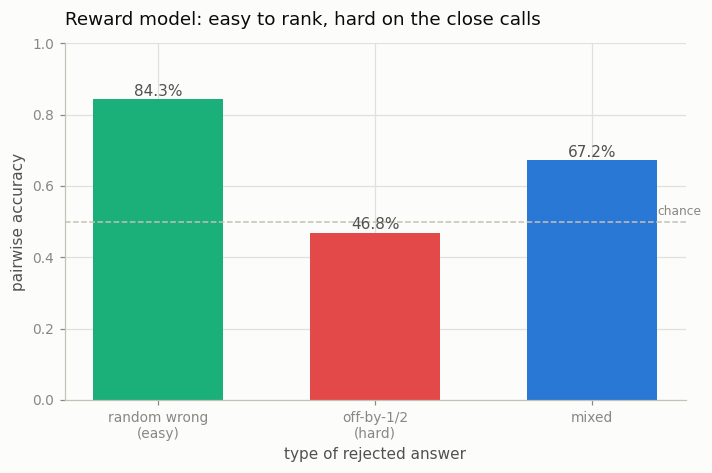

# Train a Reward Model

---

> Turn "humans liked this answer better" into a number a machine can chase.

---

## ELI5 (Explain Like I'm 5)

- **The Big Idea:** You can't hand a training loop "human taste", but you *can* show it
  pairs — "answer A is better than answer B" — and train a model to output a **score**
  that's higher for the preferred one. That score is a reusable stand-in for the judgment,
  and RLHF later optimizes against it millions of times. But the reward model is only as
  good as its hardest calls.
- **Analogy:** Teaching a robot judge by showing it thousands of "this dish beats that
  dish" comparisons until it can score a new plate. It nails the obvious wins and
  struggles on the close ones — just like human judges.
- **Example:** Our reward model easily prefers a correct sum over a *random* wrong number
  (**84%** of pairs) but is basically guessing on an *off-by-one* near-miss (**47%** ≈
  chance). That blind spot on the close calls is exactly what gets exploited in
  [PPO](../32-ppo-rlhf-loop/README.md).

## Key Insight

This project trains a [reward model](/shared/glossary/#reward-model) on human preference pairs — for a given prompt, which of two answers a person preferred — and reports how often it agrees with people. The model learns to give a higher score to the response a human would have picked.

## Why This Matters

A reward model converts messy, one-off human judgment into a reusable score that [RLHF](/shared/glossary/#rlhf) can optimize against millions of times. Its accuracy sets a ceiling on how good the aligned model can ever become.

## What's in this directory

| File | Role |
|------|------|
| `rm.py` | A `RewardModel` (GPT body + scalar head) trained with the Bradley-Terry loss on preference pairs; reports pairwise accuracy by difficulty. Imported by projects 32 and 35 |

```bash
python rm.py       # ~3 min on CPU
```

Reuses the shared task (`sft_lib`) and the GPT skeleton from
[project 08](../08-nanogpt-reproduction/README.md). A reward model is just a transformer
with a **1-number head** instead of a vocabulary head, read off the last token.

## The Bradley-Terry loss

For each prompt we form a *chosen* (correct) and *rejected* (wrong) answer and train the
scalar reward `r` so the chosen scores higher:

```
L = -log sigmoid( r(chosen) - r(rejected) )
```

That's the entire objective — no absolute labels, just "this one over that one", exactly
the pairwise form humans are good at producing.

## Results

**Easy to rank, hard on the close calls — a reward model's version of human disagreement.**



```
type of rejected answer     pairwise accuracy
random wrong (easy)         0.843
off-by-1/2 (hard)           0.468     ← ≈ chance: a genuine blind spot
mixed                       0.672
```

The reward model reliably tells a correct answer from an obviously-wrong one, but on an
off-by-one near-miss it is *no better than a coin flip*. This mirrors real reward models,
whose pairwise accuracy tops out around 65-75% precisely because the hard, close
comparisons are where even humans disagree ~25% of the time. And it is not a cosmetic
flaw: that blind spot is a **hackable gap**. [Project 32](../32-ppo-rlhf-loop/README.md)
turns a policy loose on this exact reward model and watches it farm the blind spot;
[project 35](../35-reward-hacking-forensics/README.md) traces the damage back to it.

## Why the reward model sets the ceiling

RLHF optimizes *against* the reward model, so whatever the reward model can't distinguish,
the aligned model has no pressure to get right — and whatever the reward model
*mis*-ranks, the policy will happily exploit. Its pairwise accuracy is therefore a
ceiling on alignment quality, which is why so much RLHF effort goes into better preference
data and bigger reward models, and why *verifiable* rewards ([RLVR](../34-grpo-on-a-math-task/README.md))
are so attractive when they exist: an exact checker has a pairwise accuracy of 100% and no
blind spot to hack.

## Things to try

- Train the reward model *with* near-miss pairs (`kind="close"` / `"mixed"`) and watch its
  hard-case accuracy inch up — but not to 100%, because close calls are genuinely hard at
  this scale.
- Plot the reward gap `r(chosen) − r(rejected)` as a histogram: it's wide and positive for
  random rejects, near zero for near-misses — the blind spot, visualized.
- Add label noise (flip 15% of the preferences) and watch accuracy fall toward the
  human-agreement ceiling — reward models can't be more consistent than their labels.
