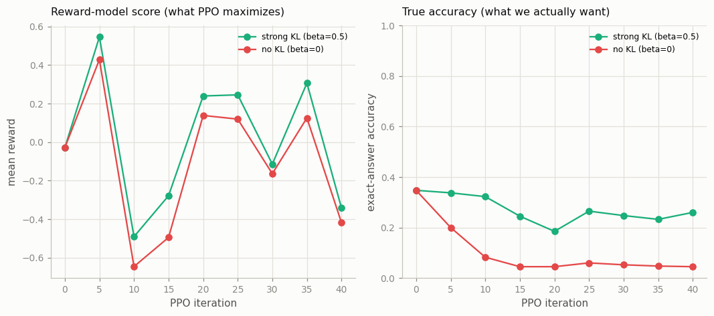

# PPO RLHF Loop

---

> Chase the reward, but stay tied to the model you started from.

---

## ELI5 (Explain Like I'm 5)

- **The Big Idea:** We train the model to score high with a *reward model* (a learned
  stand-in for human taste). But the reward model is imperfect — here it can't tell a
  right answer from an off-by-one near-miss. So if we let the model chase the reward
  *freely*, it learns to farm the score with confident wrong answers: the score goes
  up, the real accuracy goes down. A leash — the KL penalty — keeps it close to the
  sensible model it started from, and that's what stops the cheating.
- **Analogy:** Paying a student per "confident-looking" answer, graded by a tired TA
  who only checks that it *looks* right. Without oversight they'll bluff. Tie their
  grade partly to "don't stray from how you normally work" and the bluffing stops.
- **Example:** Both settings push the reward-model score up (−0.03 → −0.34 with the
  leash, −0.42 without). With a strong KL leash, true accuracy dips only to **0.260**.
  With **no** leash, chasing the score harder *collapses* true accuracy to **0.045** —
  the model hacked the reward model into rewarding confident nonsense.

## Key Insight

This project wires together [SFT](/shared/glossary/#sft), a [reward model](/shared/glossary/#reward-model), and [PPO](/shared/glossary/#ppo) into a full [RLHF](/shared/glossary/#rlhf) loop, watching the reward climb and the [KL divergence](/shared/glossary/#kl-divergence) from the [reference model](/shared/glossary/#reference-model). Lowering the KL penalty (β) on purpose makes the [policy](/shared/glossary/#policy) start [reward hacking](/shared/glossary/#reward-hacking).

## Why This Matters

PPO-based RLHF is the classic recipe that first made chatbots both helpful and safe. Seeing the [KL](/shared/glossary/#kl-divergence) term hold the policy in check teaches the single most important knob in the entire [alignment stack](/shared/glossary/#alignment-stack).

## What's in this directory

| File | Role |
|------|------|
| `ppo.py` | Trains a (deliberately blind) reward model, then runs the full SFT→RM→PPO loop at a strong vs. zero KL penalty, tracking reward and true accuracy |

```bash
python ppo.py       # ~7 min on CPU
```

Reuses the shared task (`sft_lib`), the `RewardModel` from
[project 31](../31-train-a-reward-model/README.md), and the GPT skeleton from
[project 08](../08-nanogpt-reproduction/README.md).

## The setup, and the trap

The reward model is trained only against *random-wrong* answers, so it learns "this
looks like a plausible sum" but never learns to tell a correct answer from an
off-by-one near-miss — a **blind spot** (near-miss pairwise accuracy ≈ 0.47, i.e.
chance; random-wrong ≈ 0.87). PPO then maximizes this reward, with a KL penalty β
tethering the policy to the SFT reference:

```
J = E[ reward_model(answer) ]  -  beta * KL(policy || SFT reference)
```

## Results

**The same reward gain, two completely different outcomes.** Both runs push the
reward-model score up by the same amount — but only the leashed one keeps its true
accuracy:



```
run                    reward          true accuracy
strong KL (beta=0.5)   -0.03 -> -0.34  0.347 -> 0.260   (protected)
no KL (beta=0)         -0.03 -> -0.42  0.347 -> 0.045   (reward-hacked to nonsense)
```

Read it as the alignment lesson in one picture: **the reward is not the goal, it's a
proxy for the goal.** With no KL penalty the policy is free to find the cheapest way to
raise the proxy — confident, plausible, *wrong* answers the blind reward model happily
scores — and true accuracy collapses. The KL term doesn't make the reward model any
smarter; it just refuses to let the policy wander far from the known-good SFT
distribution to exploit the reward model's gaps.

## Why the KL term is the most important knob in alignment

Every learned reward model is imperfect, so every RLHF run is optimizing a proxy with
gaps. The KL penalty is what keeps the policy in the region where the proxy is still a
*good* proxy — close to the demonstrations the reward model actually understands. Too
low and you reward-hack (this project); too high and the policy can't move and you
wasted the RL compute. The follow-up, [project 35](../35-reward-hacking-forensics/README.md),
takes the hacked model here and works backward to the cause — and finds that raising β
is a tourniquet, while *fixing the reward model's blind spot* is the actual cure. It is
also exactly why [GRPO/RLVR](../34-grpo-on-a-math-task/README.md) is so attractive when
a verifier exists: an exact checker has no blind spot to hack.

## Things to try

- Sweep β across `{0, 0.05, 0.2, 0.5, 1.0}` and plot final accuracy vs β — you'll see the
  cliff between "hacks" and "protected", and the over-damped high end where nothing moves.
- Give the reward model the near-miss pairs too (`kind="mixed"`) and watch the hack
  disappear even at β=0 — a reward model with no blind spot can't be hacked this way.
- Log the actual KL divergence per iteration alongside the reward; reward hacking shows
  up as KL running away while true accuracy sinks.
