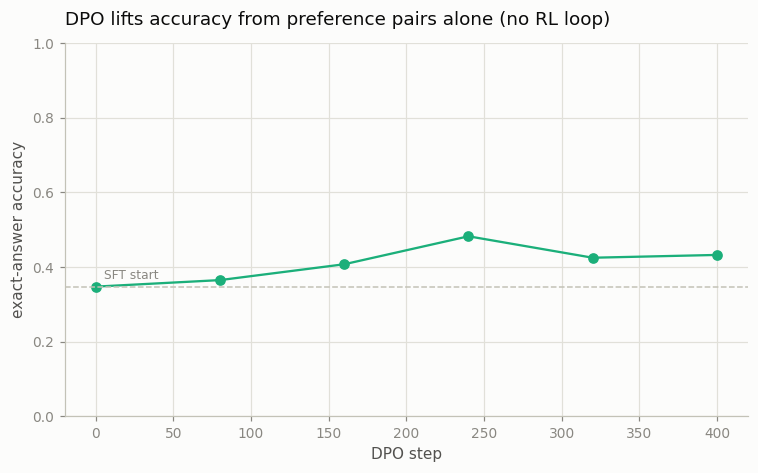

# DPO from Scratch

---

> Get the result of RLHF without running any of the reinforcement learning.

---

## ELI5 (Explain Like I'm 5)

- **The Big Idea:** RLHF needs a reward model *and* a reinforcement-learning loop. DPO
  proves you need neither: with a bit of algebra, "train the optimal RLHF policy" becomes
  a single ordinary loss on (preferred, rejected) pairs. You just directly push up the
  probability of the good answer and down the bad one — relative to the model you started
  from — and you're done.
- **Analogy:** Instead of hiring a judge (reward model) and running a tournament (PPO),
  you hand the student a stack of "this answer beats that answer" flashcards and let them
  study directly. Same lesson, none of the tournament machinery.
- **Example:** Our hand-written DPO loss matches an independent reference implementation to
  the bit (**diff 0.0e+00**). Training with it lifts the SFT model from **0.347** to
  **0.432** accuracy — no reward model, no rollouts, just a loss on answer pairs.

## Key Insight

This project implements [DPO](/shared/glossary/#dpo) by hand and checks it against the reference loss in a library like TRL. DPO skips the [reward model](/shared/glossary/#reward-model) and the [PPO](/shared/glossary/#ppo) loop entirely, collapsing preference learning into a single supervised [loss](/shared/glossary/#loss-function) on (chosen, rejected) answer pairs.

## Why This Matters

DPO made alignment dramatically simpler — no reward model, no [rollouts](/shared/glossary/#rollout), just two models and a loss. It became a default open-source recipe because it captures much of [RLHF](/shared/glossary/#rlhf)'s benefit with a fraction of the moving parts.

## What's in this directory

| File | Role |
|------|------|
| `dpo.py` | Implements the DPO loss, cross-checks it against an independent reference implementation, and trains a policy with it |

```bash
python dpo.py       # ~4 min on CPU
```

Reuses the shared task (`sft_lib`) and the GPT skeleton from
[project 08](../08-nanogpt-reproduction/README.md). TRL isn't installed here, so the
"reference" is the exact formulation TRL uses, written out by hand — a real cross-check,
not a mock.

## The loss

```
L = -log sigmoid( beta * [ (logp_pi(y_w) - logp_ref(y_w))
                          - (logp_pi(y_l) - logp_ref(y_l)) ] )
```

`y_w` is the chosen answer, `y_l` the rejected one; `pi` is the policy being trained and
`ref` the frozen SFT model. The bracket is the policy's *relative* preference for chosen
over rejected, measured against the reference — the reward model of PPO, dissolved into
the loss itself.

## Results

**Matches the reference exactly, and lifts accuracy without any RL.**



```
DPO loss vs. reference implementation   diff 0.0e+00   (identical)
SFT baseline accuracy                   0.347
DPO final accuracy                      0.432          (+0.085, no RM, no rollouts)
```

The verification is the point of "from scratch": our compact loss and a byte-for-byte
reference implementation (padded tensors, explicit `-100` label masking) return the
*same* number, so the one-liner really is the whole algorithm. Training with it then
raises exact-answer accuracy by pushing probability toward the chosen (correct) answers
and away from the rejected ones.

> **A hard-won detail.** DPO only optimizes the *margin* between chosen and rejected, so
> if the rejected answers are too *similar* to the chosen ones (here, off-by-one
> near-misses), pushing them down also drags the correct answers down and accuracy
> *falls* — the well-known DPO degeneracy. Using clearly-wrong rejected answers keeps the
> margin from cannibalizing the good behavior. Preference-data quality is as decisive for
> DPO as it is for a reward model.

## Why DPO took over open-source alignment

DPO delivers much of RLHF's benefit with a fraction of the moving parts: no reward model
to train and serve, no rollouts, no value network, no PPO clipping to tune — two models
(policy + frozen reference) and a supervised loss you can run on a couple of GPUs. That
simplicity made it the default for open post-training after 2023. The trade-offs are real
— it's offline (no fresh on-policy data like [PPO](../32-ppo-rlhf-loop/README.md) or
[GRPO](../34-grpo-on-a-math-task/README.md)), it inherits a length bias, and, as above,
it lives or dies on the quality of the preference pairs.

## Things to try

- Sweep `beta` and watch the trade-off: small `beta` moves far from the reference (more
  gain, more risk of degeneration), large `beta` barely moves.
- Swap in near-miss rejected answers and reproduce the degeneracy — accuracy falls even as
  the preference margin (pref-acc) climbs, the classic DPO failure signature.
- Track the *chosen* log-prob during training: healthy DPO keeps it flat-or-up; if it
  falls while the margin grows, you're in the degenerate regime.
