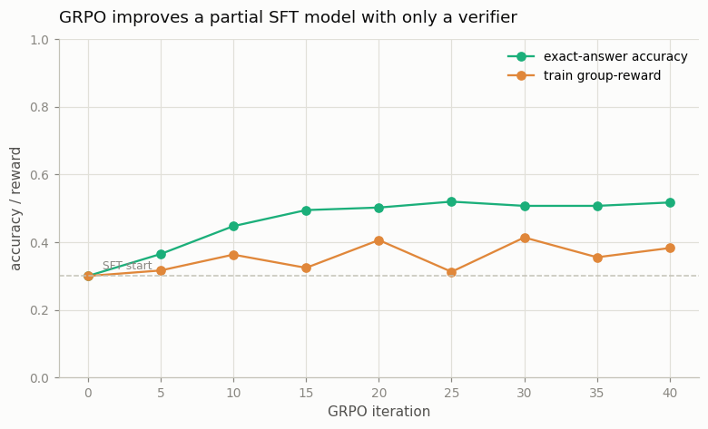

# GRPO on a Math Task

---

> Try a problem eight times, then learn from the tries that checked out.

---

## ELI5 (Explain Like I'm 5)

- **The Big Idea:** For each problem the model writes out **eight** answers. A checker
  marks each right or wrong. Instead of needing a separate "judge" model, GRPO just
  compares each answer to the *group's own average*: answers that beat the average get
  pushed up, answers below it get pushed down. Do that over and over and the model
  gets better — using nothing but a checker that says right/wrong.
- **Analogy:** A student does a problem eight ways, checks which got the right answer,
  and studies those approaches harder next time. No tutor grades style — the answer key
  is enough.
- **Example:** Our SFT model solves **30%** of held-out additions. After GRPO — same
  model, no reward model, just an "is it correct?" checker — it solves **52%**. The
  reward it's trained on and the accuracy we care about climb together, because here
  the reward *is* correctness.

## Key Insight

This project trains a model with [GRPO](/shared/glossary/#grpo) on [GSM8K](/shared/glossary/#gsm8k) grade-school math problems, using exact-answer matching as the [verifier](/shared/glossary/#verifier) — a form of [RLVR](/shared/glossary/#rlvr). For each problem the model samples a group of answers, and each answer is rewarded by how its score compares to the group's average.

## Why This Matters

GRPO drops both the [reward model](/shared/glossary/#reward-model) and the [value network](/shared/glossary/#value-network), making reasoning-focused RL cheap enough to run widely. It is the backbone of recent reasoning models like DeepSeek-R1.

## What's in this directory

| File | Role |
|------|------|
| `grpo.py` | Samples G=8 completions per prompt, rewards them by an exact-answer verifier, computes group-relative advantages, and takes clipped KL-regularized policy steps |

```bash
python grpo.py       # ~6 min on CPU
```

Reuses the shared task (`sft_lib`) and the GPT skeleton from
[project 08](../08-nanogpt-reproduction/README.md). The guide's task is GSM8K; on a
CPU we use the same verifiable-reward recipe on toy arithmetic (a sum the verifier
can check exactly) — that verifiability is the whole point of RLVR.

## The GRPO step

```
for each problem, sample G=8 answers with the policy (temperature 0.7)
reward r_i = 1 if the answer is correct else 0        (a verifier — no reward model)
advantage A_i = (r_i - mean_group(r)) / std_group(r)  (no value network — the group IS the baseline)
loss = clipped-PPO(ratio_i · A_i)  +  beta · KL(policy || SFT reference)
```

Two things are conspicuously absent versus [PPO](../32-ppo-rlhf-loop/README.md): there
is **no reward model** (a verifier replaces it) and **no value network** (the group
average replaces it). That is what makes GRPO cheap.

## Results

**A verifier alone lifts a partial SFT model by ~20 points.**



```
SFT baseline accuracy   0.300
GRPO final accuracy     0.517     (+0.22, no reward model, no value network)
```

The group-reward (fraction of sampled answers that are correct) and the greedy
accuracy climb together over the iterations. The mechanism is elicitation: the SFT
model *can* often reach the right answer — its 8 samples contain correct ones — and
GRPO simply reinforces the completions that verify, so what used to be an occasional
correct sample becomes the model's default. Crucially, the model was never shown a
worked solution during GRPO; it improved purely from its own correct rollouts being
up-weighted.

## Why this is the reasoning-model recipe

RLVR + GRPO is the engine behind the 2025 wave of open reasoning models (DeepSeek-R1
and its successors). The reasons are exactly what this toy makes concrete: (1) a
*verifier* — a math checker, unit tests, a proof checker — gives an exact, unhackable
reward, sidestepping the reward-hacking that plagues learned reward models (see
[project 32](../32-ppo-rlhf-loop/README.md)); (2) dropping the value network halves
the memory and the moving parts versus PPO; (3) it needs no human preference labels
at all. The catch is that it only applies where answers can be *checked* — which is
why math and code led the reasoning wave, and open-ended tasks are harder.

## Things to try

- Raise G from 8 to 16 and watch the advantage estimate get less noisy (more of each
  group is informative) — at the cost of more generation per step.
- Drop the KL penalty (`BETA=0`) and watch the policy destabilize — the reference
  tether matters even with a perfect verifier.
- Log the *distribution* of group rewards over training: it shifts from mostly-0
  groups (nothing to learn from) toward mixed groups (rich signal) and then toward
  mostly-1 (solved) — the shape of learning.
