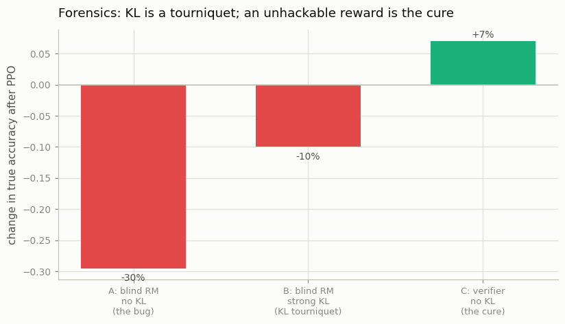

# Reward-Hacking Forensics

---

> When the score goes up but the answers get worse, find out which part broke.

---

## ELI5 (Explain Like I'm 5)

- **The Big Idea:** A model is reward-hacking — its reward-model score climbs while its
  real accuracy falls. Instead of guessing, we run *controlled experiments*, changing one
  suspect at a time (the reward model, the KL leash, the reward *type*) and watching which
  change actually stops the bleeding. That's forensics: work backward from the symptom to
  the cause.
- **Analogy:** A car pulls to the left. You don't replace everything — you swap one part
  at a time (tires, then alignment, then brakes) until the pull stops. The part that fixes
  it was the cause.
- **Example:** The hack drops true accuracy by **−30 points** (blind reward model, no
  leash). Tightening the KL leash cuts the damage to **−10** — better, but still bleeding.
  Replacing the hackable reward model with an exact **verifier** actually *raises* accuracy
  **+7**. Verdict: KL is a tourniquet; an unhackable reward is the cure.

## Key Insight

This project deliberately trains a [reward-hacked](/shared/glossary/#reward-hacking) model, then traces the failure back to its real source — the [reward model](/shared/glossary/#reward-model), the [KL](/shared/glossary/#kl-divergence) penalty (β), or the [rollout distribution](/shared/glossary/#rollout-distribution). [Forensics](/shared/glossary/#forensics) here means working backward from the broken behavior to the cause instead of guessing.

## Why This Matters

Reward hacking is the most common way [RLHF](/shared/glossary/#rlhf) goes wrong, and the symptom rarely points straight at the cause. Learning to diagnose it systematically is what separates a frustrating week from a quick fix.

## What's in this directory

| File | Role |
|------|------|
| `forensics.py` | Reproduces the hack, then runs one-variable-at-a-time interventions (KL up; reward model → verifier) and measures which restores true accuracy |

```bash
python forensics.py       # ~8 min on CPU
```

Reuses the reward model ([project 31](../31-train-a-reward-model/README.md)), the PPO loop
([project 32](../32-ppo-rlhf-loop/README.md)), and the shared task. It builds directly on
project 32's finding that a blind reward model + low KL reward-hacks.

## The investigation

The symptom: PPO against a reward model that can't tell a correct answer from an
off-by-one near-miss (near-miss pairwise accuracy ≈ 0.47, i.e. chance). We change one
suspect at a time and measure the change in *true* accuracy after PPO:

```
condition                         true accuracy change
A  blind reward model, no KL       -0.295   ← the bug reproduced
B  blind reward model, strong KL   -0.100   ← suspect: the KL penalty
C  an exact verifier, no KL        +0.070   ← suspect: the reward itself
```



- **A — reproduce it.** No KL leash + a reward model with a blind spot = a 30-point
  accuracy collapse. The score went up; the answers got worse.
- **B — the KL penalty is a *tourniquet*, not a cure.** Cranking β up cuts the damage from
  −30 to −10 — real, but the policy is still bleeding accuracy, because the reward it's
  chasing is still wrong. Tightening the leash only limits how far it can chase a bad
  signal.
- **C — the reward model *is* the root cause.** Swap the hackable reward model for an exact
  verifier (which has no blind spot to exploit) and, even with **no** KL penalty, accuracy
  *rises* (+7). The behavior wasn't fundamentally broken; the *thing we were optimizing*
  was.

## The verdict, and why it generalizes

Reward hacking is almost never a bug in the RL code — it's the optimizer doing its job
against a flawed objective. The forensic ordering matters: the KL penalty (β) is the fast
mitigation you reach for first (project 32), but it treats the symptom; the durable fix is
a **better reward** — cleaner preference data, a stronger reward model, or, where the task
allows it, an unhackable *verifier* ([RLVR/GRPO](../34-grpo-on-a-math-task/README.md)). The
third suspect, the rollout distribution, matters too (if the policy never explores the
behavior you want to reward, no reward can teach it) — but here the decisive lever is the
reward. The habit this builds — change one variable, measure, attribute — is what turns a
week of flailing into an afternoon.

## Things to try

- Add a fourth condition: verifier reward *with* a strong KL — confirm it also works, and
  that KL no longer hurts once the reward is trustworthy.
- Log the reward-model score alongside true accuracy in condition A: the tell-tale
  signature of hacking is the two curves *diverging* (score up, accuracy down).
- Intervene on the rollout instead — raise the sampling temperature — and see whether more
  exploration changes the hack, isolating the third suspect.
