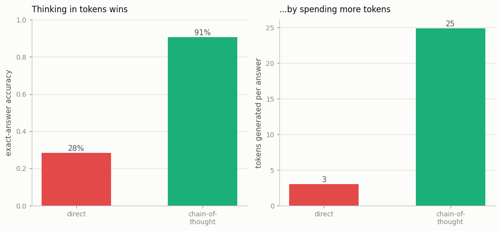

# CoT vs. Direct on GSM8K

---

> Ask the model to show its work, and it gets the answer right far more often.

---

## ELI5 (Explain Like I'm 5)

- **The Big Idea:** Ask a model to add four numbers and blurt out the answer, and it
  mostly flubs it — that's a lot to do in one mental step. Ask it to *write out the
  running total* first (7+18=25, 25+17=42, …) and it nails it, because each little step
  is an easy two-number add. Same model; the only change is that it's allowed to think in
  writing before answering.
- **Analogy:** Multiplying 47×83 in your head vs. on paper. On paper you don't get
  smarter — you just have somewhere to put the intermediate numbers so you stop dropping
  them.
- **Example:** Answering directly, our model gets **28%** of four-number sums right (3
  tokens per answer). Writing the chain of partial sums first, it gets **91%** (25 tokens
  per answer). The extra tokens *are* the extra thinking.

## Key Insight

[Chain-of-thought (CoT)](/shared/glossary/#cot) prompting asks the model to write out its reasoning step by step before giving a final answer, instead of replying right away. This project measures the accuracy gain from that single change on [GSM8K](/shared/glossary/#gsm8k) grade-school math problems.

## Why This Matters

The intermediate reasoning tokens give the model more room to compute and a place to lay out partial results. The same model — with no retraining at all — solves much harder problems just by being told to think out loud first.

## What's in this directory

| File | Role |
|------|------|
| `reason_lib.py` | **The shared Phase-6 stack**: the multi-step addition task, CoT/direct formats, SFT, batched sampling, a step verifier, and a reward-model class — imported by projects 37-41 |
| `cot_vs_direct.py` | Trains a direct-answer model and a chain-of-thought model and compares accuracy and token cost |

```bash
python cot_vs_direct.py       # ~5 min on CPU
```

Reuses the GPT skeleton from [project 08](../08-nanogpt-reproduction/README.md). GSM8K
needs a real LLM; on a CPU we use a task with the same shape — a sum the model must
either compute in one shot or decompose. Because the answer (and every intermediate
step) can be **checked exactly**, this one task carries the whole phase: self-consistency
([37](../37-self-consistency-sweep/README.md)), best-of-N ([38](../38-best-of-n-with-a-reward-model/README.md)),
process rewards ([39](../39-process-reward-model/README.md)), tree search
([40](../40-tree-of-thoughts-on-a-logic-puzzle/README.md)), and the R1 recipe
([41](../41-mini-r1-recipe/README.md)).

## Results

**A 3× accuracy jump from the same model, just by letting it think in tokens.**



```
method              accuracy   tokens/answer
direct              0.283      3.0
chain-of-thought    0.907      25.0
```

The samples show exactly what "room to compute" means:

```
7+18+17+4=46    direct-> 45   cot-> 7+18=25,25+17=42,42+4=46  [OK]
11+19+15+20=65  direct-> 64   cot-> 11+19=30,30+15=45,45+20=65 [OK]
18+2+19+0=39    direct-> 41   cot-> 18+2=20,20+19=39,39+0=39   [OK]
```

The direct model is *close* — off by one or two — because it's trying to hold a running
sum in its activations with no place to write it down. The CoT model never has to: each
line is a two-number addition it can do reliably, and the final line carries the answer.
The accuracy didn't come from new knowledge; it came from **serial computation spread
across tokens**.

## Why intermediate tokens are computation

A transformer does a fixed amount of computation per token. Forcing the answer out in one
token caps how much serial work it can do — for a 4-way sum, not enough. Each
chain-of-thought token is another slab of compute *and* a slot of memory the model can
write a partial result into and read back later. That is the whole reason "let's think
step by step" works with no retraining, and it is the seed of everything else in this
phase: once thinking-in-tokens helps, you can spend *more* of it (sample many chains,
search over them, or train the model to use it well) to get better answers. The rest of
Phase 6 is ways to spend that inference-time compute.

## Things to try

- Increase the number of operands (`reason_lib.K`) and watch the direct model collapse
  while CoT degrades gracefully — longer problems need more thinking, not more cleverness.
- Sample the CoT model at temperature 1.0 and read a few failures: they're usually a
  single wrong step that then propagates — which is exactly what a
  [process reward model](../39-process-reward-model/README.md) is built to catch.
- Count tokens vs. accuracy across problem sizes — the "more compute → better" trend is
  the inference-time scaling law in miniature.
