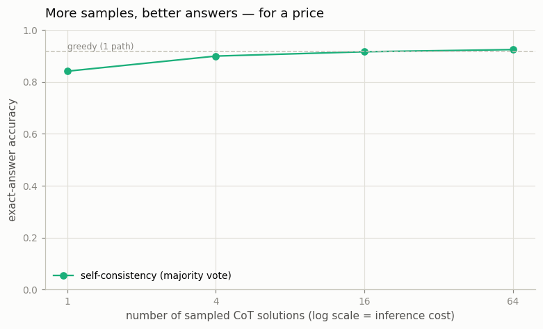

# Self-Consistency Sweep

---

> Solve the problem many times, then trust the answer that keeps coming up.

---

## ELI5 (Explain Like I'm 5)

- **The Big Idea:** A single sampled chain-of-thought can slip on one step and get the
  wrong answer. So solve the problem *many* times with a little randomness, and take a
  vote on the final answer. Random slip-ups scatter in different directions and cancel;
  the right answer is the one that keeps showing up. More samples, better vote — you're
  spending extra inference compute to buy accuracy, no retraining.
- **Analogy:** Ask one person to estimate the jar of jellybeans and they might be way
  off; average a crowd and you land near the truth. The wrong guesses are all different;
  the right one recurs.
- **Example:** One sampled solution is right **84%** of the time. Vote over 64 of them
  and accuracy climbs to **92.5%** — above even the greedy single answer (91.7%). The
  gain is free of any training; it's pure inference-time compute.

## Key Insight

[Self-consistency](/shared/glossary/#self-consistency) samples many independent [chain-of-thought](/shared/glossary/#cot) solutions to the same problem and takes a majority vote on the final answer. This project [sweeps](/shared/glossary/#sweep) the number of samples (1, 4, 16, 64) and plots accuracy against the compute cost.

## Why This Matters

A single reasoning path can go wrong by chance. Pooling many of them cancels out random mistakes and reliably raises accuracy — letting you trade more inference compute for better answers, no retraining required.

## What's in this directory

| File | Role |
|------|------|
| `self_consistency.py` | Samples 64 CoT solutions per problem once, then majority-votes over the first n ∈ `{1,4,16,64}` and plots accuracy vs. samples |

```bash
python self_consistency.py       # ~5 min on CPU
```

Reuses the shared task and CoT model (`reason_lib`) from
[project 36](../36-cot-vs-direct-on-gsm8k/README.md). We sample at temperature 1.0 so the
solutions genuinely differ — the diversity is what majority voting exploits.

## Results

**Accuracy rises monotonically with the number of sampled solutions.**



```
n samples   majority-vote accuracy
1           0.842     (one noisy sample)
4           0.900
16          0.917     (matches greedy)
64          0.925     (beats greedy's 0.917)
```

A *single* temperature-1.0 sample (0.842) is worse than greedy decoding (0.917) — turning
up the randomness costs you on any one try. But that same randomness is what makes the
votes independent, and pooling 64 of them recovers the loss and then surpasses greedy.
The curve is the inference-time scaling law for a *fixed* model: no new parameters, just
more samples, monotonically better answers — for a linearly growing compute bill.

## Why voting beats a single try

Each sampled chain makes independent, roughly-random mistakes. If the model is right more
often than any *particular* wrong answer is produced, the correct answer is the mode — so
majority voting concentrates probability on it as `n` grows, exactly like averaging noisy
measurements. The catch is the shape of the curve: it has **diminishing returns** (0.842
→ 0.900 for the first 4 samples, but only 0.917 → 0.925 for the last 48), so you pay
geometrically more compute for linearly less gain. That trade-off is why the next
projects get smarter about *which* samples to trust — a [reward model](../38-best-of-n-with-a-reward-model/README.md)
that scores candidates, or a [process reward model](../39-process-reward-model/README.md)
that scores each step — instead of just counting votes.

## Things to try

- Push to n=256 and watch the curve flatten — self-consistency has a ceiling set by how
  often the model's *most common* answer is correct.
- Lower the sampling temperature toward 0 and watch the samples collapse to identical
  copies: no diversity, no benefit from voting.
- Weight the vote by each solution's length or log-probability and see whether a smarter
  aggregate beats a plain count.
