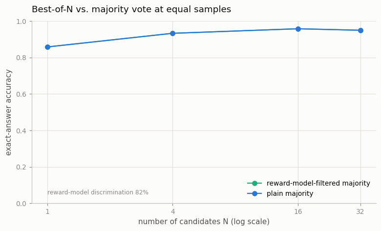

# Best-of-N with a Reward Model

---

> Generate many answers, then keep the one a judge likes best.

---

## ELI5 (Explain Like I'm 5)

- **The Big Idea:** Instead of trusting the *most common* answer (majority voting), train a
  judge — a reward model — to tell good answers from bad, and use it to throw out the bad
  ones before voting. The catch this project makes honest: on a task where the answer is
  easy to *check* and mistakes are all different, plain voting is already very hard to beat.
- **Analogy:** A spelling bee where you poll the audience. If you also have a decent judge
  who quietly removes the obviously-wrong shouts before you count, the winner usually
  doesn't change — the crowd already had it right. The judge earns its keep when the crowd
  is split or fooled, not when it already agrees.
- **Example:** Our reward model tells correct solutions from wrong ones **81.5%** of the
  time — a genuinely useful judge. Yet using it to filter-then-vote gives **exactly** the
  same accuracy as plain majority (0.86 → 0.96 as N grows), because on arithmetic the wrong
  answers scatter and the vote already lands on the correct one.

## Key Insight

[Best-of-N](/shared/glossary/#best-of-n) sampling draws `N` candidate answers and uses a [reward model](/shared/glossary/#reward-model) to score them, keeping the highest-scoring one. This project compares that approach against [self-consistency](/shared/glossary/#self-consistency) majority voting on a math benchmark.

## Why This Matters

When a learned scorer recognizes a good answer better than a plain vote does, Best-of-N picks winners that majority voting would miss. It is a simple, effective way to spend extra inference compute on quality.

## What's in this directory

| File | Role |
|------|------|
| `best_of_n.py` | Trains an outcome reward model (a correct/incorrect classifier on verifier-labeled samples), reports its discrimination, and compares reward-model-filtered voting against plain majority |

```bash
python best_of_n.py       # ~7 min on CPU
```

Reuses the shared task and RewardModel (`reason_lib`) from
[project 36](../36-cot-vs-direct-on-gsm8k/README.md). We sample at temperature 1.2 so the
model produces a realistic mix of right and wrong solutions (78% correct) to train and test
the judge on.

## A note on *how* to use the scorer

The naive Best-of-N — take the single highest-scored candidate — is a trap: with more
candidates it increasingly finds the *reward model's* mistakes and picks confidently-wrong
answers, so accuracy **falls** as N grows (the inference-time face of reward hacking). The
robust move is to let the reward model **filter** out the candidates it judges wrong, then
*vote* among the survivors — you use the scorer to prune, not to over-optimize.

## Results

**A decent judge — that plain voting already keeps up with.**



```
reward-model discrimination accuracy   0.815

N    RM-filtered majority   plain majority
1    0.858                  0.858
4    0.933                  0.933
16   0.958                  0.958
32   0.950                  0.950
```

The reward model is real and useful — it separates correct from incorrect solutions 81.5%
of the time. But filter-then-vote lands *exactly* on plain majority, and the reason is the
honest lesson of this project: **on a cheaply-verifiable task whose wrong answers are
diverse, majority voting is already near-optimal.** Each wrong chain of thought errs onto a
*different* number, so no wrong answer accumulates enough votes to beat the correct one —
and filtering away votes that were already losing changes nothing.

## When Best-of-N actually beats the vote

The stub's promise — "Best-of-N picks winners majority voting would miss" — is true, just
not on *this* task. Best-of-N wins when a plain vote *fails*, which happens in two regimes
this toy deliberately lacks: (1) **open-ended tasks** (summaries, code, essays) where there
is no single answer to count votes over, so a learned scorer is the *only* way to compare
candidates; and (2) tasks where **errors cluster** on a common wrong answer (a shared
misconception), so the majority can be confidently wrong and only a judge can rescue it.
The meta-lesson that ties Phase 6 together: when you *can* check the answer, an exact
[verifier](../34-grpo-on-a-math-task/README.md) beats every learned scorer — which is why
verifiable rewards are so prized; learned reward models are for when you can't.

## Things to try

- Bias the sampler so wrong answers concentrate on one value, then watch RM-filtered voting
  pull ahead of plain majority — the regime where the judge earns its keep.
- Use the reward model on an *un*-checkable variant (score by "looks like a clean
  derivation") and see Best-of-N do something majority voting simply cannot.
- Compare against the per-step [process reward model](../39-process-reward-model/README.md):
  a denser signal, but the same "majority is strong on verifiable tasks" ceiling.
