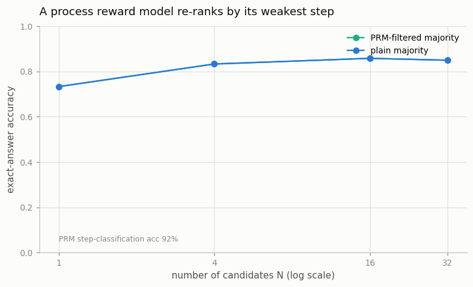

# Process Reward Model

---

> Grade every step of the reasoning, not just the final answer.

---

## ELI5 (Explain Like I'm 5)

- **The Big Idea:** An *outcome* judge only says "final answer right or wrong". A
  *process* judge grades **each step** of the work, so it can point at the exact line
  where the reasoning broke. We train one by showing it lots of steps labeled correct or
  wrong (easy here: a step "A+B=C" is correct iff C really equals A+B), and it learns to
  spot a bad step on its own.
- **Analogy:** A math teacher who doesn't just mark the final answer wrong, but circles
  the exact line where you dropped a carry. That pinpoint feedback is far more useful than
  a single ✗ at the bottom.
- **Example:** Our PRM grades individual steps with **91.5%** accuracy — it reliably knows
  when a partial sum is wrong. That step-level signal is the sharp tool the next project
  ([tree search](../40-tree-of-thoughts-on-a-logic-puzzle/README.md)) uses to steer
  reasoning.

## Key Insight

A [process reward model (PRM)](/shared/glossary/#process-reward-model) scores each individual step in a model's reasoning, unlike an [outcome reward model](/shared/glossary/#outcome-reward-model) that judges only the final answer. This project trains a small PRM on the [PRM800K](/shared/glossary/#prm800k) dataset and uses it to re-rank generated solutions.

## Why This Matters

Pinpointing the exact step where reasoning goes wrong gives a far sharper signal than a single right-or-wrong label on the final answer — which is why PRMs are strong scorers for [Best-of-N](/shared/glossary/#best-of-n) and tree search.

## What's in this directory

| File | Role |
|------|------|
| `prm.py` | Trains a PRM by supervising the reward at every step boundary with that step's correctness, reports per-step accuracy, and uses it to filter-and-vote. Its scoring is imported by the [tree search](../40-tree-of-thoughts-on-a-logic-puzzle/README.md) |

```bash
python prm.py       # ~6 min on CPU
```

Reuses the shared task and RewardModel (`reason_lib`) from
[project 36](../36-cot-vs-direct-on-gsm8k/README.md). PRM800K labels each step of human
solutions; here the *verifier* labels each step for free (correct iff `C == A+B`), so we
can train a real PRM without any human annotation.

## Results

**The PRM learns to grade steps sharply.** Supervising the reward at each step boundary
with that step's correctness, it reaches **91.5%** per-step classification accuracy — it
genuinely knows a wrong partial sum when it sees one.



```
PRM per-step classification accuracy   0.915

N    PRM-filtered majority   plain majority
1    0.733                   0.733
4    0.833                   0.833
16   0.858                   0.858
32   0.850                   0.850
```

**But for *selecting* a final answer, it exactly matches plain majority — an honest and
instructive result.** Two things conspire: (1) the base model is strong, so most sampled
chains are already correct; and (2) on arithmetic, the *wrong* answers are diverse (each
mistake lands on a different number), so majority voting already puts the correct answer on
top. Filtering out the chains the PRM flags as broken removes losing votes that weren't
going to win anyway — so the vote doesn't change. (Naive best-of-N that takes the single
*highest*-scored chain does *worse* than this, because with enough candidates it finds the
PRM's own blind spots — the inference-time echo of reward hacking.)

## Where a process reward model actually pays off

The step-level signal is the point, and it shows its value not in re-ranking finished
answers but in **guiding generation while it happens**: a PRM can catch a wrong step *at
the moment it's produced* and steer the search away from it, which is exactly what
[Tree-of-Thoughts](../40-tree-of-thoughts-on-a-logic-puzzle/README.md) does with this very
PRM. It also gives a denser training signal than an outcome label — one bit per step
instead of one bit per solution — which is why PRMs were a key ingredient in early strong
math models. The honest caveat this project teaches: on a task where the answer is cheaply
*verifiable* and mistakes are diverse, a plain vote is a formidable baseline, and a learned
scorer earns its keep through *process* (steering, dense feedback), not through out-voting
the crowd on the final answer.

## Things to try

- Evaluate on harder problems than the model trained on (bigger numbers): errors rise, the
  correct answer stops being the automatic majority, and the PRM filter starts to matter.
- Make wrong answers *collude* (bias the sampler toward a common off-by-one): now majority
  can vote for the wrong answer, and PRM filtering rescues it — the regime where scorers win.
- Compare the PRM's step-accuracy to an outcome model's solution-accuracy
  ([project 38](../38-best-of-n-with-a-reward-model/README.md)): one bit per step is a lot
  more signal than one bit per solution.
