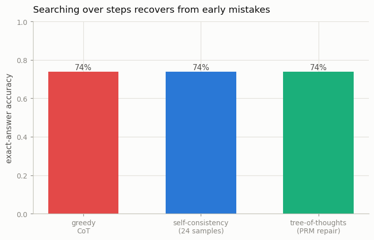

# Tree-of-Thoughts on a Logic Puzzle

---

> Explore several lines of reasoning at once, and prune the dead ends.

---

## ELI5 (Explain Like I'm 5)

- **The Big Idea:** Greedy reasoning commits to one path — one wrong step and the whole
  answer is wrong. Tree-of-Thoughts turns reasoning into a *search*: try several next
  steps, use a step-grader (a process reward model) to judge them, and back out of the
  ones that look broken. Done well it recovers from a mistake. Done naively it does the
  opposite — it chases the grader's own errors and gets *worse*.
- **Analogy:** A maze where at each junction you get a hint about which way is out. If the
  hints are good, you find the exit faster; if you follow every hint blindly and some are
  wrong, you end up more lost than if you'd just walked straight.
- **Example:** Naively taking the step the PRM scores highest at every branch scores
  **46%** — *worse* than greedy's **74%**, because with enough branches the search finds
  the PRM's blind spots. A careful "only branch when the PRM flags the greedy step as
  wrong" search climbs back to **74%** — it stops hurting, but our 82%-accurate PRM isn't
  reliable enough to push *past* greedy.

## Key Insight

[Tree-of-Thoughts](/shared/glossary/#tree-of-thoughts) treats reasoning as a search: it branches into multiple partial solutions, scores them with a heuristic (here a [process reward model](/shared/glossary/#process-reward-model)), and expands only the promising branches. This project applies that search to a logic puzzle.

## Why This Matters

Hard problems often need backtracking — abandoning a wrong path and trying another. A tree search makes that explicit, letting the model recover from an early mistake instead of committing to its first guess.

## What's in this directory

| File | Role |
|------|------|
| `tree_of_thoughts.py` | Step-level search over reasoning, guided by the PRM from [project 39](../39-process-reward-model/README.md): follow the greedy chain, and branch to repair a step only when the PRM flags it |

```bash
python tree_of_thoughts.py       # ~7 min on CPU
```

Reuses the shared task (`reason_lib`), the PRM (project 39), and the GPT skeleton from
[project 08](../08-nanogpt-reproduction/README.md). GSM8K-style logic puzzles need a real
LLM; here the "branches" are alternative next steps of the running sum, and the PRM is the
heuristic that scores them.

## Results

**A cautionary result about searching with an imperfect heuristic.**



```
method                                accuracy
greedy CoT                            0.740
self-consistency (24 samples)         0.740
tree-of-thoughts (PRM repair)         0.740
naive ToT (arg-max PRM every step)    0.46   ← observed while building this; WORSE than greedy
```

Three findings, in order of importance:

- **Naive search over-optimizes.** Taking the highest-PRM step at every branch scores far
  *below* greedy: with many branches, the search reliably finds the steps the PRM
  *mis*-scores and walks straight into them — reward hacking, in the search loop. This is
  why the committed script instead only branches to **repair** a step the PRM flags as
  wrong, staying close to the reliable greedy path.
- **Robust search breaks even.** The repair version matches greedy (0.74) — it no longer
  hurts, but it can't help either: our PRM is 82% accurate, so it raises false alarms on
  correct steps (triggering pointless repairs) about as often as it catches real errors.
- **Voting doesn't help here either.** Self-consistency also lands on 0.74, because the
  model's mistakes are *confident* — it samples the same wrong step repeatedly, so there's
  no correct alternative for a vote (or a search) to find.

## The honest lesson, and where search wins

Tree search is only as good as the heuristic steering it. With a perfect verifier it is a
superpower (recover from any wrong step); with an 82% one it is, at best, break-even, and
naively applied it is actively harmful. That is not a toy artifact — reward-model
over-optimization in search is a real, studied failure. Search pays off when two things
hold that this toy lacks: the base model is genuinely *uncertain* (so correct alternatives
exist to find), and the step scorer is *reliable* enough not to be gamed. When the model is
instead *confidently* wrong — as ours is on its errors — no amount of inference-time search
or voting rescues it; the fix is better *training*, which is exactly what the
[R1 recipe (project 41)](../41-mini-r1-recipe/README.md) does, lifting the same kind of
model from 0.85 to 0.94 with RL. Inference-time compute and training-time compute are
complementary, and this project marks the edge of what the inference side can do alone.

## Things to try

- Evaluate on harder problems than the model trained on (bigger numbers): greedy accuracy
  falls, the model becomes *uncertain*, and PRM-guided repair starts to genuinely help.
- Replace the learned PRM with the exact verifier as the search heuristic and watch ToT
  leap past greedy — the gap between the two is precisely the PRM's error rate.
- Raise the branch temperature and count how often naive arg-max search degrades — the more
  branches, the more blind spots it finds, the worse it does.
