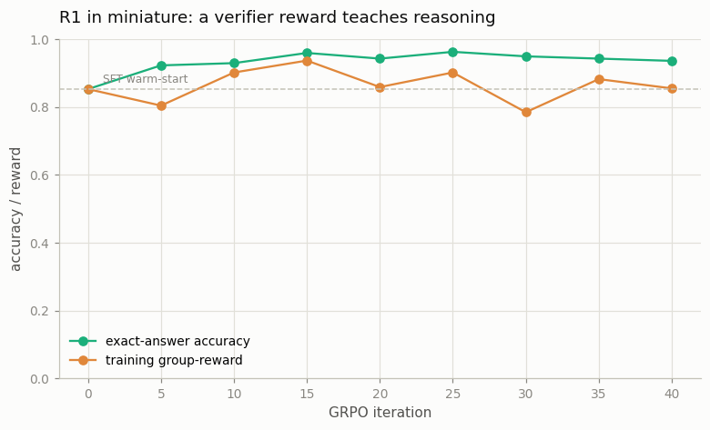

# Mini R1 Recipe

---

> Reward only correct answers, and watch the model teach itself to reason.

---

## ELI5 (Explain Like I'm 5)

- **The Big Idea:** Take a model that can *sort of* reason (a light chain-of-thought
  warm-start), then give it problems and one bit of feedback: was the final answer right?
  Reinforce the tries that were correct, over and over. With no answer keys to copy and no
  human ratings — just a "correct?" checker — the model gets better at reasoning on its
  own. That's the DeepSeek-R1 recipe, shrunk to a laptop.
- **Analogy:** A student who does practice problems, checks each against the answer key,
  and leans harder on whatever approach kept working. Nobody showed them worked solutions;
  the answer key was enough.
- **Example:** Our warm-started model solves **85%** of four-number sums. After GRPO with
  only a correctness reward — no reward model, no worked examples — it reaches **94%**,
  reinforcing purely its own correct chains of thought.

## Key Insight

This project reproduces a small version of the DeepSeek-R1 recipe: lightly fine-tune ([SFT](/shared/glossary/#sft)) a [base model](/shared/glossary/#base-model) on a few reasoning traces, then run [GRPO](/shared/glossary/#grpo) with a simple "is the answer correct?" [verifier](/shared/glossary/#verifier) — a form of [RLVR](/shared/glossary/#rlvr) — on math problems.

## Why This Matters

With nothing but a correctness signal, the model spontaneously grows long [chain-of-thought](/shared/glossary/#cot) habits like backtracking and self-checking. This emergence is the core discovery behind modern reasoning models.

## What's in this directory

| File | Role |
|------|------|
| `mini_r1.py` | The two-stage recipe: a light CoT SFT warm-start, then GRPO with an exact-answer verifier reward |

```bash
python mini_r1.py       # ~7 min on CPU
```

Reuses the shared task (`reason_lib`) and the GPT skeleton from
[project 08](../08-nanogpt-reproduction/README.md). The GRPO step is the same clipped,
KL-regularized, group-relative update built in
[Phase 5's project 34](../34-grpo-on-a-math-task/README.md) — here applied to *multi-step*
reasoning instead of a single answer.

## The recipe

```
1. SFT warm-start   — a few hundred steps on chain-of-thought traces
                      (enough to reason a bit, not perfectly)
2. GRPO / RLVR      — sample G=8 chains per problem, reward = 1 if the final
                      answer checks out, advantage = beat the group average,
                      clipped policy update with KL to the warm-start
```

No reward model, no human preferences, no worked-solution supervision during stage 2 —
the only signal is the verifier.

## Results

**A correctness signal alone lifts reasoning accuracy by ~8 points.**



```
stage                accuracy
SFT warm-start       0.853
after GRPO (RLVR)    0.937
```

The mechanism is the same elicitation seen in
[project 34](../34-grpo-on-a-math-task/README.md), now over *reasoning chains*: the
warm-started model already produces correct chains sometimes, and GRPO up-weights exactly
those, so a chain that used to appear occasionally becomes the model's default. The group
reward (fraction of sampled chains that verify) and the accuracy climb together, and the
model was never shown a single worked solution during the RL phase.

## Why this is the reasoning-model recipe

DeepSeek-R1's headline was that this loop — a light SFT warm-start plus RL on a *verifiable*
reward — produces strong reasoners, and that at scale the model *spontaneously* grows long
chain-of-thought habits: backtracking ("wait, let me redo that"), self-verification, trying
multiple approaches. Our toy shows the engine (RLVR improving reasoning with only a
checker) but not that emergence, for an honest reason: our chain-of-thought format is
*fixed* (three running sums), so there's no room for the model to invent longer reasoning.
The emergence needs a task with free-form reasoning space and a much larger model — but the
part that makes it *possible*, the verifier-only RL loop, is exactly what runs here in seven
minutes.

## Things to try

- Start GRPO from a *weaker* warm-start (fewer SFT steps) and watch the RL gain grow — RL
  has more to elicit when SFT left more on the table.
- Give the model room for free-form steps (a variable-length scratchpad) and look for it
  adding redundant "check" steps under RL — the first flicker of emergent long-CoT.
- Remove the SFT warm-start entirely and confirm GRPO stalls: RL polishes reasoning, it
  can't conjure it from a model that never reasons at all.
