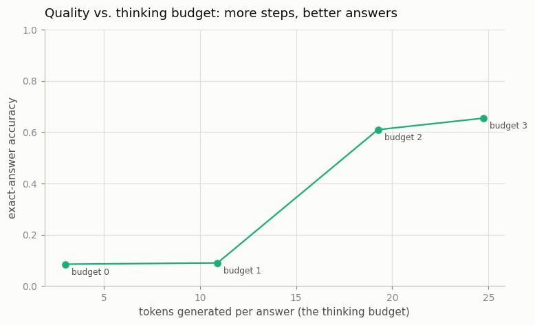

# Length-Budget Controller

---

> Teach the model to think just long enough — and no longer.

---

## ELI5 (Explain Like I'm 5)

- **The Big Idea:** We put a little number at the front of the prompt — the *thinking
  budget* — that says "show at most this many steps of work". The model learns to obey
  it: a budget of 0 makes it blurt the answer; a full budget makes it write out every
  partial sum. Then we can watch accuracy rise as we hand it a bigger budget, and decide
  how much thinking each problem is worth.
- **Analogy:** A test where the proctor says "you may use 0, 1, 2, or 3 lines of
  scratch paper." With no scratch paper you guess; with enough, you work it out. More
  paper, better score — up to the point where you didn't need more.
- **Example:** Same model, four budgets. With 0-1 steps allowed it must finish the sum in
  its head and scores ~**9%**; allow 2 steps and it jumps to **61%**; a full 3 steps
  reaches **66%** — spending 3, 11, 19, and 25 tokens respectively. The budget dial
  directly trades tokens for accuracy.

## Key Insight

This project trains a model to obey an explicit "think for at most N tokens" instruction, then measures answer quality against the thinking budget it was given.

## Why This Matters

Longer reasoning costs more time and money, but more thinking is not always better. Controlling the budget lets a system spend [inference-time compute](/shared/glossary/#inference-time-compute) only where a hard problem actually needs it.

## What's in this directory

| File | Role |
|------|------|
| `budget.py` | Trains one model on all budgets (a leading `B>` token sets how many reasoning steps to show), then measures accuracy and tokens generated per budget |

```bash
python budget.py       # ~5 min on CPU
```

Reuses the GPT skeleton from [project 08](../08-nanogpt-reproduction/README.md). A budget
of `b` means "write exactly `b` partial sums, then give the final answer" — so a small
budget forces the model to finish the remaining additions *implicitly* (hard), while a
full budget lets it write out every step (easy).

## Results

**A controllable quality-vs-compute curve from one model.**



```
budget (steps)   accuracy   tokens/answer
0 (direct)       0.085      3.0
1                0.090      10.9
2                0.610      19.2
3 (full CoT)     0.655      24.8
```

Two things to read off it:

- **The model obeys the dial.** Token count scales cleanly with the budget (3 → 11 → 19 →
  25), so the instruction is doing real work — the model shows exactly as many steps as it
  was told to.
- **Accuracy climbs, with a threshold.** It's flat and low while the model still has to do
  *two* additions in its head (budgets 0-1), then jumps once the budget covers all but the
  *last* addition (budget 2). That is the inference-time scaling curve in miniature: more
  thinking tokens buy more accuracy, but with a shape — here a cliff — that depends on how
  much implicit work remains.

## Why a budget knob matters at scale

Reasoning models can burn thousands of tokens per query, and that's real latency and cost
— but a trivial question doesn't need a long think, and a hard one is starved by a short
one. A length-budget controller lets a serving system *route* compute: short budget for
easy queries, long budget for hard ones, tuned to the accuracy each actually needs. It's
the control surface on top of everything else in this phase — self-consistency, best-of-N,
and long-CoT RL all *spend* inference compute; the budget controller decides *how much* to
spend. Modern systems expose exactly this as a "thinking effort" or "reasoning budget"
setting.

## Things to try

- Add per-problem difficulty (vary the number of operands) and train the model to pick its
  *own* budget — the model deciding how long to think is the frontier version of this idea.
- Plot accuracy per token (accuracy ÷ tokens) to find the most *compute-efficient* budget —
  it's often not the largest one.
- Push budgets beyond the number of steps needed and confirm accuracy plateaus — more
  thinking stops helping once the work is done.
