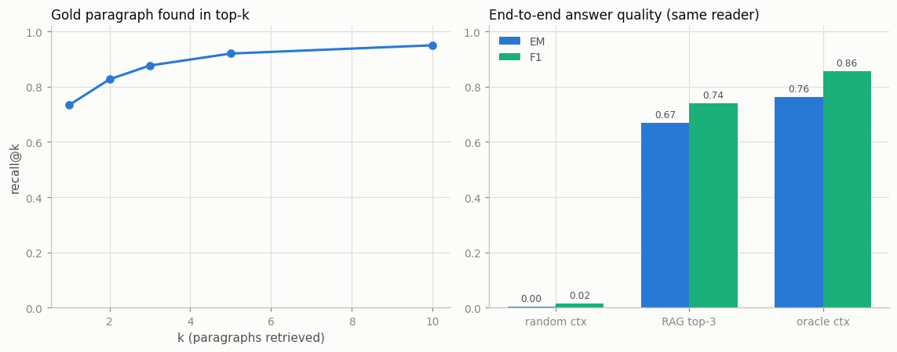

# Minimal RAG

---

> Don't make the model memorize your documents — let it look them up.

---

## ELI5 (Explain Like I'm 5)

- **The Big Idea:** A model can only answer from what it saw in training. RAG
  bolts a library onto it: when a question arrives, first *fetch* the few
  paragraphs most likely to contain the answer, paste them into the prompt,
  and only then let the model answer — open-book instead of closed-book.
- **Analogy:** An exam where you're allowed to bring the textbook. You don't
  read the whole book per question; you flip to the right page. The "flipping"
  is a vector search: paragraphs whose *meaning* sits closest to the question.
- **Example:** Our reader model given 3 random paragraphs gets **0.3%** of
  questions exactly right. Given the 3 paragraphs retrieval picked, it gets
  **67%** — almost all of the **76%** it scores when handed the gold
  paragraph by an oracle. Same model; the only change is what it gets to read.

## Key Insight

This project builds the simplest possible [RAG](/shared/glossary/#rag) pipeline: encode 1,000 Wikipedia paragraphs with a [sentence-embedding](/shared/glossary/#sentence-embedding) model, store the vectors, and at query time fetch the few closest paragraphs and paste them into the prompt before the model answers.

## Why This Matters

RAG is how you get an LLM to answer questions about *your* data — private or recent documents it never saw during training — without the cost of retraining it.

---

## What's in this directory

| File | Role |
|------|------|
| `rag_lib.py` | **The shared Phase-7 retrieval stack**: SQuAD corpus loader, MiniLM embedder, extractive reader, from-scratch BM25/RRF/nDCG — imported by projects 44-46 |
| `minimal_rag.py` | Embeds the corpus, retrieves, answers, and scores the whole pipeline |

```bash
python minimal_rag.py        # ~4 min on CPU (models download once, ~350 MB)
```

The corpus is SQuAD v1.1 dev: 1,000 real Wikipedia paragraphs sampled across
48 articles, plus 300 crowd-written questions whose answers are literal spans
of one gold paragraph — so retrieval and answers are both exactly gradable,
no LLM-as-judge needed. The embedder is `all-MiniLM-L6-v2` (mean-pooled,
L2-normalized, so cosine = dot product); the "generator" is an extractive QA
reader (`distilbert-...-distilled-squad`), which plays the LLM's role on a
CPU budget and has the property a RAG evaluation needs: if retrieval doesn't
fetch the answer, it cannot bluff one from its weights.

## Results

**Retrieval turns a 0-EM reader into a 67-EM system — 88% of the oracle
ceiling — with a 2.4 ms vector search.**



```
recall@1 0.733   recall@3 0.877   recall@5 0.920   recall@10 0.950
condition     EM      F1
random ctx    0.003   0.016     (retrieval off: reader can't know)
RAG top-3     0.670   0.741     (the pipeline)
oracle ctx    0.763   0.856     (perfect retrieval upper bound)
```

The two controls bracket exactly what retrieval contributes. With random
context the reader — a model that *always* answers with some span — produces
confident nonsense from the wrong paragraph. With retrieved context it is
right two times out of three, and the remaining gap to the oracle splits into
two failure classes you can read off the numbers: ~12% of questions where the
gold paragraph wasn't in the top-3 at all (recall@3 = 0.877), and reader
misses on the rest.

## Where the errors live

A RAG pipeline fails in stages, and the fix is different per stage. Miss at
retrieval (gold paragraph not fetched) and no amount of model quality helps —
that's what projects [44](../44-chunking-ablation/README.md) (chunking),
[45](../45-reranker-effect/README.md) (reranking) and
[46](../46-hybrid-retrieval/README.md) (hybrid search) attack. Miss at
reading (right paragraph, wrong span) and retrieval work is wasted — that's
the model's share, the `RAG top-3` → `oracle ctx` gap here. Log which stage
each failure came from before optimizing anything; the recall@k curve is the
budget sheet for that decision — k=3 buys 87.7% of the questions a chance,
k=10 buys 95%, and past that you're paying context for paragraphs that
mostly distract.

## Things to try

- Sweep `K_CTX` from 1 to 10: EM rises then *falls* as extra paragraphs crowd
  the reader with plausible distractor spans — more context is not free.
- Ask questions whose answers aren't in the corpus. The extractive reader
  always produces a span — count how often it's confidently wrong, then add
  a score threshold to make it say "I don't know".
- Swap the corpus sample seed and re-run: the numbers move a point or two;
  the random/RAG/oracle ordering never does.
