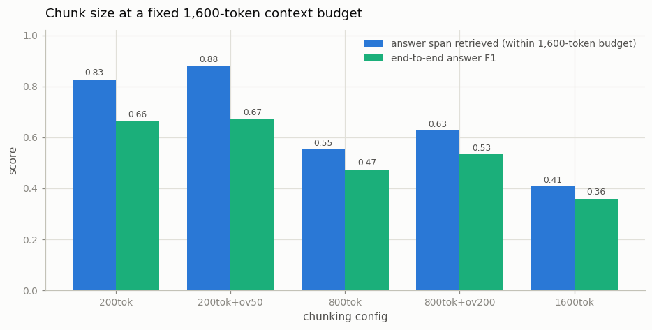

# Chunking Ablation

---

> The size of the pieces decides what the model gets to read.

---

## ELI5 (Explain Like I'm 5)

- **The Big Idea:** Before documents go into the retrieval index they get cut
  into pieces. Cut small, and each piece is precise but may slice a fact in
  half. Cut big, and each piece keeps its context but retrieval drags in a
  haystack per needle — and the embedding model may not even read to the end
  of it.
- **Analogy:** Index cards vs. whole chapters. Ask a question and you can
  afford to pull a fixed stack of paper: eight index cards cover eight
  different leads; one chapter covers one lead, mostly padding — and the
  librarian who filed it only skimmed its first pages.
- **Example:** With the same ~1,600 tokens of retrieved context, 200-token
  chunks answer at **F1 0.66** and 1,600-token chunks at **F1 0.36** — and
  two-thirds of the answers in big chunks sit past the point where our
  embedding model stopped reading.

## Key Insight

Before documents can be retrieved, they must be split into smaller passages — a step called [chunking](/shared/glossary/#chunking). This project is an [ablation](/shared/glossary/#ablation) that varies the chunk size (200 vs. 800 vs. 1,600 tokens) and overlap, then measures how each choice changes a [RAG](/shared/glossary/#rag) system's answer quality.

## Why This Matters

Chunk too small and a passage loses the context that makes it meaningful; chunk too large and retrieval drags in irrelevant text. Chunking is one of the quietest but highest-leverage knobs in a RAG pipeline.

---

## What's in this directory

| File | Role |
|------|------|
| `chunking_ablation.py` | Rebuilds full articles, re-chunks at five configs, evaluates each at an equal context budget |

```bash
python chunking_ablation.py     # ~9 min on CPU
```

Reuses the retrieval stack from [project 43](../43-minimal-rag/README.md).
The 48 SQuAD articles are glued back into full documents (5k-9k tokens) and
re-chunked by token windows. The crucial control: every config hands the
reader the **same ~1,600-token budget** — eight 200-token chunks, two
800-token chunks, or one 1,600-token chunk — so this measures how to *slice*
a fixed context spend, not who spends more. Ground truth is exact: a chunk
counts as relevant only if it contains the gold answer span (char offsets
mapped through the chunker).

## Results

**Small chunks win at every stage, overlap helps at every size, and the
1,600-token config quietly loses two-thirds of its answers to embedder
truncation.**



```
config        chunks  ctx    answer-retrieved  nDCG@10   end-to-end F1
200tok         1672   8x200       0.827         0.676       0.663
200tok+ov50    2209   8x200       0.880         0.749       0.673
800tok          435   2x800       0.553         0.621       0.475
800tok+ov200    555   2x800       0.627         0.680       0.533
1600tok         232   1x1600      0.407         0.618       0.360
```

Three separate effects stack against big chunks:

1. **Fewer lottery tickets per budget.** Eight small chunks are eight
   independent chances to cover the answer; one big chunk is a single bet.
2. **Diluted embeddings.** A 1,600-token chunk about five subtopics has one
   384-d vector that matches none of them sharply.
3. **The silent killer — encoder truncation.** MiniLM reads at most 512
   wordpieces. Measured directly: **64.7%** of gold answers inside
   1,600-token chunks sit *past* token 512 — the index has literally never
   seen the text that would answer the question, and no retrieval tuning can
   find what was never embedded.

Overlap is the cheap win: +5 points of answer-retrieval at 200 tokens (25%
more index vectors), because a window boundary that slices a sentence in
half now has a twin window where that sentence is whole.

## Things to try

- Print the questions the 200-token config gets wrong but 800 gets right:
  they're mostly cases where the *question's* wording matches the paragraph's
  surrounding context rather than the answer sentence itself — the real
  argument for bigger (or structure-aware) chunks.
- Chunk on paragraph boundaries (split on `\n\n`) instead of fixed token
  windows and compare — structure-aware chunking is what production systems
  actually do.
- Raise `BUDGET` to 3,200 tokens: the big-chunk configs recover some recall
  but F1 barely moves — the reader starts losing spans in the haystack.
