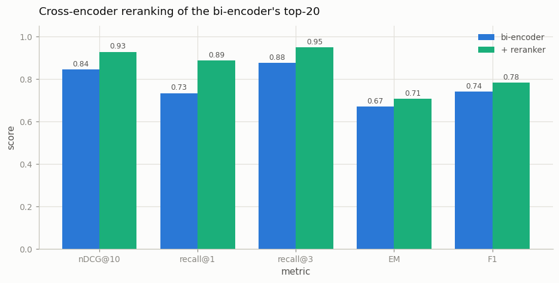

# Reranker Effect

---

> Cast a wide net fast, then carefully pick the best catch.

---

## ELI5 (Explain Like I'm 5)

- **The Big Idea:** The fast retriever squeezed every paragraph into one
  fixed vector *before it ever saw your question* — it's matching against a
  summary. A reranker reads the actual question next to each actual candidate
  paragraph, together, and re-scores. Too slow to run on 1,000 paragraphs;
  cheap to run on the top 20 the fast pass fished up.
- **Analogy:** Hiring. A recruiter skims 1,000 résumés in an hour to pick 20
  (fast, shallow — the résumés were written before the job ad existed); then
  you interview those 20 (slow, deep, and question-specific). Nobody
  interviews all 1,000, and nobody hires straight off a résumé skim.
- **Example:** The right paragraph lands in first place 73% of the time under
  the fast retriever, 89% after the reranker re-reads the top-20 — for
  ~0.5 s of extra CPU per query vs. 2.4 ms for the whole first stage.

## Key Insight

A fast first-pass retriever is rough, so this project adds a [reranker](/shared/glossary/#reranker) — a [cross-encoder](/shared/glossary/#cross-encoder) that re-reads each top candidate together with the query and re-scores it — then measures the gain with a ranking metric like [nDCG](/shared/glossary/#ndcg) and on end-to-end answer quality.

## Why This Matters

Cheap retrieval casts a wide net, and a slow but accurate reranker then picks the true best few; this "retrieve then rerank" two-stage pattern is standard in production search and [RAG](/shared/glossary/#rag).

---

## What's in this directory

| File | Role |
|------|------|
| `reranker_effect.py` | Bi-encoder top-20 → `ms-marco-MiniLM-L-6-v2` cross-encoder rerank → ranking + end-to-end metrics |

```bash
python reranker_effect.py      # ~5 min on CPU
```

Reuses [project 43](../43-minimal-rag/README.md)'s corpus and reader. Both
stages are the *same size* model (22M-param MiniLM) — the entire quality gap
below comes from architecture, not capacity: the bi-encoder encodes query and
document separately (so documents can be pre-embedded offline), while the
cross-encoder runs full attention *across* the query-document pair at query
time (so every token of the question can interrogate every token of the
candidate).

## Results

**Reranking converts recall into precision: recall@1 +15 points, half the
top-1 errors gone, for 214x the query latency.**



```
stage        nDCG@10  recall@1  recall@3  recall@5   EM     F1     ms/query
bi-encoder    0.845    0.733     0.877     0.920    0.670  0.741      2.4
+ reranker    0.928    0.887     0.950     0.953    0.707  0.782    520
```

Read the recall columns as a story about *where the fix happens*: recall@5
barely moves (0.920 → 0.953) because the reranker can only reorder what the
first stage already fetched — a gold paragraph outside the top-20 stays lost
(that ceiling is [hybrid retrieval](../46-hybrid-retrieval/README.md)'s
job). What reranking does brilliantly is push the gold paragraph from
"somewhere in the net" to "first" — recall@1 +15 points — which is exactly
what the reader needed: with the gold paragraph reliably in the top-3, F1
climbs 4 points toward its oracle ceiling of 0.856.

The latency column is the design constraint, not a footnote. At 26 ms per
query-document pair, cross-encoding all 1,000 paragraphs would cost ~26 s
per query; the bi-encoder's 2.4 ms is possible only because the 1,000
document vectors were computed once, offline. The two-stage split — recall
from a pre-computed index, precision from query-time attention over a
shortlist — is the same compute-allocation trick as
[speculative decoding](/shared/glossary/#speculative-decoding) or MoE:
spend the expensive model only where the cheap one is unsure.

## Things to try

- Sweep the first-stage depth (top-5 / top-20 / top-100 into the reranker):
  quality saturates fast while cost grows linearly — find the knee.
- Rerank *BM25*'s top-20 instead: the cross-encoder repairs lexical
  retrieval just as well — reranking is retriever-agnostic.
- Plot bi-encoder score vs. cross-encoder score for the same pairs: the
  scatter is wide — the two models genuinely disagree, and the cross-encoder
  is the one that's right.
