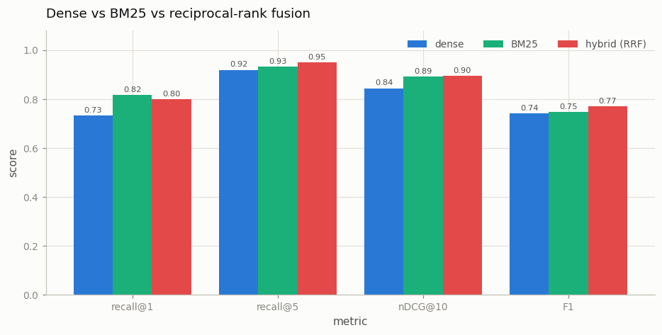

# Hybrid Retrieval

---

> Meaning and keywords each catch what the other misses.

---

## ELI5 (Explain Like I'm 5)

- **The Big Idea:** Embedding search finds paragraphs that *mean* the same
  thing as your question, even with zero shared words — but it blurs exact
  strings like names, codes, and numbers. Keyword search (BM25) nails exact
  strings but is blind to synonyms and paraphrase. Run both, then merge the
  two ranked lists so anything ranked high by *either* side surfaces.
- **Analogy:** Two librarians hunting the same book: one goes by your
  description of the plot, the other by the exact title words you remember.
  Different books slip past each one; few slip past both.
- **Example:** On 300 questions, 14 are found only by dense search and 18
  only by BM25. Reciprocal rank fusion keeps 23 of those 32 one-sided wins
  and posts the best recall@5 (0.95), nDCG (0.90), and answer F1 (0.77) of
  the three systems.

## Key Insight

Dense [embedding](/shared/glossary/#embedding) search matches *meaning* while sparse keyword search ([BM25](/shared/glossary/#bm25)) matches *exact words*; [hybrid retrieval](/shared/glossary/#hybrid-retrieval) fuses their two ranked lists with [reciprocal rank fusion](/shared/glossary/#reciprocal-rank-fusion) so each covers the other's blind spots.

## Why This Matters

Embeddings miss rare names, codes, and exact phrases that keyword search nails — and vice versa — so combining them reliably beats either method alone on real-world documents.

---

## What's in this directory

| File | Role |
|------|------|
| `hybrid_retrieval.py` | Dense vs. from-scratch Okapi BM25 vs. RRF fusion, plus the disagreement analysis |

```bash
python hybrid_retrieval.py     # ~6 min on CPU
```

Reuses [project 43](../43-minimal-rag/README.md)'s corpus, embedder and
reader. BM25 is implemented from scratch in `rag_lib.py` (~30 lines:
tf-saturating term weights, length normalization, k1=1.5, b=0.75) — no IR
library. RRF is three lines: each document scores the sum of
`1/(60 + rank)` across the two lists, so fusion needs no score calibration
between systems whose raw scores live on incomparable scales (cosine in
[-1,1] vs. unbounded BM25 sums) — only *ranks* matter.

## Results

**Hybrid posts the best recall@5, nDCG@10, EM and F1 — by rescuing 72% of
the queries that exactly one retriever gets right.**



```
system        recall@1  recall@5  nDCG@10   EM      F1
dense          0.733     0.920     0.845   0.670   0.741
BM25           0.817     0.933     0.892   0.677   0.748
hybrid (RRF)   0.800     0.950     0.896   0.690   0.771

disagreement @5: both hit 262/300, only-dense 14, only-BM25 18
hybrid keeps 10/14 dense-only wins and 13/18 BM25-only wins
```

The disagreement set is the whole argument. The two retrievers agree on the
easy 87%; on the contested 11% they fail in *different places* — dense-only
wins are paraphrase questions ("What should be avoided when talking to
authorities?" shares almost no content words with its paragraph), BM25-only
wins hinge on exact rare terms ("Who did **Luther** strike out against...").
Because the failures are decorrelated, fusing ranks recovers most of both
one-sided sets, which is why hybrid tops every set-level metric.

Two honest footnotes. First, BM25 *alone* beats dense on this corpus —
SQuAD questions were written by crowdworkers looking at the paragraph, so
they inherit its vocabulary; on real user queries (typos, synonyms, jargon)
dense wins more of the one-sided set and hybrid's margin grows. Second,
hybrid's recall@1 (0.800) sits *between* the two bases: rank fusion is a
recall device, and the two experts can outvote the right answer's top slot.
That residue is precisely what stacking [project
45](../45-reranker-effect/README.md)'s cross-encoder on the fused top-20
cleans up — retrieve wide (hybrid), then rank sharp (rerank), which is the
full production pipeline.

## Things to try

- Stack the pipeline: hybrid top-20 → cross-encoder rerank → reader, and
  compare against project 45's dense-only version — the gains compose.
- Delete a keyword from questions before dense search (or introduce typos):
  BM25 degrades sharply, dense barely notices — the blind spots in reverse.
- Sweep RRF's constant k (10 / 60 / 200): small k trusts each list's #1
  harder; large k flattens toward set-union. 60 is a robust default, not a
  magic number.
