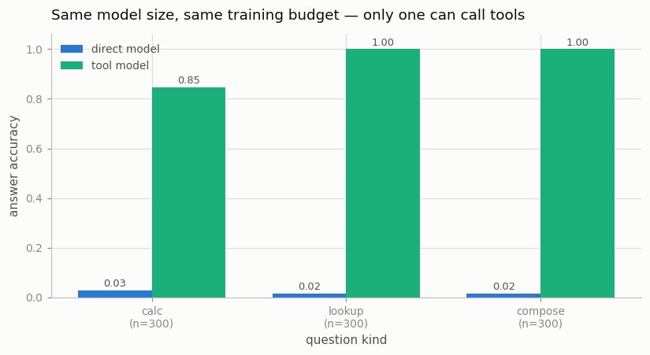

# Tool-Using Chatbot

---

> Give the model a calculator and it stops guessing at arithmetic.

---

## ELI5 (Explain Like I'm 5)

- **The Big Idea:** Instead of forcing the model to compute or memorize
  everything inside its own weights, teach it to write a tiny structured
  request — `C:47*82;` — that a program outside the model executes. The
  program pastes the result back into the conversation, and the model just
  reads it and finishes the answer. The model's job shrinks from "know
  everything" to "know *who to ask*, and copy faithfully".
- **Analogy:** A receptionist with a phone. They don't know the warehouse
  inventory off the top of their head, and nobody wants them to — they know
  which extension to dial and how to relay the answer without garbling it.
- **Example:** Two identical tiny models, identical training budget. On
  questions needing 2-digit multiplication or a fact rolled fresh per episode,
  the tools-free model scores **2-3%**. The tool-calling model scores
  **85-100%** — and its one weakness is not dialing, but *relaying*.

## Key Insight

This project gives a chat model two tools — a calculator and a search function — through [function calling](/shared/glossary/#function-calling): the model emits a structured request, an external program runs it, and the result is fed back so the model can finish its answer.

## Why This Matters

Tools let an LLM do what it is bad at on its own — exact arithmetic, looking up fresh facts — turning a closed-book guesser into a system that can reach out to the outside world.

---

## What's in this directory

| File | Role |
|------|------|
| `tool_lib.py` | **The shared Phase-7 agent stack**: char-level GPT (project 08's skeleton), segment grammar, orchestrator loop with mid-generation tool splicing, environment-token loss masking, batched episode runner — imported by projects 48-50 |
| `tool_chatbot.py` | Trains the tool model and the direct model, evaluates both on the synthetic benchmark |

```bash
python tool_chatbot.py       # ~5 min on CPU
```

The benchmark is rigged the way reality is rigged. `calc` questions
(`Q:47*82=?`) need exact 2-digit multiplication — genuinely hard for a tiny
LM. `lookup` questions (`Q:val(fr)?`) ask for a value that is *rolled fresh
every episode* and exists only in the orchestrator's database — the model
cannot memorize it, just like tomorrow's weather wasn't in the training set.
`compose` chains two lookups and an addition. A trained episode looks like:

```
Q:val(qd)+val(ac)?  L:qd;  R:84;  L:ac;  R:14;  C:84+14;  R:98;  A:98;
env(question)      model  env   model  env    model     env    model
```

Training uses [project 29](../29-loss-masking-bug-hunt/README.md)'s lesson in
multi-turn form: loss is computed **only on model-emitted tokens** — the
`Q:`/`R:` text is environment output, and a model trained to predict it is
being trained to predict its own tools instead of using them.

## Results

**Same architecture, same steps: 2-3% without tools, 85-100% with them —
and zero malformed calls.**



```
model    kind      accuracy  malformed   model-tokens/answer
direct   calc        0.030     —           6.3
direct   lookup      0.017     —           5.0
direct   compose     0.017     —           6.0
tool     calc        0.847     0.000      14.3
tool     lookup      1.000     0.000      10.0
tool     compose     1.000     0.000      23.6

direct model, asked for a fact it can't know:   Q:val(qd)?  A:46;   (truth: 10)
```

The direct model's `lookup` row is the hallucination mechanism laid bare: SFT
taught it that questions get confidently-shaped numeric answers, so it emits
one. Nothing in its training could do better — the information isn't in the
weights. The tool model's `L:qd;` fixes this *categorically*, not
statistically.

The most instructive number is tool-`calc`'s 0.847. Every failure has the
same shape: perfect call, correct tool result, **miscopied final answer** —

```
Q:16*19=?  C:16*19;  R:304;  A:360;
```

The model still has to *read* the 3-4 digit result back out, and copying
long unfamiliar numbers is exactly the kind of precision work tiny
transformers fumble. Tool use removes the computation, not the model from
the loop — "tool grounding" includes faithfully relaying what the tool said,
and evaluations that only check whether the right call was made would miss
this entire failure class. (Project [50](../50-rl-fine-tune-for-tools/README.md)
tries to attack this residue with RL — and finds that random digit-slips are
exactly the kind of error a policy gradient *can't* fix.)

## Things to try

- Retrain the tool model with `full_loss`-style unmasked training (loss on
  `R:` tokens too) and watch it start *predicting* tool outputs — including
  confidently wrong products — instead of waiting for them.
- Break the orchestrator: return a wrong number in `R:`. The model copies it
  without hesitation — a tool-using model is exactly as trustworthy as its
  tools (this is the prompt-injection surface of Phase 10).
- Add a `W:` (weather) tool the model was never trained on and ask weather
  questions: it answers directly (and wrongly) rather than calling the
  unknown tool — tool grounding comes from training, not from the tool
  existing.
