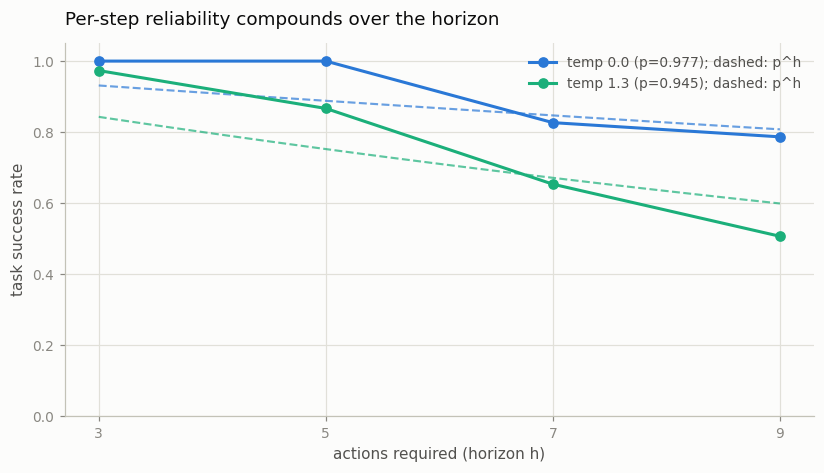

# Agent on a [Sandbox](/shared/glossary/#sandbox) Task

---

> An agent is just a model in a loop — and loops are where things go wrong.

---

## ELI5 (Explain Like I'm 5)

- **The Big Idea:** An agent doesn't answer once — it acts, looks at what
  happened, and acts again, maybe nine times before the task is done. If each
  action is right 97% of the time, that sounds great — until you multiply:
  0.97 nine times over is 0.79. Reliability doesn't add across steps; it
  *compounds*, and the compounding is exponential in the horizon.
- **Analogy:** A relay race where every runner has a 3% chance of dropping
  the baton. One runner? Fine. Nine handoffs? You lose the baton in one race
  out of five, and no single runner looks like the problem.
- **Example:** Our spreadsheet agent, judged over 75 random worlds per task
  size: copying one cell (3 actions) succeeds 100%; summing four cells into a
  target (9 actions) drops to **79%** — with a per-action reliability of
  0.977, tracking the p^h curve. Nudge sampling temperature so p slips to
  0.945 and 9-action success falls to **51%**.

## Key Insight

An [agent](/shared/glossary/#agent) is an LLM placed in a loop: it plans, picks a tool, acts, observes the result, and repeats until the task is done. This project builds a tiny [ReAct](/shared/glossary/#react)-style agent on a deterministic task and runs it across many [seeds](/shared/glossary/#seed) to measure how reliably it actually succeeds.

## Why This Matters

A single correct answer is easy; staying on track across many steps is hard, because a small per-step error rate compounds into frequent whole-task failure — which is why agents must be judged over many runs, not on one lucky success.

---

## What's in this directory

| File | Role |
|------|------|
| `sandbox_agent.py` | The spreadsheet environment, expert-trace SFT, batched rollouts over many seeds, and the p-vs-p^h analysis |

```bash
python sandbox_agent.py      # ~10 min on CPU (cached SFT: ~3 min)
```

Reuses [project 47](../47-tool-using-chatbot/README.md)'s orchestrator stack.
The environment is a 12-cell spreadsheet (`a1`..`d3`, fresh random values
each seed) with three tools and a stop action — `G:a1;` read, `C:57+82;`
calculator, `S:c3=139;` write, `A:done;` stop. Tasks form a horizon ladder:
copy a cell (3 actions), sum 2/3/4 cells into a target (5/7/9 actions). An
episode:

```
Q:c1=a1+c3?  G:a1; R:71;  G:c3; R:42;  C:71+42; R:113;  S:c1=113; R:ok;  A:done;
```

Success is judged on the **environment, not the transcript**: after the
episode, the target cell must hold the right number. Per-action reliability
p is measured separately by teacher-forcing expert traces and asking how
often the model reproduces each expert action.

## Results

**Success falls exponentially with horizon, tracks p^h, and the temperature
knob shows exactly how sensitive the exponent is to per-step polish.**



```
                      h=3     h=5     h=7     h=9    per-action p
temp 0.0  measured    1.00    1.00    0.83    0.79      0.977
          p^h         0.93    0.89    0.85    0.81
temp 1.3  measured    0.97    0.87    0.65    0.51      0.945
          p^h         0.84    0.75    0.67    0.60
```

Two readings matter. First, the trend: nothing about the model changes
between h=3 and h=9 — the same network with the same weights goes from
perfect to failing one task in five, purely because more things must go
right in sequence. This is the guide's "95%-per-step agent succeeds less
than 60% of the time over 10 steps" made concrete.

Second, the deviations from p^h are themselves informative. Measured success
sits *above* the prediction at short horizons because p^h assumes only the
expert's exact action sequence succeeds — but the environment forgives
harmless deviations (reading cells in a different order still sums them
correctly). It dips *below* at long horizons under temperature because one
bad action doesn't just fail a step, it derails the rest of the trajectory —
errors in a loop are correlated, not independent. Real agents live between
those two regimes: recovery skills push you above the naive curve,
compounding confusion drags you below it.

The 1600-step training budget is itself part of the lesson: at 900 steps the
model had p ≈ 0.49 — it "knew" the tool grammar perfectly and produced
plausible-looking transcripts with wrong cell names and off-by-one copies,
succeeding at ~19% of even 3-action tasks. Fluent-but-imprecise is the
default failure mode of small agents, and it looks fine until you score the
environment.

## Things to try

- Extend the ladder (sum 5, 6 cells...) and fit log(success) vs. h: the slope
  recovers log(p) — measure the exponent directly.
- Give the agent a retry budget (let it keep acting after a malformed call):
  success at h=9 rises noticeably — recovery converts correlated failures
  back toward independence.
- Score transcripts instead of the environment (does the trace *look*
  right?) and count how often the two judgments disagree — the gap is why
  agent benchmarks execute rather than grade text.
