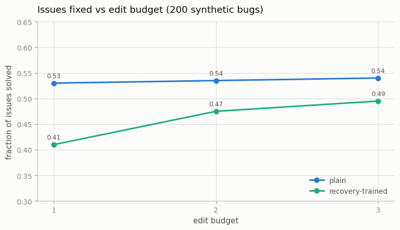

# [SWE](/shared/glossary/#swe)-Style Coding Agent

---

> Give a model a shell and a test suite, and watch it debug like an engineer.

---

## ELI5 (Explain Like I'm 5)

- **The Big Idea:** A coding agent is a loop around three moves: read the
  failing tests, edit the file, rerun the tests. The tests are the agent's
  eyes — it never "knows" if its fix worked; it *checks*. This project builds
  that whole loop small: a one-line-bug benchmark, a real file on disk, a
  real editor tool, a real test runner, and a tiny model driving them.
- **Analogy:** A mechanic who can't see the engine — they can only turn a
  bolt and then run the car. What separates a good mechanic isn't just
  turning the right bolt first; it's what they do after the car still
  rattles: use the *new* rattle to pick a different bolt, instead of turning
  the same one harder.
- **Example:** Two identically-budgeted agents. One trained only on
  perfect fixes: 53% first-try, and extra attempts buy +1 point — it can't
  use feedback. One trained on failure-then-fix traces: 41% first-try, and
  attempts buy +8.5 points, with visible course corrections ("want 22, got
  23 → lower the constant by one").

## Key Insight

This project wires an LLM to a shell and a file editor so it can read a codebase, make edits, and run tests in a loop, then points it at a few easy issues from a bug benchmark like [SWE-bench](/shared/glossary/#swe-bench).

## Why This Matters

Fixing a real bug end-to-end is the canonical test of an [agent](/shared/glossary/#agent): it must explore, act, check its own work, and recover from errors — the same loop behind coding assistants like Claude Code.

---

## What's in this directory

| File | Role |
|------|------|
| `swe_agent.py` | The bug benchmark generator, the file/test harness, and the plain-vs-recovery-trained comparison |

```bash
python swe_agent.py          # ~9 min on CPU
```

Each "issue" is a repo with one file, `def f(x): return x-16`, where the
return line carries a planted bug (wrong operator among `+ - *`, or wrong
constant up to 19), plus two asserts that pin down the unique correct line.
The agent's `E:return x+18;` **rewrites the file on disk**; the harness then
execs the file and reports `R:pass;` or `R:fail got 23,26;` — a real
edit-compile-test loop, miniaturized. Fixing an issue requires genuine
inference from the tests (which operator and constant reproduce both
expected outputs?), which sits right at this tiny model's capacity — so
first edits fail about half the time, and what happens *next* is the
experiment:

* **plain** — SFT only on perfect traces: prompt → correct edit → pass → done.
* **recovery-trained** — 40% of traces open with a *wrong* first edit whose
  tokens are **loss-masked** (an environment-forced error the model observes
  but is never trained to produce), then the failing report and the correct
  second edit. It learns what a failure looks like and what to do after one,
  without learning to fail.

## Results

**Edit budget is worthless to the agent that was never trained to use
feedback (+1 point), and worth +8.5 points to the one that was — but
recovery training taxes first-shot accuracy at a fixed budget.**



```
agent              solved@1  solved@2  solved@3  recovery  repeat-after-fail
plain                0.530     0.535     0.540    0.02          0.02
recovery-trained     0.410     0.475     0.495    0.14          0.47

recovery-trained, after a miss (want f(4)=22, first try gave 23):
Q:f(4)=22,f(7)=25;code return x-16; E:return x+19; R:fail got 23,26;
                                    E:return x+18; R:pass; A:done;
```

The transcripts show real *directional* debugging: got 23, wanted 22, so
`x+19` becomes `x+18`; a `*9` overshoot becomes `*8`. The plain agent
almost never repeats itself after a failure (2%) — but its second guess
ignores the feedback entirely and is wrong 98% of the time; the failure
report is out-of-distribution text it was never taught to read.

Two honest wrinkles, both general. First, the recovery skill was paid for
out of the same 1,200-step budget — 40% of training went to post-failure
states, so first-edit accuracy dropped 12 points, and on this benchmark the
plain agent's careful single shot still nets out ahead (0.540 vs. 0.495).
The loop only wins when per-shot competence *and* feedback-reading are both
strong — which is why frontier coding agents train both, at a scale where
they don't trade off this sharply. Second, the recovery-trained agent shows
a textbook loop pathology: after a miss it re-emits the *same* failed edit
47% of the time — "the model loops forever" from the guide's failure-mode
list, measured. Real harnesses add repetition detectors and forced-diversity
retries for exactly this reason: the loop is part of the system, and
babysitting it is the harness's job.

## Things to try

- Give the recovery-trained agent 5 edits instead of 3: solves keep creeping
  up while the plain agent stays flat — then plot solves-per-edit to see the
  diminishing return that decides real agent budgets.
- Detect a repeated edit in the harness and force-resample at temperature
  0.8: the cheapest possible "retry logic" recovers several points of
  solved@3 — harness engineering substituting for model quality.
- Scale the fix: train with 60% recovery traces, or 2,000 steps — which
  closes the solved@1 gap first, more recovery data or more budget?
