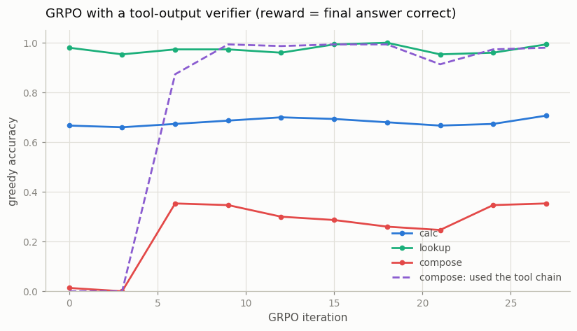
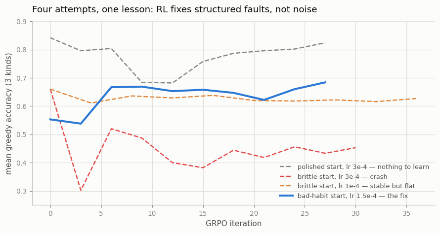

# RL Fine-Tune for Tools

---

> Reward the tool calls that work, and the model learns to use its tools well.

---

## ELI5 (Explain Like I'm 5)

- **The Big Idea:** Imitation copies whatever is in the training traces —
  including the bad habits. If some recorded traces skipped the tools and
  guessed, the model learns to sometimes skip the tools and guess. RL fixes
  this differently: let the model *practice*, actually run its tool calls,
  and reward only the episodes whose final answer checks out. Habits that
  never earn reward wither; the tool chain that works takes over.
- **Analogy:** A trainee who studied from a manual with some sloppy pages.
  Watching them, you can't lecture the sloppiness away — but put them on
  real tickets where wrong answers bounce, and the sloppy shortcut
  extinguishes itself in a week. What practice *can't* fix: occasional
  typos. Those aren't a habit; they're noise.
- **Example:** Our SFT'd model answers multi-step questions by blurting a
  guess (1.3% correct, tools used 0% of the time). Twenty-seven GRPO
  iterations with a verifier reward later, it runs the full lookup→lookup→calculator
  chain 98% of the time and is 27× more accurate — while three matched RL
  runs against models whose only faults were random copy-slips gained
  *nothing*.

## Key Insight

Instead of only imitating recorded tool-call examples, this project trains the model with [GRPO](/shared/glossary/#grpo) using a [verifier](/shared/glossary/#verifier) that checks whether each tool call produced the expected output — a form of [RLVR](/shared/glossary/#rlvr) applied to tool use.

## Why This Matters

A verifiable success signal lets the model *practice* using its tools and learn from what actually works, rather than just copying traces — the frontier recipe for reliable tool-using [agents](/shared/glossary/#agent).

---

## What's in this directory

| File | Role |
|------|------|
| `rl_tools.py` | Corrupted-trace SFT, interactive GRPO rollouts with a verifier reward, and the four-regime comparison |
| `outputs/ablation_*.csv` | Full eval histories of the three RL runs that *didn't* work (see below) |

```bash
python rl_tools.py           # ~10 min on CPU (cached SFT: ~7 min)
```

Reuses [project 47](../47-tool-using-chatbot/README.md)'s task and stack.
The SFT corpus has a realistic disease: 55% of multi-step (`compose`) traces
are "lazy" — they skip the tools and answer with a plausible guess, the kind
of shortcut that riddles scraped agent logs. Imitation absorbs it without
complaint: the SFT model *knows* the tool chain (it appears under sampling)
but *serves* the guess (greedy picks the majority habit).

The RL is Phase 5's GRPO recipe made multi-turn: rollouts are interactive
(the orchestrator splices `R:...;` observations into the sequence
mid-generation), and the PPO ratio, advantages, and k3-KL are all computed
under a **model-token mask** — environment tokens carry no policy gradient,
the same masking discipline as [project 29](../29-loss-masking-bug-hunt/README.md),
now load-bearing for RL correctness. Reward is 1.0 iff the final answer
verifies against the episode's ground truth. One recipe change was forced:
Phase 5's lr 3e-4 assumed 4-token completions; here one episode-level
advantage spreads over 10-25 model tokens, and 3e-4 crashes the policy
(ablation below) — 1.5e-4 is stable.

## Results

**GRPO finds the latent tool-chain mode and makes it the policy: compose
accuracy 0.013 → 0.353 (27×), chain usage 0% → 98%, in about six
iterations — with no regression on the other kinds.**



```
                calc   lookup  compose   chain-rate   mean
SFT (lazy)      0.667   0.980   0.013       0.000     0.553
+ 27 GRPO       0.707   0.993   0.353       0.980     0.684
```

The dashed line is the mechanism: the verifier never says *how* to answer,
but the only rollouts that earn reward are the sampled minority that ran
the tool chain, so the group-relative advantage transfers probability mass
from the guessing mode to the chain mode. This is behavior-level surgery —
exactly what a 1-bit episode reward can do well.

What it can't do is teach precision. Compose plateaus at ~0.35 because the
chain, once adopted, still fumbles digit copies (project 47's residue), and
those slips are *unstructured* — a different wrong digit every time. Three
full matched runs against uncorrupted partial-SFT models make that point
brutally:



* **Polished start** (600-step SFT, only copy-noise left): RL destabilizes
  what worked, KL drags it back; net -0.02.
* **Brittle start, lr 3e-4** (560 steps, right at the format-grok cliff):
  the policy crashes in 3 iterations — barely-grokked skills sit in sharp
  minima and the first big RL step knocks them out.
* **Brittle start, lr 1e-4**: stable and flat. ~4,600 episodes of 1-bit
  reward cannot teach token-level copying that 40 steps of dense SFT
  supervision fix outright (0.66 → 0.84 for a fraction of the compute).

Together: **RLVR pays when the fault is structured (a wrong behavior being
chosen) and gold traces can't tell you which behavior wins in practice; when
dense supervision exists, use it, and when the errors are noise, neither
helps — make the task easier or the model bigger.** That is the same
conclusion Phase 6 reached for inference-time search, now on the training
side.

## Things to try

- Log the fraction of *sampled* (temp 0.7) compose rollouts using the chain
  across iterations: it starts at 28% — RL never invents the behavior, it
  amplifies what sampling already finds. Zero sampled successes = zero
  gradient (we hit this: a 5%-lazy-free SFT mix had a 0% chain mode and
  GRPO had nothing to reinforce).
- Add a -0.05 penalty per tool call: the model learns to skip the
  calculator on `calc` questions it can do... and its accuracy drops — a
  tiny reward-design lesson in cost-vs-reliability.
- Re-corrupt with a *subtler* habit (lazy only when the two entities
  alphabetically sort ascending) and watch GRPO still find and excise it —
  verifier reward doesn't need to know what the bug is, only that answers
  verify.
