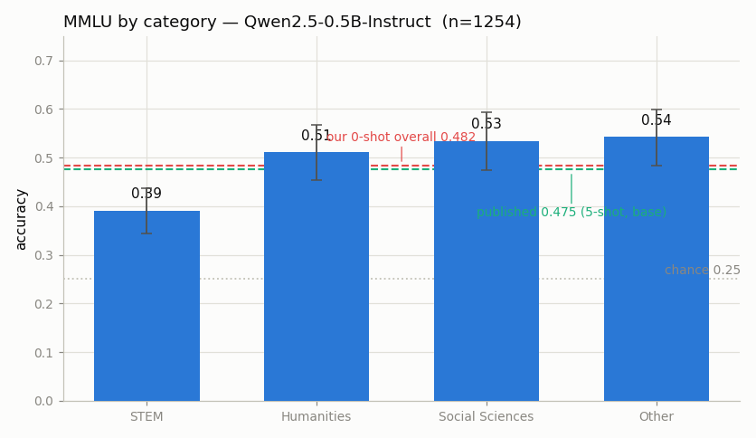

# MMLU Re-run

---

> Before you trust a leaderboard number, reproduce it yourself.

---

## ELI5 (Explain Like I'm 5)

- **The Big Idea:** [MMLU](/shared/glossary/#mmlu) is a 14,000-question
  multiple-choice quiz covering 57 subjects, from astronomy to law. Model cards
  advertise a single MMLU score. This project makes the model actually sit the
  exam and checks whether we get the advertised number.
- **How the model "answers":** we don't make it write an essay. We show it the
  question and the four lettered choices, then read how much probability it puts
  on the next token being " A", " B", " C", or " D". The biggest one is its
  answer — one forward pass, no generation.
- **What we find:** our score of **0.482** lands right on the published
  **0.475** — but that agreement is partly luck. We ran the exam 0-shot; the
  authors ran it 5-shot. The very next project shows that just *rewording the
  question* moves this number by several points, so a matching number is
  reassuring, not proof.

## Key Insight

This project runs an open model through [MMLU](/shared/glossary/#mmlu) — a 57-subject multiple-choice [benchmark](/shared/glossary/#benchmark) — scores it per category, and checks the total against the number the model's authors published.

## Why This Matters

Reproducing a known score teaches you that small choices — the prompt format, the [sampling](/shared/glossary/#sampling) settings, how you parse the model's letter answer — can move a benchmark result by several points, so a single number means little without the setup that produced it.

---

## What's in this directory

| File | Role |
|------|------|
| `eval_lib.py` | **The shared Phase-8 evaluation stack** — the `Model` wrapper (batched letter-scoring, generation, loglik judge), the Hugging Face parquet loader, and the MMLU loader + category map. Imported by projects 52-57. |
| `mmlu_re_run.py` | Loads MMLU, scores Qwen2.5-0.5B-Instruct, reports per-category accuracy, checks it against the published number, and draws the figure. |

```bash
python mmlu_re_run.py     # ~7 min on CPU the first time; instant re-plot after (cached)
```

The model is **Qwen2.5-0.5B-Instruct** — a real, published open model small
enough to evaluate on a CPU. We take a stratified sample of 22 questions from
each of the 57 subjects (1,254 questions) so the run fits a time budget while
staying balanced across categories.

## How the scoring works

MMLU is scored the way `lm-evaluation-harness` scores it: as a **cloze** task,
not a generation task. We build the prompt

```
Question: What is true for a type-Ia supernova?
A. This type occurs in binary systems.
B. This type occurs in young galaxies.
C. This type produces gamma-ray bursts.
D. This type produces high amounts of X-rays.
Answer:
```

and read the model's next-token distribution, restricted to the four letter
tokens. The letter with the highest log-probability is the model's answer. This
is one forward pass per question and needs no answer parsing — the model never
has to *say* "A", it just has to prefer it.

Two implementation details matter enough to have caused bugs while building
this:

- **Left-padding.** Batched prompts are padded on the *left* so the final column
  is a real token for every row — that is the position whose logits we read. Pad
  on the right and you read the distribution after a run of `<pad>` tokens, which
  scored *below chance* (0.15) until fixed.
- **`logits_to_keep=1`.** Ask the model for logits at the last position only.
  The default materializes a `(batch, tokens, 152k-vocab)` tensor — tens of GB
  for a batch of long law questions — and OOM-kills the run.

## Results

**Our 0-shot score of 0.482 lands inside the confidence interval of the
published 0.475 — but the two runs used different protocols, so the match is
reassuring rather than conclusive.**



```
category          accuracy   95% CI          n
STEM              0.390      [0.344, 0.438]  418
Humanities        0.510      [0.453, 0.568]  286
Social Sciences   0.534      [0.474, 0.593]  264
Other             0.542      [0.484, 0.599]  286

OVERALL           0.482      [0.455, 0.510]  1254
published         0.475      (Qwen2.5-0.5B, 5-shot, base model)
```

The per-category breakdown is where a single number lies. STEM (0.39) is a full
**15 points** below the other three categories (~0.51-0.54) and its confidence
interval doesn't overlap them — this small model can recite humanities facts far
better than it can do the multi-step reasoning STEM subjects demand. An
"MMLU = 0.48" headline hides that entirely. (The 95% intervals are Wilson score
intervals; at ~300 questions per category a 5-point wobble is still just noise,
which is itself worth internalizing before you rank two models 2 points apart.)

## The reproduction is closer than it should be

The published 0.475 was measured **5-shot on the base model**; we measured
**0-shot on the Instruct model** with our own prompt. Three knobs differ, and
each is worth a few points — yet the totals agree to within 0.7 of a point. That
is partly luck: the errors happened to cancel. The honest reading of a
reproduction this clean is *"nothing is obviously broken in my harness"*, not
*"I have confirmed the number"*. Project
[52](../52-prompt-sensitivity-sweep/README.md) makes the fragility concrete by
holding the model fixed and moving only the wording.

## Things to try

- Raise `PER_SUBJECT` to run the full test set and watch the confidence
  intervals shrink — the category ordering (STEM last) will not change.
- Switch `mmlu_cloze(..., style=...)` to one of project 52's other formats and
  watch the overall number move off 0.482.
- Score the full answer *text* instead of the letter (sum the log-probs of the
  choice's tokens). It is 4× the compute and, for an instruct model, usually a
  point or two different — a fifth knob nobody reports.
