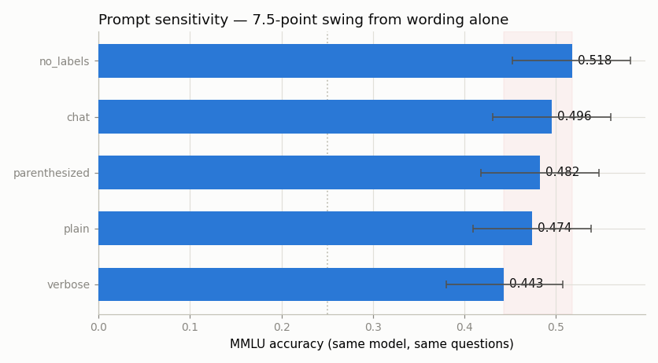

# Prompt Sensitivity Sweep

---

> Same model, same questions, five wordings — five different scores.

---

## ELI5 (Explain Like I'm 5)

- **The Big Idea:** We take the exact model and the exact MMLU questions from
  project [51](../51-mmlu-re-run/README.md) and change *only one thing* — how the
  question is phrased on the page. Five phrasings a person would call equivalent
  give five different scores.
- **The wordings:** a bare `Answer:` cloze, a `Q:/A:` format, parenthesized
  `(A)` choices, a wordy "you are an expert taking an exam" instruction, and the
  model's own chat template. Nothing about the model's knowledge changed between
  them.
- **What we find:** the scores swing **7.5 points** (0.443 to 0.518) purely from
  wording. That is larger than the gap that separates many models on a
  leaderboard — so a benchmark comparison is only meaningful if both models were
  tested with the *identical* prompt.

## Key Insight

This project holds the model and the [benchmark](/shared/glossary/#benchmark) fixed and changes only how the question is phrased, running a [sweep](/shared/glossary/#sweep) over five prompt formats and plotting how far the accuracy moves.

## Why This Matters

If rewording a prompt swings the score by ten points, then comparing two models is meaningless unless both are tested with the same template — a trap that has produced many bogus "model A beats model B" claims.

---

## What's in this directory

| File | Role |
|------|------|
| `prompt_sweep.py` | Scores Qwen2.5-0.5B-Instruct on a fixed 228-question MMLU sample under five prompt formats and plots the spread. |

Reuses `eval_lib.py` and the `mmlu_cloze(..., style=...)` formats from project 51.

```bash
python prompt_sweep.py     # ~7 min on CPU
```

## The five wordings

Every format ends just before the answer letter, so all five are scored the same
way (log-prob over the letter tokens) — the *only* variable is the surrounding
text.

| Format | Shape |
|--------|-------|
| `plain` | `Question: … / A. … / Answer:` |
| `no_labels` | bare question, then `A. … / Answer:` |
| `parenthesized` | `(A) …` choices, then `The answer is (` |
| `verbose` | a wordy "you are an expert taking a multiple-choice exam" wrapper |
| `chat` | the model's own Qwen chat template, answered on the assistant turn |

## Results

**Wording alone moves the score 7.5 points — and the wordy, "helpful" instruction
does the *worst*.**



```
format          accuracy   95% CI
no_labels       0.518      [0.453, 0.582]
chat            0.496      [0.431, 0.560]
parenthesized   0.482      [0.418, 0.547]
plain           0.474      [0.410, 0.538]
verbose         0.443      [0.380, 0.508]

spread = 7.5 points  (min verbose 0.443 -> max no_labels 0.518)
```

Two things are worth sitting with:

1. **The verbose "expert exam" instruction is the worst format.** The wrapper
   most people would assume *helps* a small model — spelling out the task,
   telling it to answer with a letter — costs it 7.5 points versus the terse
   `no_labels` format. Bigger models are more robust to this; small ones are
   easily distracted by extra tokens. You cannot guess the best format; you have
   to sweep it.

2. **The confidence intervals overlap.** At 228 questions each format's 95%
   interval is about ±6 points, so we *cannot* confidently rank `no_labels` above
   `plain` — the point estimates differ by less than the noise. This is the
   sharper version of the lesson: if a 7-point gap can be half wording and half
   sampling luck, then a leaderboard that ranks two models 3 points apart, each
   run with its own prompt, is reporting noise with a decimal point.

## The connection to project 51

Project 51's reproduction of the published number was suspiciously exact (0.482
vs. 0.475). This sweep explains why that agreement was partly luck: the choice of
prompt was worth several points on its own, comparable to the entire gap between
our protocol and the authors'. A matching number means "nothing looks broken,"
not "confirmed" — and the only defensible way to compare models is to fix the
prompt for all of them and report it.

## Things to try

- Add a 6th format that inserts an irrelevant sentence before the question
  ("The following question is important.") and watch the score move again.
- Re-run with `per_subject` raised to shrink the confidence intervals until the
  format ranking becomes statistically distinguishable — then note how many
  questions that took.
- Sweep the same five formats on a *larger* model (if you have the compute); the
  spread shrinks, which is exactly why prompt robustness is itself a capability.
