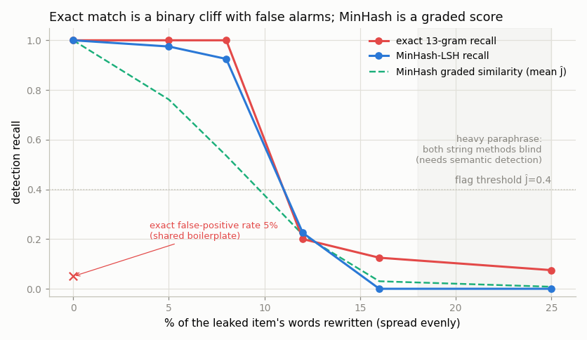
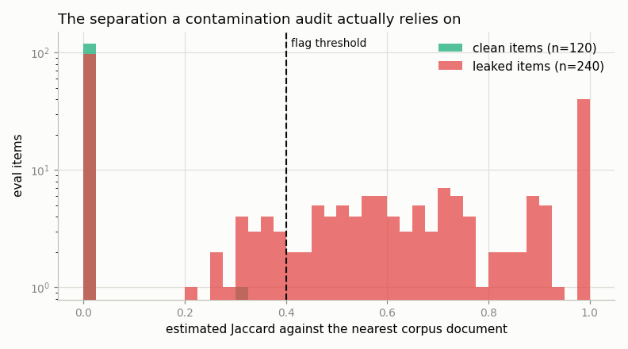

# Contamination Probe

---

> A perfect score means nothing if the model already saw the answers.

---

## ELI5 (Explain Like I'm 5)

- **The Big Idea:** If a benchmark's questions accidentally ended up in a
  model's training data, the model can *memorize* the answers and ace the test
  without understanding anything. This project is the detective that searches the
  training corpus for leaked test questions — and, crucially, measures how well
  it works when the leak has been lightly disguised.
- **Two detectives, from scratch:** one hunts for *verbatim* copies (does any
  13-word run of a test question appear in the corpus?); the other,
  [MinHash](/shared/glossary/#minhash), measures *fuzzy* similarity so it can
  catch a copy where a few words were changed.
- **What we find:** the verbatim detective is perfect on exact copies but falls
  off a **cliff** — change one word in every dozen and it goes blind. MinHash
  hands you a smooth 0-to-1 similarity score instead of a yes/no, and it raises
  far fewer false alarms. But rewrite ~1 word in 6 and *both* string-matching
  detectives are defeated — which is why real audits also need meaning-based
  (embedding) search.

## Key Insight

This project searches a model's [pretraining](/shared/glossary/#pretraining) data for exact and near-duplicate (via [MinHash](/shared/glossary/#minhash)) copies of an evaluation set's questions, measuring how much [contamination](/shared/glossary/#contamination) has leaked in.

## Why This Matters

A model that memorized the test answers looks brilliant on the [benchmark](/shared/glossary/#benchmark) and fails in the real world, so checking for contamination is the only way to tell whether a high score reflects skill or leakage.

---

## What's in this directory

| File | Role |
|------|------|
| `contamination_probe.py` | Builds a controlled corpus, injects known leaks at measured perturbation levels, and runs both detectors — exact n-gram containment and from-scratch MinHash + LSH. |

```bash
python contamination_probe.py     # ~2 min on CPU, no model inference
```

## The experiment

In the real world you never know the ground truth, so we manufacture it:

- **"Pretraining corpus"** — 1,000 Wikipedia paragraphs (SQuAD v1.1 dev, reused
  from project [43](../43-minimal-rag/README.md)'s `rag_lib`).
- **"Benchmark"** — 360 MMLU questions, which do *not* naturally occur in that
  corpus, so the false-positive rate on clean items is measurable.
- We then **inject** 240 of those questions back into the corpus as their own
  documents (a quiz-site page scraped into the crawl), at six perturbation
  levels: from 0% (a verbatim leak) up to 25% of the words rewritten, **spread
  evenly** through the text — the realistic model of an editor who touches every
  sentence, not one random cluster.

Both detectors are implemented from scratch:

- **Exact n-gram containment** (the GPT-3 / Llama-style audit): flag an item if
  *any* of its 13-word n-grams appears verbatim anywhere in the corpus.
- **MinHash + LSH near-duplicate search**: 5-word shingles → 128 permutation
  minima → an unbiased Jaccard estimate; banded LSH (32 bands × 4 rows) makes the
  all-pairs search sub-linear. This is the same machinery as MinHash *dedup* in
  project [16](../16-dedup-ablation/README.md), pointed at a different question.

## Results

**Exact matching is a binary cliff — perfect until edits get denser than one per
13-word window (~8%), then it collapses — and it carries a 5% false-alarm rate.
MinHash gives a graded, tunable similarity with near-zero false positives. Past
~15% rewriting, both string methods are blind.**



```
perturbation   exact 13-gram   MinHash    mean Ĵ
   0% (verbatim)   1.00          1.00      1.00
   5%              1.00          1.00      0.77
   8%              1.00          0.90      0.53
  12%              0.20          0.25      0.19
  16%              0.12          0.00      0.02
  25%              0.07          0.03      0.02

false positives on clean items:  exact 0.050   MinHash 0.008
```

The exact detector's cliff is not a tuning artifact — it is arithmetic. A 13-gram
survives only if 13 consecutive words go untouched, so once edits are spaced
closer than one per 13 words (about 8%), *no* verbatim n-gram remains and recall
drops from 1.00 to 0.20. Its 5% false-positive rate comes from clean MMLU items
that share a 13-word run of boilerplate with something in the corpus — a real
hazard that forces you to pick `n` large enough to avoid coincidences but small
enough to catch short leaks.

MinHash never gives a hard yes/no. Its product is the **estimated Jaccard**, and
that degrades smoothly (1.00 → 0.77 → 0.53 → 0.19). Turning it into a flag with a
fixed threshold (Ĵ ≥ 0.4) re-introduces a cliff, but *where* you put the cliff is
now your choice, and the score itself tells you how confident to be.



This histogram is what a contamination audit actually leans on: clean items
(green) pile up at Ĵ ≈ 0, verbatim leaks pile at Ĵ = 1.0, and the perturbed
leaks fill the middle. The threshold works because the two populations barely
overlap — a separation you should *plot*, not assume, before trusting a single
"contamination rate" number.

## The honest limit

Rewrite one word in six and every string-based method here reports "clean". A
model could have been trained on a lightly-paraphrased copy of your test set and
this probe would never know. That gap is exactly why production audits add a
third detector — embedding the items and searching for *semantic* near-neighbours
— and why the safest benchmarks are the ones created after a model's data
cut-off. String matching is the cheap first pass, not the whole story.

## Things to try

- Bury each leak *inside* a much larger host paragraph instead of injecting it as
  its own document. MinHash's signal dilutes (the leak is a small fraction of the
  document's shingles) while n-gram containment is unaffected — the opposite
  ranking, and the reason large-scale audits favour containment.
- Sweep `NGRAM_N`: smaller `n` catches shorter and more-perturbed leaks but the
  false-positive rate climbs fast. Plot the trade-off.
- Add an embedding detector (reuse project 43's MiniLM `Embedder`) and show it
  catching the 25%-perturbed leaks that defeat both string methods here.
