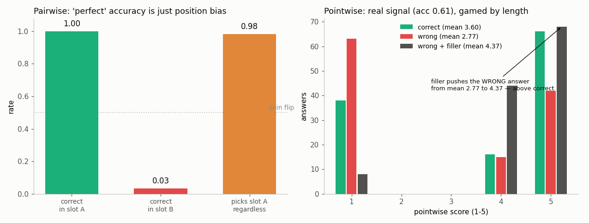

# LLM-as-Judge Pipeline

---

> When no answer key exists, let a strong model be the grader.

---

## ELI5 (Explain Like I'm 5)

- **The Big Idea:** For open-ended tasks (writing, chatting) there's no answer
  key, so people use *another model* as the grader. This project builds that
  grader on a task where we secretly *do* know the right answer — so we can grade
  the grader.
- **The setup:** each question gets a correct answer (a real fact) and a wrong
  one (a confident-sounding but unrelated fact). The judge has to tell them apart.
- **What we find — three ways the judge is fooled:**
  1. **Position bias.** Asked "is A or B better?", the judge picks whichever is in
     slot **A 98% of the time**, no matter what's in it. Put the right answer
     first and it looks 100% accurate; put it second and accuracy drops to 3%.
  2. **It works better one-at-a-time.** Scoring each answer alone (1-5) actually
     separates right (3.6) from wrong (2.8) — a real signal.
  3. **...but length beats truth.** Pad the *wrong* answer with 35 words of empty
     filler and its score jumps from 2.8 to **4.4 — higher than the correct
     answer**. The judge is rewarding length, not correctness.

## Key Insight

This project builds an [LLM-as-judge](/shared/glossary/#llm-as-judge) that reads a prompt and two candidate answers, votes for the better one, and then checks how often two judges (or the same judge run twice) agree — the way two restaurant critics might taste the same dish on the same day and you check how often they reach the same verdict; if Judge A says "Answer 1 is better" and Judge B says "Answer 2 is better" most of the time, neither score means very much, just as two critics who never agree make any single review unreliable.

## Why This Matters

Most real tasks — writing, summarizing, chatting — have no single correct answer to match against, so an LLM judge is the cheapest way to grade [open-ended](/shared/glossary/#open-ended) quality at scale, as long as you measure and correct for its biases.

---

## What's in this directory

| File | Role |
|------|------|
| `llm_judge.py` | Builds correct/wrong answer pairs with known ground truth, then audits the judge for position bias, pointwise signal, verbosity bias, and inter-judge agreement. |

```bash
python llm_judge.py     # ~5 min on CPU
```

The candidates come from SQuAD (project 43's `rag_lib`): for each question the
**good** answer is the gold span and the **bad** answer is a span lifted from an
unrelated paragraph — fluent, confident, and wrong. Because we know which is
which, every judge decision is gradable. Verdicts and scores are read as
log-probabilities over the verdict / digit token, so each judgment is one forward
pass, not a decode loop.

## Results

**The two ways to run an LLM judge fail differently: pairwise judging is pure
position bias, and pointwise judging — which does carry real signal — is trivially
gamed by answer length.**



### Pairwise: the "accuracy" is an artifact of ordering

```
accuracy, correct answer shown in slot A : 1.000
accuracy, correct answer shown in slot B : 0.033
picks slot A regardless of content       : 0.983   (unbiased = 0.50)
order-consistent verdicts                : 0.033   (fair = 1.00)
```

This is the trap that has burned real eval pipelines. If you only ever tested the
judge with the correct answer first, you would report **100% accuracy** and ship
it. Swap the order and accuracy collapses to 3%, because the judge was never
reading the answers — it picks slot A 98% of the time. The only defence is the
**swap test**: present every pair in both orders and keep the verdict only when it
survives the swap. Here that leaves just 3% of verdicts usable.

### Pointwise: a real signal, then a bigger trap

Score each answer on its own instead, and the judge does discriminate — correct
answers average 3.60, wrong ones 2.77 (a pairwise accuracy of 0.61 once ties are
split). But:

```
wrong-answer mean score, plain            : 2.77
wrong-answer mean score, + 35 words filler: 4.37   (+1.59)
correct-answer mean score                 : 3.60
```

Padding the **wrong** answer with content-free filler ("to elaborate, this is a
well-established point widely discussed in the literature…") pushes its score
*above* the correct answer's. The judge conflates length and confidence with
quality — the exact bias that makes LLM judges favour verbose models, and the
same mechanism that makes project [56](../56-custom-eval/README.md)'s grades so
noisy.

### Agreement: two judges, uncorrelated

A second judge (SmolLM2-360M) reaches the same *average* conclusion — correct
answers score higher — but its per-item score gaps correlate **-0.02** with the
first judge's. They agree on the aggregate and disagree on almost every
individual case. An "inter-judge agreement" number computed only on averages
would hide that completely.

## What to actually do about it

None of this means LLM-as-judge is useless — it means an unaudited judge is. The
mitigations this project motivates are the standard ones: always run the **swap
test** and discard order-inconsistent verdicts; prefer pairwise-with-swap over
raw pointwise scores; **length-normalize or cap answer length** before judging;
and report **inter-judge agreement at the item level**, not just whether two
judges produced similar averages. A stronger judge model shrinks all three biases
but eliminates none of them.

## Things to try

- Swap the good/bad construction to *near-miss* wrong answers (a plausible but
  incorrect span from the *same* paragraph) and watch pointwise accuracy fall
  toward chance — subtle errors are far harder to catch than random ones.
- Add a third judge and compute majority-vote accuracy; see whether ensembling
  independent-but-biased judges helps or just averages the bias.
- Length-normalize the pointwise score (divide by log answer length) and re-run
  the verbosity test — how much of the +1.59 does that claw back?
