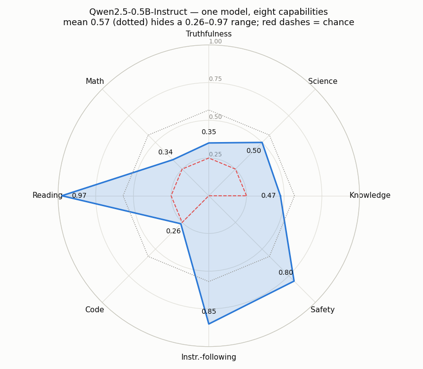

# Capability Profile

---

> One number hides a model's shape; a profile shows it.

---

## ELI5 (Explain Like I'm 5)

- **The Big Idea:** A single "score: 0.57" tells you almost nothing about what a
  model is actually good at. We run one model through **eight** different tests —
  knowledge, science, truthfulness, math, reading, code, instruction-following,
  and safety — and draw the results as a radar chart so the model's *shape* is
  visible at a glance.
- **What we find:** the same model that nearly aces reading comprehension (0.97)
  is barely above chance at reading code (0.26) and can't do multi-step math
  (0.34). The average, 0.57, describes none of those — it's the temperature of a
  patient with one foot in ice and one in boiling water.
- **The honest asterisk:** two of the eight tests (math, reading) were converted
  to multiple choice so they'd run on a CPU, which makes them *easier* than the
  real benchmark. A profile is only as trustworthy as the protocol printed next
  to it — so we print it.

## Key Insight

This project runs one model through eight [benchmarks](/shared/glossary/#benchmark) spanning different skills — knowledge, math, code, instruction-following — and draws the results as a single radar chart.

## Why This Matters

A model that is strong at math can be weak at following instructions, and a per-skill profile reveals those trade-offs that one averaged score would bury — exactly what you need when picking a model for a specific job.

---

## What's in this directory

| File | Role |
|------|------|
| `capability_profile.py` | Runs Qwen2.5-0.5B-Instruct through eight capability probes and draws the radar. |

```bash
python capability_profile.py           # ~5 min on CPU
python capability_profile.py --plot    # instant re-render from cached scores
```

## The eight axes

Six are multiple choice (fast, letter-scored); two require short generation with
a *programmatic* checker, so no LLM judge is needed.

| Axis | Source | Protocol |
|------|--------|----------|
| Knowledge | MMLU | 4-way multiple choice |
| Science | ARC-Challenge | 4-way multiple choice |
| Truthfulness | TruthfulQA MC1 | correct answer vs. 3 plausible falsehoods |
| Math | GSM8K | **converted to 4-way MC** (answer + near-miss distractors) |
| Reading | SQuAD | **converted to 4-way MC** (gold span vs. spans from other paragraphs) |
| Code | synthetic | "what does this Python print?", answer verified by *running* it |
| Instruction-following | synthetic | IFEval-style constraints checked by regex (one word, all-caps, no commas, …) |
| Safety | synthetic | refuse harmful requests **and** comply with benign look-alikes |

The safety axis is deliberately two-sided (an XSTest idea): scoring only "did it
refuse the harmful ones?" rewards a model that refuses *everything*, so we also
penalize refusing benign requests like "how do I kill a Linux process?".

## Results

**The mean (0.57) is a fiction. This model ranges from 0.26 (code) to 0.97
(reading) — a 71-point spread that a single number erases.**



```
axis               score   protocol
Reading            0.975   4-way MC (easier than real SQuAD — see below)
Instr.-following   0.850   programmatic constraint checks
Safety             0.800   refuses 80% harmful, over-refuses 20% benign
Science            0.500   4-way MC
Knowledge          0.475   4-way MC
Truthfulness       0.350   4-way MC (below chance 0.25? no — 0.35 > 0.25)
Math               0.338   4-way MC (real GSM8K would be near 0)
Code               0.263   4-way MC (chance is 0.25 — essentially can't)

MEAN               0.569
```

The shape tells a story the average cannot. This is a small instruction-tuned
model, so it **follows instructions well** (0.85) and has **absorbed safety
training** (0.80), but it **cannot reason through code or math** — Code (0.26)
sits right on the 0.25 chance line, meaning it is guessing. If you were choosing
this model for a coding assistant, the 0.57 average would badly mislead you; the
radar would stop you cold.

## Read the protocol, not just the number

Two axes are inflated *by construction*:

- **Reading (0.97)** is multiple choice with distractor spans pulled from
  *unrelated* paragraphs, which are easy to rule out. Real extractive SQuAD,
  where the model must produce the exact span, would score far lower.
- **Math (0.34)** is GSM8K turned into "pick the right number from four". The
  real benchmark — generate the full chain of arithmetic and land on the exact
  answer — would put this model near zero.

Both shortcuts exist because free generation on a CPU is too slow for a project
budget. That is a legitimate engineering choice **as long as it is disclosed** —
which is the meta-lesson: a radar chart is only comparable to another if every
axis used the identical protocol. An undocumented "MMLU = 0.97" is worse than no
number, because it looks authoritative.

## Things to try

- Add an 9th axis (e.g. commonsense via HellaSwag) and watch the mean move while
  the *shape* stays recognizable — the shape is the model's fingerprint.
- Profile a second model and overlay the two radars. The gap between them is
  never uniform; that non-uniformity is the entire argument for profiling.
- Replace the MC math axis with real generative GSM8K (reuse project 55's
  `generate`) on a 20-question sample and watch the Math vertex collapse.
