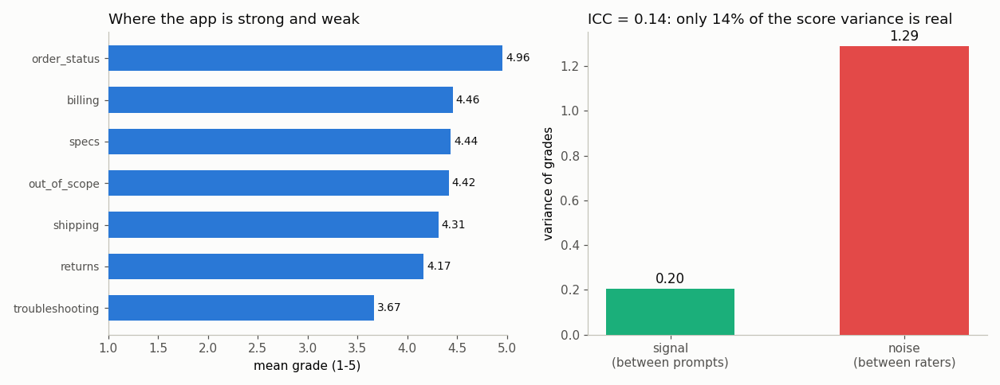

# Custom Eval

---

> The only benchmark that matters is the one shaped like your problem.

---

## ELI5 (Explain Like I'm 5)

- **The Big Idea:** Public benchmarks test trivia and math; your app answers
  *"where is my order?"*. So we build a 100-prompt eval shaped like one real
  application — a customer-support bot for a fictional electronics store — and
  grade the model's replies.
- **Grade it three times:** grading is done by another model, and that grader is
  not consistent. We grade every reply with three differently-worded rubrics (the
  stand-in for three human reviewers) and check how much they disagree.
- **What we find:** the three graders agree on only **14%** of prompts, and a
  reply's grade wobbles by **1.5 points (out of 5)** depending on which rubric
  you use. When we split the score's variance into "real differences between
  prompts" versus "grader noise", only **14%** of it is real. A single graded
  number from this setup is mostly measuring the grader's mood.

## Key Insight

This project defines a 100-prompt evaluation that mirrors a specific [application](/shared/glossary/#application) — say, the customer-support chatbot for your online store — collects three independent grades per prompt, and measures how noisy those grades are. Think of it like building a custom road test for your own car instead of trusting a magazine's generic review: the 100 prompts look like the questions your real users actually ask, and grading each one three times tells you how much of the final score is real signal versus random fluctuation from the grader — the same way checking a thermometer three times at the same spot reveals how much you should trust any single reading.

## Why This Matters

Public [benchmarks](/shared/glossary/#benchmark) rarely match what your users actually do, and grading is noisy, so a small targeted eval with repeated grades tells you far more about real quality than a famous leaderboard number.

---

## What's in this directory

| File | Role |
|------|------|
| `custom_eval.py` | Builds the 100-prompt support eval, generates replies, grades each 3× with three rubrics, and decomposes the grade variance into signal vs. noise. |

```bash
python custom_eval.py     # ~4 min on CPU (replies cached after first run)
```

- **Model under test:** SmolLM2-360M-Instruct (fast generation), prompted with a
  "you are VoltMart's support assistant" system message.
- **Grader:** Qwen2.5-0.5B-Instruct, scoring each reply 1-5 by log-probability
  over the digit tokens.
- **The 100 prompts** are assembled from templates across seven categories —
  order status, returns, shipping, product specs, troubleshooting, billing, and
  a few out-of-scope requests the bot should deflect.

## The three "raters"

To measure grader noise we grade every reply three times, each with a differently
worded rubric — a *plain* 1-5 scale, a *criteria* rubric (helpfulness +
correctness + tone), and a *strict* QA-reviewer rubric. These are the analogue of
three human reviewers who broadly agree on the task but not on the details.

Signal and noise then have clean definitions:

- **Signal** = variance of the per-prompt mean grades (do prompts genuinely
  differ in quality?).
- **Noise** = the average, over prompts, of the variance *across the three
  rubrics* (how much does one prompt's grade wobble by rater?).
- **ICC** = signal / (signal + noise) — the fraction of the score that is real.

## Results

**Only 14% of the score variance is real. The graders are unanimous on 14% of
prompts, and a typical reply's grade swings 1.5 points depending on the rubric.**



```
grand mean grade         4.33 / 5
between-prompt variance  0.204     (signal)
within-prompt variance   1.290     (grader noise)
ICC (signal fraction)    0.137
3 raters unanimous on    14% of prompts   (mean grade spread 1.47)

per category (mean grade):
  order_status    4.96      troubleshooting 3.67
  billing         4.46      returns         4.17
  specs           4.44      shipping        4.31
  out_of_scope    4.42
```

Two readings, both important:

1. **The per-category profile is usable.** `troubleshooting` (3.67) is clearly
   the weak spot and `order_status` (4.96) the strong one — averaged over three
   grades and 16 prompts, that ranking survives the noise. This is the eval doing
   its job: pointing at *where* the app fails.

2. **A single prompt's grade is not usable.** With noise variance (1.29) six
   times the signal variance (0.20), the grade you'd read off one rubric on one
   prompt is mostly random. If you shipped a change and one rubric's average
   moved by half a point, you would have learned nothing — that is inside the
   noise band. **You must average over prompts *and* over graders**, and you must
   measure the noise before you trust any delta.

## Why the noise is so high here

The grader is a 0.5B model scoring on a coarse 1-5 integer scale — low
resolution, and easily swayed by rubric wording (project
[54](../54-llm-as-judge-pipeline/README.md) shows the same grader can be pushed
1.6 points by padding an answer with filler). A stronger grader and a finer scale
would raise the ICC, but *never to 1.0*: human graders on open-ended text
routinely disagree a quarter of the time. The discipline the number teaches is
universal — **report grader noise alongside every LLM-graded score, or the score
is a point estimate with an invisible, larger error bar.**

## Things to try

- Add a fourth rubric or grade each rubric at temperature > 0 to get more
  independent samples, and watch the noise estimate stabilize.
- Swap in Qwen at a finer scale (1-10) and re-measure the ICC — resolution alone
  buys back some signal.
- Replace the templated prompts with 100 real messages from your own product and
  re-run; the category profile is only as representative as the prompt set.
