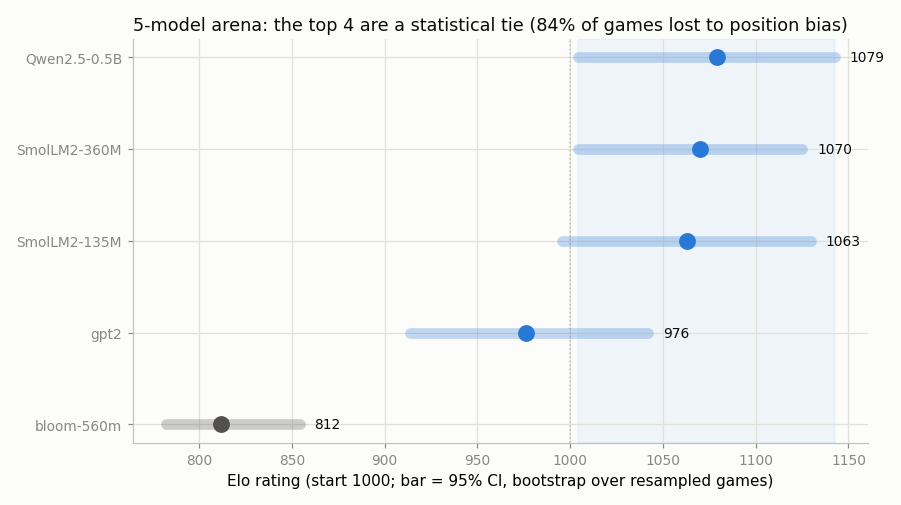

# Arena Reproduction

---

> Rank models the way chess ranks players: by who beats whom.

---

## ELI5 (Explain Like I'm 5)

- **The Big Idea:** Instead of a fixed test, let models *play each other*. Five
  models answer the same 20 prompts; a judge picks the winner of each head-to-head
  matchup; wins and losses become [Elo](/shared/glossary/#elo) ratings, exactly
  like chess.
- **Why reproduce it:** the point isn't the leaderboard — it's discovering how
  shaky the leaderboard is. We shake it two ways: resample the games (does the
  order hold?) and swap the judge model (does *its* order hold?).
- **What we find:** the arena can only confidently name the **worst** model. The
  top four are a statistical tie — with so few clean games their rating bars all
  overlap. And the judge is so biased about answer *position* that **84% of
  matchups are thrown out**, while a weaker second judge is *so* biased it
  produces **zero** usable games and can't rank anything at all. A single arena
  number, taken on faith, would have hidden all of that.

## Key Insight

This project runs a small tournament where five open models answer the same prompts, an [LLM-as-judge](/shared/glossary/#llm-as-judge) picks each winner, and the wins and losses become [Elo](/shared/glossary/#elo) ratings — the [arena](/shared/glossary/#arena) style of evaluation.

## Why This Matters

Pairwise "which is better?" comparisons are often more reliable than fixed-answer [benchmarks](/shared/glossary/#benchmark) for open-ended quality, but the resulting ranking can wobble with the random seed and the choice of judge — something you only appreciate by reproducing it.

---

## What's in this directory

| File | Role |
|------|------|
| `arena.py` | Generates answers from five models, judges every pair in both orders, computes Elo with a bootstrap confidence interval, and tests stability across a second judge. |

```bash
python arena.py     # ~7 min first run; generations cached to checkpoints/ after
```

**Contestants** (chosen to span a real quality range, all CPU-sized): Qwen2.5-0.5B-Instruct,
SmolLM2-360M-Instruct, SmolLM2-135M-Instruct, and two base models with no chat
template — gpt2 and bloom-560m.

**Judging** uses the authentic arena verdict — show both answers, ask which is
better — with the **swap test** from project
[54](../54-llm-as-judge-pipeline/README.md): every pair is judged in both orders
and only order-consistent verdicts count as a game. **Confidence intervals**
bootstrap over the *games* (resampled with replacement), which answers the real
question — "how much would the ranking move on a different sample of matchups?" —
rather than merely reshuffling the processing order.

## Results

**The arena confidently identifies only the worst model. The top four overlap in
a statistical tie, 84% of games are lost to the judge's position bias, and a
second judge can't run the arena at all.**



```
rank  model           Elo    95% CI          win-rate
 1.   Qwen2.5-0.5B     1079   [1004, 1143]    0.77
 2.   SmolLM2-360M     1070   [1004, 1125]    0.80
 3.   SmolLM2-135M     1063   [ 996, 1130]    0.80
 4.   gpt2              976   [ 913, 1042]    0.45
 5.   bloom-560m        812   [ 782,  854]    0.00

judge A (Qwen):   200 matchups, 31 consistent, 169 discarded to position bias (84%)
judge B (SmolLM): 200 matchups,  0 consistent — cannot produce a ranking
```

Three findings, each one a caution about trusting an arena number:

1. **Position bias decimates the data.** Even the better judge gives an
   order-consistent verdict on only 31 of 200 matchups — the other 84% flip when
   you swap the slots (project 54 measured why: a 98% slot-A preference). An arena
   without a swap test would be ranking answer *positions*.

2. **With 31 games, only the floor is real.** The top four models' confidence
   intervals all overlap (the shaded band): Qwen, both SmolLMs, and even *gpt2*
   are a statistical tie. Only bloom-560m (812) sits clearly below everyone.
   Reading "Qwen #1, SmolLM #2" off these point estimates would be reading noise;
   the honest statement is "these four are indistinguishable, bloom is worst."

3. **The ranking is hostage to the judge.** Swap in SmolLM2-360M as the judge and
   it is *so* position-biased that **zero** matchups survive the swap test — it
   cannot rank the field at all. The existence of a ranking, not just its order,
   depended on which judge we used.

## The honest version of "Chatbot Arena"

Public arenas work because they pool **hundreds of thousands** of votes from
**many strong** judges (humans), which averages out both the position bias and
the small-sample noise seen here. This toy reproduces the *mechanism* — pairwise
judging → Elo → bootstrap — precisely so you can feel what it takes to make that
mechanism trustworthy: enough games that the CIs separate, and judges good enough
that the swap test doesn't throw everything away. When you see a real arena
leaderboard, the questions to ask are now concrete: *how many votes per pair, and
how were position and length bias controlled?*

## Things to try

- Raise `N_PROMPTS` and watch the top-4 confidence intervals slowly separate —
  count how many games it takes before Qwen and SmolLM2-135M become
  distinguishable.
- Replace the pairwise verdict with the pointwise scoring from project 54. It
  keeps every game (no position bias to discard) — but rewards fluent rambling,
  which lifts the base models up the board. Neither method is free; compare them.
- Add a stronger judge (a 1.5B+ model) and re-check the swap-test discard rate —
  the fraction of usable games is the single best predictor of whether your arena
  can be trusted.
