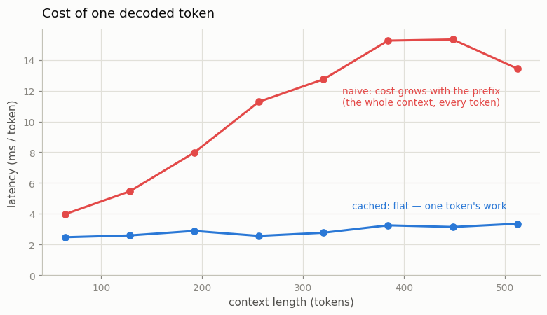
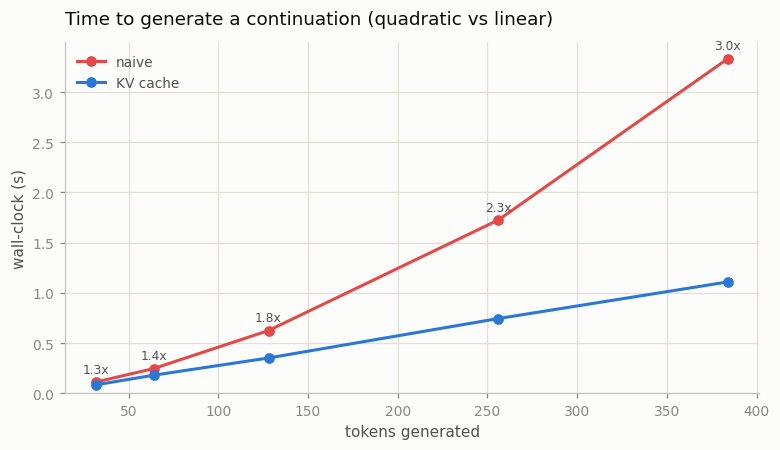
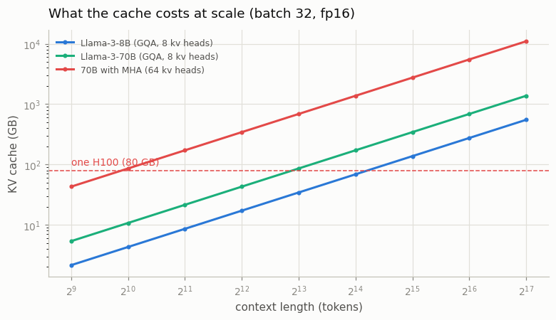

# KV Cache from Scratch

---

> The cheapest speedup is the work you don't repeat.

---

## ELI5 (Explain Like I'm 5)

- **The Big Idea:** To write the 100th word of a sentence, a naive transformer
  re-reads the 99 words before it — from scratch, through every layer. The
  [KV cache](/shared/glossary/#kv-cache) is a notepad: it writes down what the
  model worked out about each word the first time, so the 100th word costs the
  work of *one* word plus a glance at the notepad.
- **Check correctness before speed:** a cache that is fast and *wrong* is
  worthless, and the classic bug — forgetting that a cached token still needs to
  know *where* it sits in the sentence — produces fluent gibberish. So we first
  prove the cached model emits **exactly** the same tokens as the slow one.
- **The twist:** the cache removes **512x the arithmetic** at a 512-token context
  but runs only **~4x faster** on this CPU. The work it deleted was big, perfectly
  parallel matrix multiplication — the kind hardware is fastest at. Wasted
  parallel FLOPs are cheap; *serial* ones are expensive. That gap is why the rest
  of this phase exists.

## Key Insight

This project adds a [KV cache](/shared/glossary/#kv-cache) to a [transformer](/shared/glossary/#transformer) decoder so each newly generated token reuses the keys and values already computed for earlier tokens instead of recomputing [attention](/shared/glossary/#attention) over the entire prefix, and measures the speedup against a naive recompute-every-step baseline.

## Why This Matters

Without the cache, generating each new token re-reads the whole prompt — so cost grows with sequence length squared and inference crawls at long contexts. With it, decoding scales roughly linearly with sequence length, which is why the KV cache is the foundation every production serving engine is built on.

---

## What's in this directory

| File | Role |
|------|------|
| `kv_lib.py` | The cache (`KVCache`), a cached forward pass (`forward_cached`), and the two decoders (`generate_naive`, `generate_cached`). Also trains the shared 1.8M-param Shakespeare model that projects 61, 62 and 64 reuse. |
| `kvcache.py` | Proves the cache is exact, then measures latency, generation time and memory. |

```bash
python3 kvcache.py          # ~6 min (the first run also trains the shared model, ~3 min)
python3 kvcache.py --plot   # redraw the figures from outputs/*.csv
```

The model is project 08's GPT, unchanged. **The cache adds no parameters and
alters no weights** — `forward_cached` calls the very same `nn.Linear` modules and
merely remembers what they returned. Every number below is a pure
inference-engineering win, bought with bookkeeping.

## Results

### 1. First, it has to be exact

```
greedy tokens identical : True
max |logit| difference  : 0.00e+00
```

Not "close" — **identical, to the bit**. Worth checking first, because the
interesting failure mode of a KV cache is silent. Keys and values are cached
*after* [RoPE](/shared/glossary/#rope) is applied, so every cached token carries
its position baked in; the new token must then be told it sits at position `t`,
not position 0. Get that wrong and the cache is still fast, the output is still
fluent Shakespeare, and it is quietly wrong. `forward_cached` takes a
`pos_offset` for precisely this reason.

### 2. What the cache is worth



The naive decoder's cost per token climbs with the prefix it must re-read. The
cached decoder's is flat: one token's work, however long the context.

| context | naive | KV cache | wall-clock | arithmetic saved |
|--------:|------:|---------:|-----------:|-----------------:|
| 64  |  3.97 ms/tok | 2.47 ms/tok | 1.6x | 64x |
| 128 |  5.46 ms/tok | 2.59 ms/tok | 2.1x | 128x |
| 256 | 11.28 ms/tok | 2.56 ms/tok | 4.4x | 256x |
| 448 | 15.33 ms/tok | 3.14 ms/tok | 4.9x | 448x |
| 512 | 13.43 ms/tok | 3.35 ms/tok | 4.0x | 512x |



End to end, a 384-token continuation drops from 3.33 s to 1.11 s (**3.0x**), and
the curve straightens from quadratic to linear — the whole point.

### 3. The gap between FLOPs and seconds

Look at the last two columns. At a 512-token context the cache eliminates **99.8%
of the arithmetic** (512x) and returns **4x** of wall-clock. Where did the other
100x go?

The work the naive decoder wastes is *embarrassingly parallel*: it re-runs 512
tokens through the MLPs as one big matrix multiply, and a 512-row matmul uses this
CPU far more efficiently — per FLOP — than the 1-row matmul the cached decoder is
left with. The cache trades a mountain of cheap parallel work for a molehill of
expensive serial work.

That is not a disappointment. It is the central fact of LLM serving, and it points
directly at everything else in this phase:

- **Decode is memory-bandwidth-bound, not compute-bound.** Each cached token reads
  *every weight in the model* to do one token of arithmetic. The hardware sits
  starved, waiting on memory.
- So the throughput fix is **batching** ([project 61](../61-serve-with-vllm/README.md)):
  amortize that weight read across many sequences at once.
- The latency fix is **speculative decoding** ([project 60](../60-speculative-decoding/README.md)):
  get more than one token out of a single weight read.
- The memory fix is **quantization** ([project 59](../59-quantize-a-7b-model/README.md)):
  make the weight read smaller.

### 4. The cache is not free



```
KV bytes = 2 (K and V) x n_layers x n_kv_heads x d_head x seq_len x batch x bytes_per_number
```

| | KV cache |
|---|---:|
| this project (1.8M params, 512 ctx) | 1.6 MB |
| Llama-3-8B @ 8k, one request | 1.1 GB |
| Llama-3-8B @ 8k, batch 32 | 34 GB |
| Llama-3-70B @ 8k, batch 32 | 86 GB |
| Llama-3-70B @ 128k, batch 32 | 1,374 GB |

A 70B model's weights already need two 80 GB H100s in bf16 — and then serving 32
users at 8k context asks for another **86 GB just for the cache**. This single
table explains three things you will meet later: why modern models use
[GQA](/shared/glossary/#gqa) (that 86 GB would be 687 GB with 64 KV heads instead
of 8), why [PagedAttention](/shared/glossary/#pagedattention) exists
([project 61](../61-serve-with-vllm/README.md)), and why people quantize the cache
itself ([project 65](../65-fp8-serving/README.md)).

## Things to try

- **Break it on purpose.** Force `pos_offset=0` in `forward_cached` so every
  decoded token believes it sits at position 0. The speedup survives untouched;
  the correctness check fails and the samples turn to mush. This is the most
  common KV-cache bug in the wild, and it is worth seeing once.
- Set `n_kv_heads=1` in `make_config` (that is [MQA](/shared/glossary/#mqa)) and
  re-run the memory table: the cache shrinks by `n_head / n_kv_heads`. That factor
  is the entire reason nobody ships plain [MHA](/shared/glossary/#mha) any more.
- Time a *batched* cached decode (16 sequences at once) against a single sequence.
  Per-token latency barely moves — the weight read is shared — which is the
  observation project 61 turns into a serving engine.
