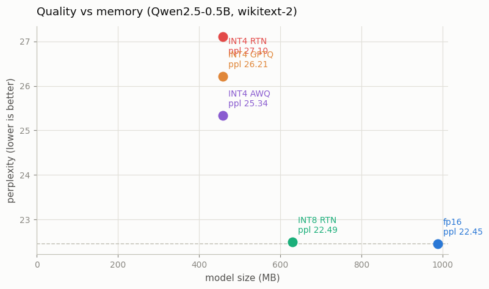
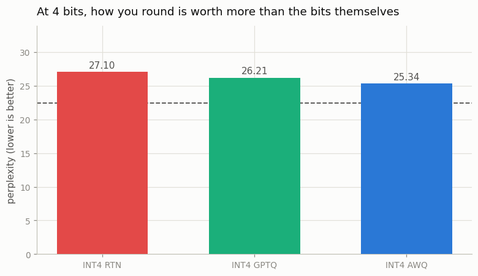
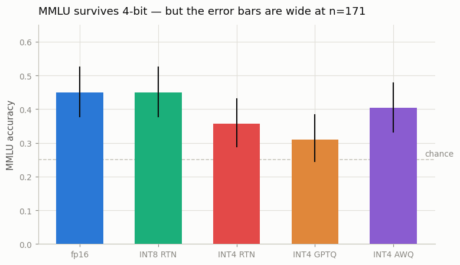

# Quantize a 7B Model

---

> Smaller numbers, the same model, a fraction of the memory.

---

## ELI5 (Explain Like I'm 5)

- **The Big Idea:** A model's weights are stored as 16-bit numbers, but most of
  those bits are noise. [Quantization](/shared/glossary/#quantization) rounds every
  weight onto a coarse grid — 256 levels for [INT8](/shared/glossary/#int8), just
  16 for 4-bit — so the model takes a half or a quarter of the memory, and decode
  (which is bottlenecked on *reading* those weights) gets faster.
- **8 bits is free. 4 bits is where the craft is.** Rounding to INT8 costs
  essentially nothing. Rounding to 4 bits with plain nearest-value rounding
  visibly hurts — and that is where [GPTQ](/shared/glossary/#gptq) and
  [AWQ](/shared/glossary/#awq) earn their keep. They round *the same weights to
  the same grid*, but choose **how** to round by looking at real data.
- **What we find:** at 4 bits, AWQ recovers 38% of the quality that naive rounding
  threw away and GPTQ recovers 19% — for zero extra bytes. Same size, better
  model, just a smarter rounding rule.

## Key Insight

This project takes a 7B model and applies two [quantization](/shared/glossary/#quantization) recipes — [GPTQ](/shared/glossary/#gptq) to compress weights to [INT8](/shared/glossary/#int8) and [AWQ](/shared/glossary/#awq) to compress them to 4-bit — then measures how much GPU memory is saved and how a few [benchmark](/shared/glossary/#benchmark) scores change.

## Why This Matters

Shrinking weights from 16-bit down to 8- or 4-bit can fit a 7B model on a consumer GPU and read it through memory faster, which is the simplest way to cut both the cost and the latency of serving while usually paying only a small quality cost.

---

## What's in this directory

| File | Role |
|------|------|
| `quant_lib.py` | RTN, [GPTQ](/shared/glossary/#gptq) and [AWQ](/shared/glossary/#awq) written from scratch, plus the layer-by-layer driver and the evaluation harness. Imported by project 65. |
| `quantize.py` | Quantizes the model five ways and scores each on perplexity, MMLU and memory. |

```bash
python3 quantize.py          # ~9 min
python3 quantize.py --plot   # redraw from outputs/results.csv
```

### An honest note on the "7B"

A 7B model does not fit on this CPU-only box, so every recipe here runs on
**Qwen2.5-0.5B-Instruct** — a real, modern, [GQA](/shared/glossary/#gqa)
transformer with a 152k vocabulary. Nothing about the algorithms changes; only the
absolute numbers do. If anything this is the *harder* test: a 0.5B model has less
redundancy to spare than a 7B, so 4-bit rounding hurts it more than it would hurt
the model the guide asked for.

The libraries do not fit either — `auto-gptq`, `awq` and `bitsandbytes` are not
installed — which turned out to be a gift. Both algorithms are about thirty lines
once you see them:

- **GPTQ** quantizes a weight matrix **one column at a time**, and after each
  column it pushes the rounding error it just made into the columns it has not
  done yet, so the errors cancel in the layer's *output*. It needs the Hessian
  `H = 2 XᵀX` of the layer's inputs to know which direction to push.
- **AWQ** notices that weights multiplied by *large activations* matter most. It
  scales those input channels up before rounding (and divides the scale back out
  afterwards), which moves the important weights onto a finer part of the grid. It
  needs only the mean activation magnitude per channel.

Both are *data-aware*: they get 16x256 tokens of wikitext as calibration. RTN sees
no data at all.

## Results



| recipe | size | wikitext ppl | MMLU (n=171) |
|---|---:|---:|---:|
| fp16 baseline | 988 MB | **22.45** | 0.450 |
| INT8 RTN (per-channel) | 630 MB | 22.49 | 0.450 |
| INT4 RTN (group-128) | 458 MB | 27.10 | 0.357 |
| INT4 GPTQ (group-128) | 458 MB | 26.21 | 0.310 |
| INT4 AWQ (group-128) | 458 MB | **25.34** | 0.404 |

### 1. INT8 is free

Perplexity moves from 22.450 to 22.494 — **0.2%** — and MMLU does not move at all,
for a 36% smaller model. There is no interesting decision to make here: if you are
serving in fp16 and not already using INT8 weights, you are paying for bits nobody
is reading. (The size drop is less than the naive half because embeddings and the
LM head stay in fp16, as they do in production — they are read once per token, not
once per layer.)

### 2. At 4 bits, *how* you round is worth more than the bits



All three 4-bit models are **exactly the same size** — 458 MB, identical grid,
identical group size. The only difference is which value each weight got rounded
to:

```
fp16      22.45   <- the target
INT4 AWQ  25.34   <- recovers 38% of what naive rounding lost
INT4 GPTQ 26.21   <- recovers 19%
INT4 RTN  27.10   <- naive rounding
```

That is the entire content of the GPTQ and AWQ papers, reproduced: **for free, in
bytes, you can buy back a third of the damage** just by choosing rounding
directions with a few hundred tokens of calibration data in hand. Rounding is not
one decision repeated a billion times; it is a billion coupled decisions, and the
naive method treats them as independent.

### 3. Where the benchmark disagrees with perplexity — and who to believe

MMLU tells a *different* story: AWQ 0.404, RTN 0.357, GPTQ 0.310. GPTQ has the
second-best perplexity and the worst MMLU.



Do not over-read that. With n=171 questions the 95% confidence intervals are
roughly ±7 points wide and **every 4-bit interval overlaps every other one** — this
is exactly the small-sample trap [project 51](../51-mmlu-re-run/README.md) and
[project 52](../52-prompt-sensitivity-sweep/README.md) exist to teach. Perplexity
is measured over 8,192 tokens and separates the methods cleanly; a 171-question
multiple-choice score does not have the resolution to rank them. The honest
statement is: *4-bit costs a few points of MMLU, and perplexity says AWQ handles it
best.*

(One real effect may hide in there too: GPTQ is the more calibration-hungry of the
two. It is estimating a 4864x4864 Hessian per layer from 4,096 tokens, and the
papers use 128 sequences, not 16. AWQ only needs a per-channel average, which 16
sequences estimate fine. If you have budget, raise `N_CALIB` and watch GPTQ move.)

### 4. What this means for the model the guide actually asked for

| model | fp16 | INT8 | INT4 |
|---|---:|---:|---:|
| Llama-2-7B | 13.5 GB | 6.9 GB | **3.5 GB** |
| Llama-3-8B | 16.1 GB | 8.2 GB | **4.2 GB** |
| Llama-3-70B | 141.2 GB | 72.3 GB | **36.7 GB** |

This table is the whole reason anyone bothers. A 7B in fp16 does not fit a 12 GB
consumer GPU once you add a [KV cache](/shared/glossary/#kv-cache); at 4 bits it
fits with room to spare. A 70B needs two 80 GB H100s in fp16 and fits on **one** at
4 bits. And because decode is bandwidth-bound (see
[project 58](../58-kv-cache-from-scratch/README.md)), reading a quarter of the
bytes is also roughly a 4x higher ceiling on tokens/sec — the memory saving *is*
the speedup.

We do not measure that speedup here, and the number above is a ceiling rather than
a promise: this CPU has no int4 kernels, so `quant_lib` stores the rounded weights
back as fp32 ("fake quantization"). The arithmetic the model sees is exactly what a
real int4 kernel would feed it, so **every quality number above is real**; the
memory column is computed analytically from the packed layout (weights + one fp16
scale and zero-point per group of 128).

## Things to try

- Set `group_size=-1` (one scale per output channel instead of one per 128 inputs)
  and re-run INT4 RTN. Perplexity falls apart — a single outlier weight in a row now
  stretches the grid for all 896 of its neighbours. Group size is the cheapest knob
  in quantization.
- Raise `N_CALIB` from 16 to 64 and see how much GPTQ improves versus AWQ. This is
  the calibration-hunger difference, made concrete.
- Try 3-bit (`bits=3`). Somewhere below 4 bits every method falls off a cliff, and
  finding that cliff for yourself is more convincing than reading that it exists.
- Quantize the embeddings and LM head too, and watch a 152k-vocabulary model
  degrade much faster than you expected — there is a reason production leaves them
  alone.
