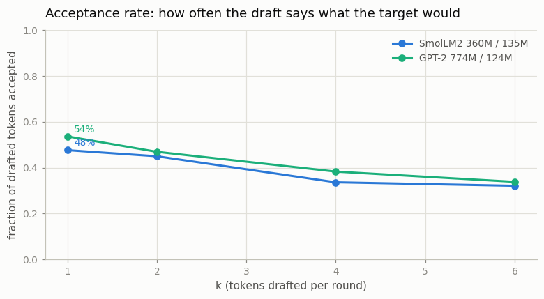
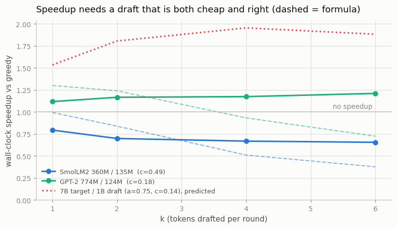
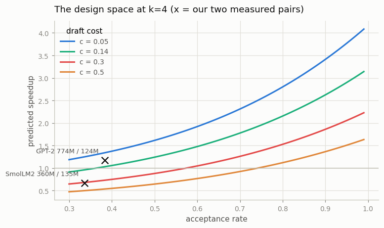

# Speculative Decoding

---

> Let a small model guess and the big one only check.

---

## ELI5 (Explain Like I'm 5)

- **The Big Idea:** Decoding is slow because it is *serial* — token 100 cannot start
  until token 99 exists. But **checking** is parallel. So let a small, cheap model
  guess the next `k` tokens, then have the big model check all `k` in a single
  forward pass and keep the longest prefix it agrees with. The guesses that survive
  were free.
- **It is exact, not approximate.** This is the part that surprises people: the
  output is **bit-identical** to what the big model would have produced on its own.
  We verify that, and it holds for every configuration below. You are not trading
  quality for speed; you are trading *wasted draft compute* for speed.
- **Two levers decide whether it pays:** how *often* the draft is right (acceptance
  rate `a`) and how *cheap* the draft is (cost ratio `c`). We run two real pairs
  that each fail on a different lever, and one of them ends up **slower than not
  using speculation at all**. Knowing why is the whole project.

## Key Insight

This project pairs a 1B draft model with a 7B target model for [speculative decoding](/shared/glossary/#speculative-decoding): the draft cheaply proposes a few tokens ahead at each step, the target verifies them all in a single parallel pass, and the longest matching prefix is kept. The project then measures the acceptance rate and the wall-clock speedup.

## Why This Matters

Single-token decoding is the slowest part of serving an [LLM](/shared/glossary/#llm) because it cannot be batched along the time axis — each new token has to wait for the one before it to be sampled before it can even start, like cars in a single-lane tunnel where the next car cannot enter until the one ahead clears the gate. (Batching *across* requests adds more cars in parallel lanes; batching *along the time axis* would mean letting cars in the same lane move at once, which the chain of dependencies forbids.) Letting a cheap helper propose several tokens that the big model verifies in parallel sidesteps this bottleneck and routinely gives a 2–4× speedup with no quality loss, which is why speculative decoding is now standard in production stacks.

---

## What's in this directory

| File | Role |
|------|------|
| `speculative.py` | The algorithm (draft, verify, accept, roll back), the exactness check, an acceptance/speedup sweep over `k`, and the cost model that explains the results. |

```bash
python3 speculative.py          # ~7 min
python3 speculative.py --plot   # redraw from outputs/results.json
```

### The pairs, and why these two

A 7B target and a 1B draft do not fit on this CPU box, but the algorithm does not
care about scale — it cares about the *ratio* between the two models, and about
their agreement. The one hard requirement is a **shared tokenizer**: the draft's
token ids must mean the same thing to the target. That gives us two real pairs:

| pair | why it is interesting |
|---|---|
| **SmolLM2** 360M target / 135M draft | Same family, same training data — the draft should guess well. But it is only ~2x cheaper than the target. |
| **GPT-2** 774M target / 124M draft | The draft is genuinely cheap (~5x). But it is a weaker, differently-trained model, so it guesses worse. |

Each pair is crippled on one of the two levers. That is deliberate.

### The cost model

Everything below is predicted by three lines of algebra:

```
expected tokens accepted per round   E = (1 - a^(k+1)) / (1 - a)
cost of a round, in target-forwards  C = k*c + 1        (k draft steps + 1 verify)
speedup                                = E / C
```

`a` = acceptance rate, `c` = draft cost / target cost, `k` = tokens drafted per round.

## Results

### 1. It is exact

```
output identical to plain greedy: True     (both pairs, every k)
```

Speculative decoding does not approximate the target — it reproduces it token for
token. The rejection rule guarantees it: a drafted token is kept **only if it is
exactly what the target's own argmax would have been**, and the moment one is
rejected everything after it is thrown away and the target's own token is used
instead.

Making that true in code comes down to one thing: when a guess is rejected, **both
KV caches must be rolled back**. A rejected token that stays in the cache is a token
the model will attend to on the next round even though it was never really
generated. `t_past.crop(n_cached)` / `d_past.crop(n_cached)` is the whole fix, and
it is the easiest thing in this project to get subtly wrong.

### 2. Acceptance falls as you draft further ahead



| k | SmolLM2 pair | GPT-2 pair |
|--:|---:|---:|
| 1 | 0.477 | 0.537 |
| 2 | 0.450 | 0.469 |
| 4 | 0.336 | 0.383 |
| 6 | 0.321 | 0.338 |

Both drafts guess right about half the time on the *first* token and get steadily
worse further out — naturally, since each additional guess is conditioned on the
previous guesses being right. This is why `k` is not "free": drafting 6 tokens
costs 6 draft forwards but the last ones are rarely kept.

### 3. Speedup: one pair wins, one pair *loses*



| | cost ratio `c` | best speedup |
|---|---:|---:|
| SmolLM2 360M / 135M | 0.486 | **0.79x** (i.e. 21% *slower*) |
| GPT-2 774M / 124M | 0.181 | **1.21x** |

The SmolLM2 pair has a perfectly respectable acceptance rate — and speculation still
makes it **slower**. The cost model says why: with `c = 0.486`, drafting 4 tokens
burns `4 x 0.486 = 1.94` target-forwards *before* the verify pass even starts. You
pay nearly three target forwards per round to win an expected ~1.5 tokens. The draft
is not cheap enough to be worth consulting, no matter how well it guesses.

The two pairs accept at almost the same rate (0.48 vs 0.54 at k=1). **Essentially all
of the difference in outcome comes from `c`** — 0.486 versus 0.181. That is the
lesson in one line: *a draft that is right half the time and costs half as much is
worthless; a draft that is right half the time and costs a tenth as much is a real
speedup.*

### 4. Where the "2-4x" claims come from



Plug in the numbers production stacks actually run — a ~7B target with a ~1B draft
(`c ≈ 0.14`) that has been **distilled from the target** so it agrees ~75% of the
time — and the same formula gives **1.96x at k=4**. Push to a Medusa/EAGLE-style
draft that is nearly free (`c ≈ 0.05`) and agrees ~80% of the time, and it gives
**2.8x**. *That* is the 2-4x the literature reports, and neither of our pairs is
anywhere near it: we have the cost ratio or the agreement, never both at once.

This is exactly why real deployments do not grab an off-the-shelf small model as a
draft. They train one — Medusa and EAGLE go further and bolt extra prediction heads
onto the target itself, which makes the "draft" nearly free (`c ≈ 0.05`) *and*
highly agreeable, because it shares the target's own hidden states.

### 5. Where our measurements beat the formula (and why)

At `k=6` the GPT-2 pair measures **1.21x** while the formula predicts 0.72x. The
formula is not wrong; its assumptions are CPU-hostile. It charges `k * c` for
drafting and `1` for verification — but on this machine a *7-token* verify forward
costs barely more than a *1-token* one, because small-model forwards here are
dominated by fixed per-call overhead rather than by arithmetic. So drafting deeper
is cheaper in reality than the model thinks.

On a GPU, where kernels are actually FLOP-bound, the formula is much tighter. Take
this as a reminder that a cost model is a *model* — and that the only way to know
which regime you are in is to measure.

## Things to try

- Distill a draft from the target (project [64](../64-distill-7b-1b/README.md) has
  the machinery) and re-measure the acceptance rate. This is the single highest-value
  change: it moves `a` without touching `c`.
- Implement the *sampling* version (Leviathan et al.'s rejection rule with the
  residual distribution `max(0, p_target - p_draft)` renormalized). It preserves the
  target's distribution exactly at temperature > 0, which the greedy check here does
  not cover, and it is only a few lines more.
- Sweep `k` at a fixed pair and find the optimum. The formula says it exists (deeper
  drafts win more tokens but cost more, and acceptance decays), and the curve has a
  visible maximum.
- Use a *much* worse draft (gpt2 drafting for SmolLM2 is impossible — different
  tokenizers — but `distilgpt2` drafting for `gpt2-large` works). Acceptance
  collapses, and you can watch the speedup fall below 1.0 in real time.
