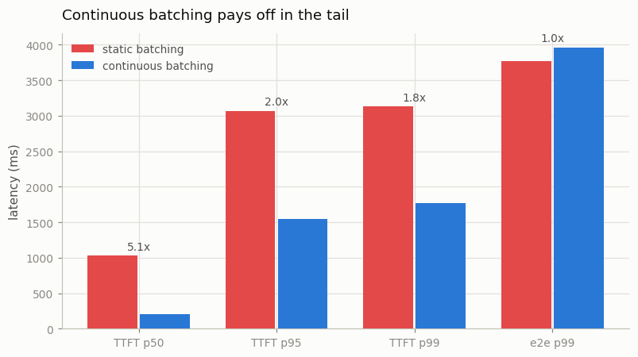
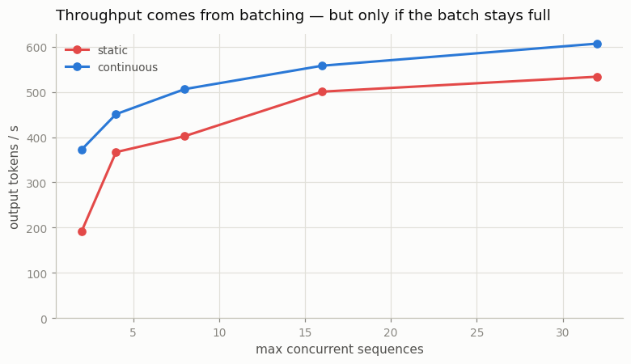
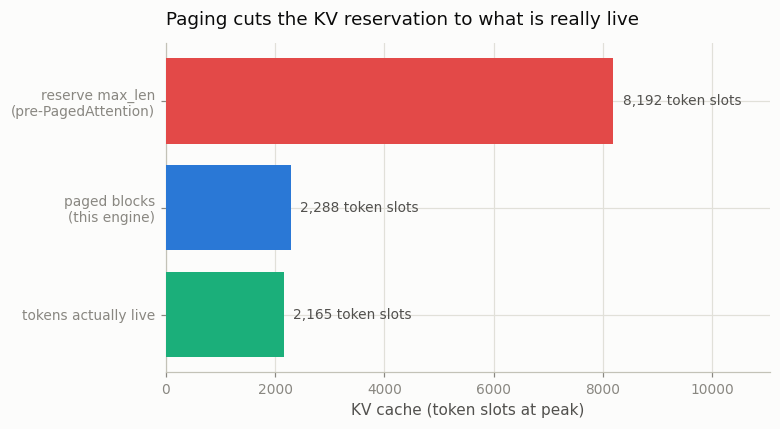

# Serve with vLLM

---

> Go from a notebook script to an HTTP server in one engine.

---

## ELI5 (Explain Like I'm 5)

- **The Big Idea:** A serving engine is a *scheduler*. Requests arrive at random
  times and want wildly different numbers of tokens, and its job is to keep the
  hardware busy anyway. [vLLM](/shared/glossary/#vllm) is famous for two ideas that
  do exactly that — and this project builds both from scratch.
- **[Continuous batching](/shared/glossary/#continuous-batching):** the old way
  (*static batching*) fills a batch, runs it until every member finishes, and only
  then admits anyone new — so a dozen short requests sit trapped behind one long
  one, and newcomers queue behind all of them. Continuous batching re-decides the
  batch **at every decode step**: finished sequences leave immediately, waiting ones
  take their seats.
- **[PagedAttention](/shared/glossary/#pagedattention):** instead of reserving each
  request a [KV cache](/shared/glossary/#kv-cache) slab big enough for the longest
  reply it *might* produce, hand out small fixed-size blocks on demand — memory
  managed like an operating system, not like a 1970s mainframe.
- **What we measure:** continuous batching drops median time-to-first-token from
  **1026 ms to 201 ms**, and paging cuts the KV reservation **3.6x**.

## Key Insight

This project stands up a [vLLM](/shared/glossary/#vllm) server in front of an open model and load-tests it with many simultaneous requests, so you can directly observe [continuous batching](/shared/glossary/#continuous-batching) and [PagedAttention](/shared/glossary/#pagedattention) at work on a real model.

## Why This Matters

A serving engine like vLLM turns the slow per-user, one-token-at-a-time decode into hundreds of tokens per second across many concurrent users by dynamically merging their requests — the engineering gap between a demo script and a real production system.

---

## What's in this directory

| File | Role |
|------|------|
| `engine.py` | The engine: a `BlockPool` (PagedAttention), a scheduler with `static` and `continuous` policies, and prefix caching (which [project 62](../62-prefix-cache-study/README.md) studies). ~250 lines. |
| `serve.py` | The load test: Poisson arrivals, heavy-tailed output lengths, TTFT / tail latency / throughput / KV memory. |

```bash
python3 serve.py          # ~6 min
python3 serve.py --plot   # redraw from outputs/results.csv
```

### Why we build the engine instead of running vLLM

vLLM needs a CUDA GPU. This box has none and the package is not installed. So
instead of driving someone else's server and reading its dashboard, we implement
its two core ideas on top of the [KV cache](/shared/glossary/#kv-cache) from
[project 58](../58-kv-cache-from-scratch/README.md). For learning that is the
better trade: **an engine you can read beats a server you can only curl.** The
mechanisms below — block tables, on-demand allocation, iteration-level scheduling —
are the real ones; only the scale is small.

The workload is what makes the comparison honest: 48 requests arriving at 25/s, and
**80% want ~24 output tokens while 20% want ~150**. That variance is the whole
problem. Without a heavy tail, static batching looks perfectly fine.

## Results

### 1. Continuous batching: same work, a fifth of the wait



| max_batch = 16 | static | continuous | |
|---|---:|---:|---|
| throughput | 488 tok/s | **518 tok/s** | 1.1x |
| TTFT p50 | 1026 ms | **201 ms** | **5.1x** |
| TTFT p95 | 3067 ms | **1545 ms** | 2.0x |
| TTFT p99 | 3127 ms | **1765 ms** | 1.8x |
| e2e p99 | 3769 ms | 3959 ms | 0.95x |

The throughput gap is modest; the **latency** gap is not. That is the true shape of
the win: static batching does not waste much *compute*, it wastes *time*. A request
arriving one step after a batch forms waits for that entire batch — including its
150-token straggler — before anyone even looks at it. Continuous batching seats it
at the next decode step.

The effect grows with the batch width:

| max_batch = 32 | static | continuous | |
|---|---:|---:|---|
| throughput | 534 tok/s | **607 tok/s** | 1.1x |
| TTFT p50 | 527 ms | **25 ms** | **21x** |
| TTFT p99 | 1161 ms | **74 ms** | **16x** |

With room for 32 concurrent sequences the continuous scheduler admits almost
everyone on arrival, and median TTFT collapses to roughly one decode step.

**And one number that does *not* improve: end-to-end p99** (3.8 s static vs 4.0 s
continuous). The slowest request wants 150 tokens, and no scheduler makes serial
decoding shorter — continuous batching gets you *seen* sooner, it does not make your
long reply *finish* sooner. Worth stating plainly, because "2x faster serving"
claims almost always mean throughput or TTFT, never tail e2e.

### 2. Throughput comes from batching — if you can keep the batch full



| max_batch | static | continuous | |
|---:|---:|---:|---|
| 2 | 192 tok/s | **373 tok/s** | **1.9x** |
| 4 | 367 tok/s | **451 tok/s** | 1.2x |
| 8 | 402 tok/s | **506 tok/s** | 1.3x |
| 16 | 501 tok/s | **558 tok/s** | 1.1x |
| 32 | 534 tok/s | **607 tok/s** | 1.1x |

Both curves climb with batch size, which is the direct answer to
[project 58](../58-kv-cache-from-scratch/README.md)'s finding that decode is
**memory-bandwidth-bound**: a decode step reads every weight in the model whether
it serves 1 sequence or 32, so widening the batch amortizes that read and tokens/sec
rises almost for free.

Continuous batching leads everywhere and leads by the *most* at small batch sizes
(**1.9x at max_batch=2**) — a narrow batch is exactly where one straggler hurts
most. That is the throughput half of the vLLM story: not that batching is fast
(everyone knew that), but that **a static batch is never as full as it looks**.

### 3. PagedAttention: stop reserving what you will not use



```
tokens actually live at peak :  2,165 slots
paged blocks (this engine)   :  2,288 slots   (143 blocks x 16 tokens)
reserve max_len per request  :  8,192 slots   (16 running x 512 max context)
```

The pre-vLLM way is to hand every running request a contiguous slab sized to the
model's *maximum* context, because you cannot know in advance how long its reply
will run. That reserves **8,192 token slots to hold 2,165 live ones — 74% of the KV
cache is air** — and it hard-caps concurrency at `KV_memory / max_len` no matter how
short the actual requests turn out to be.

Paging hands out 16-token blocks on demand as each sequence grows. It reserves
**2,288 slots — 3.6x less** — and the only waste left is the unfilled tail of each
sequence's final block (at most 15 tokens per request; 5% here).

That 3.6x is not a memory curiosity. KV memory is what **caps the batch size**, and
section 2 just showed batch size is what buys throughput. PagedAttention is a
throughput optimization wearing a memory optimization's clothes.

## Things to try

- Raise `RATE` to 100 req/s and watch static TTFT p99 blow past 10 s while the
  continuous scheduler degrades gracefully. Overload is where schedulers show their
  true character.
- Make the output lengths *uniform* (delete the heavy tail in `workload`). Static
  batching nearly catches up — proving it was the straggler, not the batching.
- Shrink `n_blocks` until `_grow` raises "KV pool exhausted". A real engine
  **preempts** here — evicting a running sequence's blocks and recomputing or
  swapping them back later — rather than crashing. Implementing that preemption is
  the natural next step and is what makes vLLM survive real overload.
- Set `block_size=1` and re-measure. Fragmentation vanishes, but the block table
  grows 16x — the classic page-size trade-off, straight out of an operating-systems
  course.
