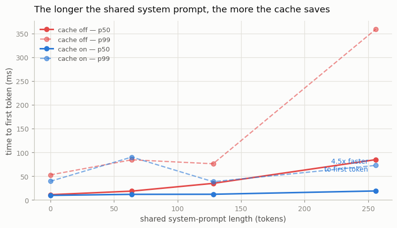
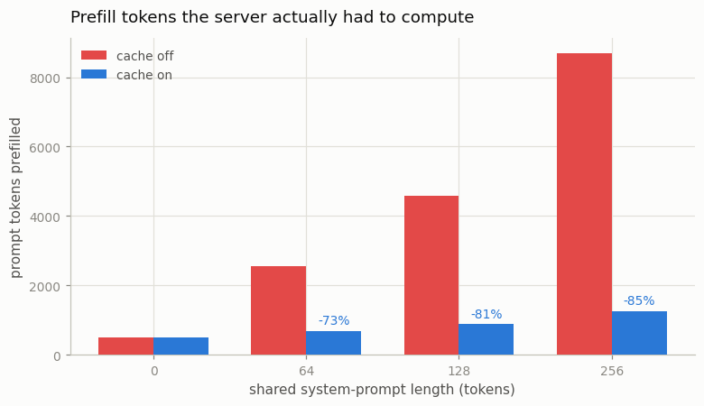

# Prefix-Cache Study

---

> Stop redoing the same long [system prompt](/shared/glossary/#system-prompt) for every request.

---

## ELI5 (Explain Like I'm 5)

- **The Big Idea:** Your users' prompts are not fresh text. They are the *same*
  long preamble — a persona, tool definitions, retrieved documents, few-shot
  examples — with a short question stapled to the end. Without a
  [prefix cache](/shared/glossary/#prefix-cache) the server pushes that identical
  preamble through every layer of the model again for every single request.
- **The fix is bookkeeping, not maths:** the [KV cache](/shared/glossary/#kv-cache)
  blocks for a run of tokens depend only on *those tokens and everything before
  them*. So hash the prefix, and if a later request starts with the same tokens,
  point it at the blocks that already exist. Nothing is recomputed.
- **What we find:** with a 256-token shared system prompt, the server prefills
  **8,690 tokens without the cache and 1,266 with it (85% skipped)**, and the median
  [TTFT](/shared/glossary/#ttft) drops from **85 ms to 19 ms (4.5x)**. The p99 —
  the number your angriest user feels — drops **4.9x**.

## Key Insight

This project runs the same workload twice on a [vLLM](/shared/glossary/#vllm) server — once with the [prefix cache](/shared/glossary/#prefix-cache) turned on and once with it turned off — then compares the [tail latency](/shared/glossary/#tail-latency) and the [TTFT](/shared/glossary/#ttft) for requests that share a long system message.

## Why This Matters

Real traffic is mostly a long shared [system prompt](/shared/glossary/#system-prompt) followed by a short [user turn](/shared/glossary/#user-turn), so caching the keys and values for that prefix means the boilerplate is processed only once across many users — a quiet but huge throughput win whenever the prompts your users send have a fixed beginning.

---

## What's in this directory

| File | Role |
|------|------|
| `prefix.py` | Runs [project 61](../61-serve-with-vllm/README.md)'s engine over an identical workload with `prefix_cache` on and off, sweeping the length of the shared system prompt. |

```bash
python3 prefix.py          # ~5 min
python3 prefix.py --plot   # redraw from outputs/results.csv
```

The engine is project 61's, unchanged — **this study flips exactly one boolean.**
The cache itself lives in `engine.py::_admit` and is about fifteen lines:

```python
for i in range(len(prompt) // block_size):          # each full block of the prompt
    key = sha1(prompt[: (i+1) * block_size])        # hash the prefix UP TO here
    if key in self.prefix_index:
        table.append(self.pool.share(self.prefix_index[key]))   # reuse, do not recompute
    else:
        break                                       # first miss ends the shared run
seq.cached_len = len(table) * block_size            # these tokens skip prefill entirely
```

Two details carry all the correctness:

1. **Hash the prefix, not the block.** A block of tokens means something different
   depending on what came before it (attention is causal but *cumulative*), so the
   key must cover position 0 through the end of this block. This is what vLLM's
   automatic prefix caching does, and it is why blocks can be shared across
   requests without ever producing a wrong answer.
2. **Only share *full* blocks, and pin them.** A partially filled block still has
   tokens to be written into it; sharing it would let one request scribble on
   another's cache. And a shared block must not be freed when its first owner
   finishes — so the cache holds a reference. That pin is the honest price:
   **a prefix cache trades KV memory for prefill time.**

The workload is the realistic chat shape: 32 requests at 20/s, three different
system prompts (a small multi-tenant server), a short unique user turn, 24 output
tokens each.

## Results

### 1. Time to first token



| shared prefix | TTFT p50 off → on | TTFT p99 off → on | throughput off → on |
|---:|---|---|---|
| 0 tokens | 11 → 10 ms | 53 → 39 ms | 396 → 385 tok/s |
| 64 tokens | 18 → 12 ms | 84 → 90 ms | 382 → 375 tok/s |
| 128 tokens | 35 → **12 ms** | 76 → **38 ms** | 347 → 387 tok/s |
| 256 tokens | 85 → **19 ms** | 359 → **73 ms** | 297 → **350 tok/s** |

Read the table top to bottom. With **no** shared prefix the cache does nothing
(11 → 10 ms is noise) — it cannot, there is nothing to share, and it costs nothing
either. As the shared preamble grows, the uncached server's TTFT climbs steadily —
it is re-running the same 256 tokens through the model 32 times — while **the cached
server's TTFT stays flat at ~10-19 ms**, because it only ever prefills the short
user turn.

That flatness is the whole point. **A prefix cache makes your system prompt free.**
You can grow it — more tools, more few-shot examples, more retrieved context —
without paying for it on every request.

### 2. The work that was skipped



| shared prefix | prompt tokens prefilled (cache off) | (cache on) | skipped |
|---:|---:|---:|---:|
| 64 | 2,546 | 690 | **73%** |
| 128 | 4,594 | 882 | **81%** |
| 256 | 8,690 | 1,266 | **85%** |

At a 256-token prefix, 85% of all prompt tokens the server would have pushed
through the transformer are simply never computed. Three system prompts get
prefilled once each; the other 29 requests read the result.

### 3. Throughput, and an honest wrinkle

Prefill work skipped is time returned to decoding, so throughput improves where it
matters: **297 → 350 tok/s (+18%)** at the 256-token prefix.

But look again at the 64-token row: throughput is a hair *lower* with the cache on
(382 → 375 tok/s), and p99 TTFT is slightly worse (84 → 90 ms). That is not a
measurement artifact to be embarrassed about — it is the cache's overhead showing
through. Hashing every prompt block and pinning blocks in the pool costs something,
and when there is little to save (a 64-token prefix against a ~76-token prompt) the
bookkeeping is not yet paid for. **The prefix cache is a bet that your prefixes are
long and shared**, and at 64 tokens that bet is roughly break-even.

Real traffic makes it a very safe bet: production system prompts run to thousands of
tokens (a tool schema alone is hundreds), which is far to the right of this chart,
where the cached curve is flat and the uncached one is still climbing.

## Things to try

- Push `PREFIX_LENS` to 512 and 1024 (raise the model's `block_size` in
  `kv_lib.make_config` first). The uncached TTFT keeps climbing; the cached one does
  not move. Watching those two lines diverge is the most convincing version of this
  result.
- Set `N_TENANTS = 32` — every request gets its *own* system prompt. Every lookup
  misses, and the cache becomes pure overhead. Cache hit rate, not prefix length, is
  what you are really betting on.
- Give the pool too few blocks and let the pinned prefix blocks squeeze out room for
  running sequences. Real engines evict prefix blocks under memory pressure (LRU);
  seeing why they must is worth the ten minutes.
- Time the *second* identical request to arrive, specifically. Its TTFT is the pure
  cache-hit latency — the number an evaluation harness that replays the same prompt
  twice will quietly show you, and the reason such harnesses lie about cold-start
  cost.
