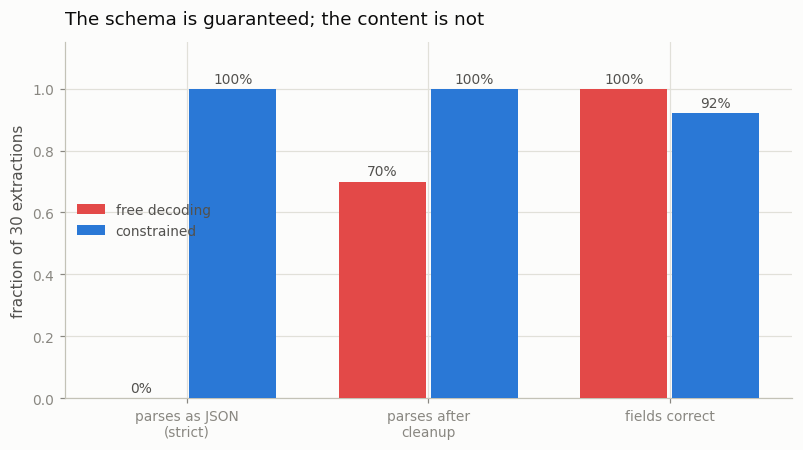
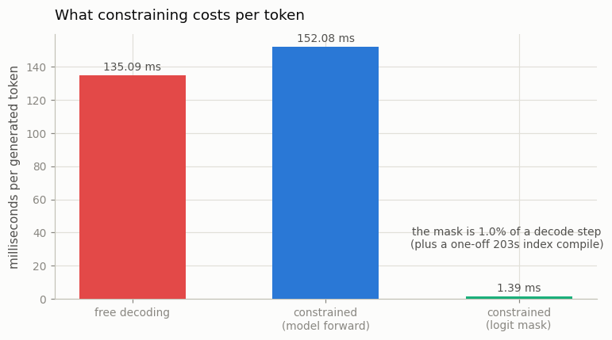

# Constrained JSON Generation

---

> Force the model to stay inside the schema's lines.

---

## ELI5 (Explain Like I'm 5)

- **The Big Idea:** At every decode step the model produces a score for all 152,000
  tokens and picks the best. If you set the score of every token that would *break
  your JSON schema* to negative infinity, the model can only pick a legal one. Do
  that at every step and invalid output becomes **impossible** — not unlikely,
  impossible.
- **How the mask is built:** compile the schema into a little state machine over
  characters, then ask, for each state, *which of the 152,000 tokens keep us on a
  legal path?* That is a big question to answer once and a trivial one to answer
  again — so you compile the index at startup and just look it up while decoding.
  This is what [Outlines](/shared/glossary/#outlines) and
  [sglang](/shared/glossary/#sglang) do.
- **The result is not subtle:** the raw output of the unconstrained model parses as
  JSON **0% of the time** (it wraps everything in markdown fences), and the
  constrained one parses **100%** of the time, for about **1% extra latency** per
  token.
- **But there is a sting.** Forcing the schema *changed the answers*. The model
  wanted to write `"age": "21"` (a string); our schema demanded an integer; forced
  onto a digit it did not intend, it wrote **42**. Constraining guarantees the
  **form**, and it can quietly damage the **content**.

## Key Insight

This project uses [Outlines](/shared/glossary/#outlines) or [sglang](/shared/glossary/#sglang) to apply [constrained generation](/shared/glossary/#constrained-generation) at decode time — masking out any next-token choices that would break a target JSON schema — and measures the small overhead this masking adds compared to free, unconstrained generation.

## Why This Matters

The downstream tools and data pipelines that consume the model's reply — the JSON parser, the function-call router, the analytics job that loads the response into a database — cannot handle "almost-JSON," output that looks JSON-like but has a missing brace, a stray comma, or an unquoted key. Constraining the [sampling](/shared/glossary/#sampling) step to obey a schema guarantees structurally valid output on every call, which is the missing piece that makes [function calling](/shared/glossary/#function-calling) and tool-using agents reliable in production.

---

## What's in this directory

| File | Role |
|------|------|
| `fsm.py` | The schema as a character FSM, and the compiled state → token-mask index. This is Outlines, in miniature. |
| `constrained.py` | Runs Qwen2.5-0.5B-Instruct on 30 extraction tasks, free vs constrained, and scores validity, content and overhead. |

```bash
python3 constrained.py          # ~8 min (203s of it is the one-off index compile)
python3 constrained.py --plot   # redraw from outputs/results.csv
```

Outlines and sglang are not installed here, so we build the mechanism instead of
calling it — which is the better deal, because the mechanism is only three ideas:

1. **The schema is a state machine over characters.** In each state only some
   characters keep a valid document reachable. After `{"name": "` you may write any
   name character; after `{"name": "Ada` you may write another one *or* close the
   quote; you may never write `[`.
2. **The model emits tokens, not characters.** So for each FSM state, walk all
   151,665 tokens through the machine: a token is legal iff every one of its
   characters is. `" Lo` is legal mid-name; `":` is legal only once the name is
   long enough to close.
3. **Compile once, look up forever.** Step 2 costs vocabulary x states, so you pay
   it at startup (101 states, 203 s in pure Python here) and decoding is then a
   tensor lookup and a `masked_fill`.

The task: 30 sentences like *"Jakarta resident Ken Thompson celebrated turning 21
last week"*, extracted into `{"name": str, "age": int, "city": str}`.

## Results



| | free decoding | constrained |
|---|---:|---:|
| raw output parses as JSON (strict) | **0%** | **100%** |
| parses after stripping markdown fences | 70% | 100% |
| fields correct | **100%** | 92.2% |
| — name | 100% | 100% |
| — **age** | 100% | **77%** |
| — city | 100% | 100% |
| tokens generated | 31 | 22 |
| latency per token | 135.1 ms | 153.5 ms |

### 1. "Almost-JSON" is the normal failure, and it is total

The unconstrained model's raw output parses **0% of the time**. Not 80%, not 95% —
zero. Here is why:

```
free        : ```json\n{\n  "name": "Ken Thompson",\n  "age": "21",\n  "city": "Jakarta"\n}\n```
constrained : {"name": "Ken Thompson", "age": 42, "city": "Jakarta"}
```

It wraps everything in a markdown fence. Every time. `json.loads` chokes on the very
first character, on all 30 requests, despite the prompt saying "Reply with JSON only."

Strip the fences and 70% survive — the rest fail on *typing*: the model writes
`"age": "21"`, a string where the schema says integer, and a downstream
`user.age > 18` comparison blows up in production rather than at the model. **This is
the real shape of the problem.** Not exotic malformed braces, but a wrapper you did
not ask for and a type you did not want. Both are the kind of thing that works in
your demo and pages you at 3am.

Constrained decoding takes both off the table. 100%, by construction, with no retry
loop, no repair prompt, no parser heuristics.

### 2. The overhead is real but small



```
model forward per token : 152.1 ms
logit mask per token    :   1.4 ms      <- 0.9% of a decode step
index compile (startup) : 203 s, 101 states, paid once
```

The per-token cost of constraining is **1%**. That is the number that matters at
serving time, and it is why nobody thinks twice about turning this on.

The startup compile (203 s) looks alarming and is an artifact of doing 151,665 x 101
string walks in pure Python — Outlines does the same work in compiled code and caches
the index to disk. The important structural fact is that it is a **startup** cost, not
a per-request one: one schema, compiled once, reused by every request forever. Note
also the constrained output is **shorter** (22 tokens vs 31), because it cannot spend
tokens on markdown fences and pretty-printing — a saving that partly pays for the
mask.

### 3. The sting: it guarantees the form, not the truth

Field accuracy fell from 100% to 92.2% — and the per-field breakdown says exactly
where it went: **name 100%, city 100%, age 77%**.

Look at the example again. The model *wanted* to write `"age": "21"` — a quoted
string. Our schema says `"age"` is an integer, so at that position the mask erases
the `"` token and every non-digit. The model, whose probability mass was on a path we
just deleted, now has to pick among digits it was not planning to write — and it
writes **42**.

This is the thing to take away from the whole project, and it is not in the
marketing:

> **A constraint does not make the model right. It makes the model *legal*.** When
> you mask away the path the model wanted, it does not reconsider — it takes the
> best of what is left, and the best of what is left may be nonsense.

The failure is concentrated exactly where the model's preferred serialization
disagrees with the schema. Which points straight at the fix: **make the schema agree
with the model.** Allow `age` to be a string (and coerce it yourself), or put an
example of the exact target format in the prompt so the model's natural path and the
legal path are the same one. Constrained decoding works best when it is a *safety
net*, not a *straitjacket* — when it is enforcing something the model was already
trying to do.

## Things to try

- Change the schema to `"age": {"type": "string"}` and re-run. Field accuracy should
  jump back toward 100% while validity stays at 100% — the model was never wrong, we
  were asking it the wrong way.
- Add the target format as a one-shot example in the prompt, keep the integer schema,
  and see how much of the 23-point age gap closes. This quantifies "align the prompt
  with the schema," a piece of folklore worth having a number for.
- Support optional keys and arrays. The FSM gains branching (a state can have several
  successors), which is where a hand-written template stops scaling and you want a
  real regex/grammar compiler — that is the line where you should reach for Outlines
  rather than rebuild it.
- Measure the mask cost with a 10x bigger schema. The per-token lookup is O(1), so it
  should not move — but the compile does. Knowing which costs scale with schema size
  is the practical thing to know.
