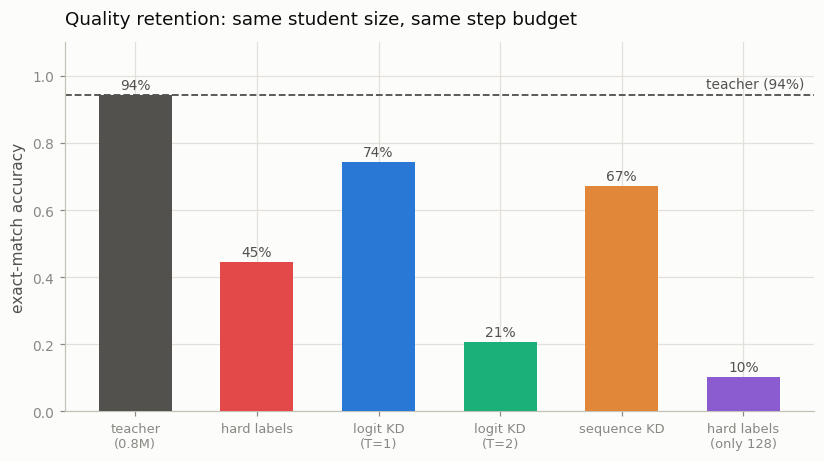
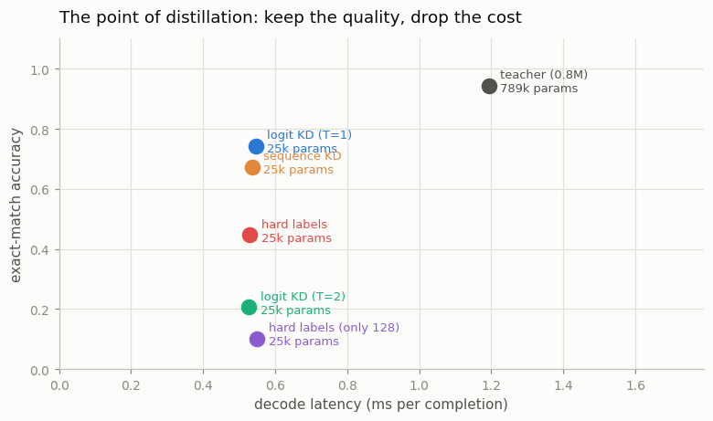

# Distill 7B → 1B

---

> Train a small student to imitate a big teacher.

---

## ELI5 (Explain Like I'm 5)

- **The Big Idea:** A big model already knows how to do your task. You cannot afford
  to serve it. So train a small model to copy it — not by giving the small model the
  *right answers* (it has those already), but by showing it **the big model's whole
  opinion**: for `37+8=`, the teacher says "45, and if not 45 then maybe 44 or 46,
  certainly not 12." That ranking of near-misses is information a plain label simply
  does not contain, and it is what the student learns from.
- **Same size, same training budget, very different results:** our tiny student
  reaches **45%** on hard labels and **74%** by copying the teacher — a 31-point gap
  for identical compute. [Distillation](/shared/glossary/#distillation) is not a
  compression trick; it is a *better teaching signal*.
- **But the temperature knob is a trap:** soften the teacher's opinion too much
  (T=2) and the student collapses to **21%** — *worse than hard labels*. Blur the
  distinction between 45 and 46 and you have taught it that arithmetic is a matter
  of taste.
- **And the real reason it exists:** labels are expensive, teachers are free. Cut the
  labelled data to 128 examples and the hard-label student falls to **10%**. The
  distilled student does not move at all — it never read a label in the first place.

## Key Insight

This project trains a 1B student model to imitate the output distribution of a stronger 7B teacher on a specific task domain — knowledge [distillation](/shared/glossary/#distillation) — and reports how much of the teacher's quality the much smaller student is able to retain.

## Why This Matters

Serving a 1B model costs a fraction of serving a 7B, so if the student can keep most of the teacher's behavior on the tasks you care about, distillation is the cheapest way to bring a capable model into a tight latency or budget — though it only works for skills the teacher already has, not for new abilities the teacher lacks.

---

## What's in this directory

| File | Role |
|------|------|
| `distill.py` | Trains the teacher, then five students — hard labels, logit KD at two temperatures, sequence KD, and the scarce-label case — and scores quality, size and decode latency. |

```bash
python3 distill.py          # ~8 min
python3 distill.py --plot   # redraw from outputs/results.csv
```

### The scale, and why the task is arithmetic

The guide's framing is 7B → 1B. Here it is **0.8M → 0.025M** (a 31x compression), on
the verifiable arithmetic task that carries Phase 5 — project 28's `sft_lib`, where
the prompt is `37+8=` and the completion is `45;`.

Arithmetic is the right choice for this specific project because **"quality
retention" stops being a vibe**. It is exact-match accuracy: the student either
states the right sum or it does not. No judge, no rubric, no perplexity proxy that
may or may not track what you care about.

The four recipes:

| recipe | what the student is trained on | needs labels? |
|---|---|---|
| **hard labels** | ground truth (`45`) | yes |
| **logit KD** | the teacher's full next-token distribution | **no** |
| **sequence KD** | the teacher's own greedy output, mistakes included | **no** |
| **hard labels (scarce)** | ground truth, but only 128 examples exist | yes |

## Results



| model | accuracy | params | retention | latency |
|---|---:|---:|---:|---:|
| **teacher** | **0.942** | 788,736 | — | 1.19 ms |
| hard labels | 0.446 | 25,088 | 47.3% | 0.53 ms |
| **logit KD (T=1)** | **0.742** | 25,088 | **78.8%** | 0.55 ms |
| logit KD (T=2) | 0.206 | 25,088 | 21.9% | 0.53 ms |
| sequence KD | 0.672 | 25,088 | 71.3% | 0.54 ms |
| hard labels (only 128 examples) | 0.102 | 25,088 | 10.8% | 0.55 ms |

### 1. The teacher's opinion beats the truth

Hard labels: **0.446**. Logit KD: **0.742**. Same architecture, same 900 steps, same
learning rate, same batches — the *only* difference is what sits on the right-hand
side of the loss.

This is the counterintuitive heart of distillation, and it is worth sitting with:
**the student learns more from a model that is sometimes wrong than from the ground
truth that is always right.** A one-hot label for `37+8=` says "45" and nothing else.
The teacher's distribution says "45, with a little mass on 44 and 46, and none at
all on 12" — it hands over the *structure* of the problem (that the answer is a
number, that near-misses are near, which digit comes first) instead of just its
solution. Hinton called this the dark knowledge, and 31 points of accuracy for free
is what it is worth here.

### 2. Temperature is a real knob, and it cuts both ways

Logit KD at T=2 scores **0.206** — worse than hard labels, worse than everything.

Softening is supposed to *reveal* the teacher's ranking over wrong answers. But this
vocabulary has 13 tokens, and the answer is a specific digit. Divide the logits by 2
and you flatten the very distinction the student needs to learn: `45` and `46` start
to look equally good, and a 25k-parameter student with no capacity to spare spends it
modelling that blur. The literature's usual T=2-5 comes from ImageNet-scale problems
with 1000 fuzzy classes; **on a small, sharp, verifiable output space, T=1 is the
right default.** Copy the hyperparameter without thinking and you would have
concluded distillation does not work.

### 3. Sequence KD is nearly as good, and much simpler

Training on the teacher's *generated text* (0.672) recovers most of the benefit of
matching its full distribution (0.742). That matters in practice, because sequence
KD is the one you can actually run against an API: you do not need the teacher's
logits, only its outputs. It is what people mean when they say they "trained on GPT-4
outputs."

The gap between the two (7 points) is exactly the information thrown away by
collapsing a distribution to its argmax. Note also that the student inherits the
teacher's **mistakes** — the teacher is 94% accurate, so ~6% of the sequence-KD
training data is confidently wrong. Distillation copies the teacher, warts and all.

### 4. The reason distillation actually exists

Now make labels scarce — 128 labelled examples instead of an endless supply:

```
hard labels, unlimited ground truth : 0.446
hard labels, only 128 examples      : 0.102     <- collapses
logit KD                            : 0.742     <- unchanged. It never used a label.
```

This is the production case, and it is why distillation is everywhere. Ground truth
is the expensive thing: it needs humans, or a verifier, or a domain expert. A teacher
model is a **label factory** — it will annotate as much data as you can generate, at
the cost of a forward pass, forever. The student in row 3 was trained on infinite
supervision that cost nothing but GPU time.

### 5. The cost side of the trade



| | teacher | distilled student |
|---|---:|---:|
| parameters | 788,736 | **25,088** (31x smaller) |
| decode latency | 1.19 ms | **0.55 ms** (2.2x faster) |
| accuracy | 0.942 | 0.742 (79%) |

That is the deal on the table: **give up 21% of the quality, get 31x fewer
parameters and less than half the latency.** Whether that is a good trade is not a
research question, it is a *product* question — and for a 7B → 1B in production, with
the KV-cache and bandwidth savings from
[project 58](../58-kv-cache-from-scratch/README.md) compounding on top, it is very
often yes.

Note the latency ratio (2.2x) is far smaller than the parameter ratio (31x). At this
scale the forward pass is dominated by fixed per-call overhead, not arithmetic —
exactly the effect project 58 measured. At 7B → 1B, where the models are big enough
to be genuinely bandwidth-bound, the latency gain tracks the parameter count much
more closely.

### 6. What distillation cannot do

The student never beats the teacher — not in any run, not at any temperature. It
cannot: every signal it receives is the teacher's. Distillation **transfers**
capability efficiently; it does not **create** it. If your teacher cannot do the
task, no amount of distillation will teach the student to. (What *does* create new
capability, on exactly this task, is RL against a verifier — see
[project 34](../34-grpo-on-a-math-task/README.md), where the model exceeds its own
SFT starting point.)

## Things to try

- Sweep the student size (`n_embd` 16 / 32 / 64 / 128) and plot retention against
  parameters. The curve rises steeply then flattens — and where it flattens is where
  the capacity gap stops being the binding constraint.
- Mix the losses: `kd_loss(..., alpha=0.5)` gives half KD, half hard labels. The
  classic recipe. Does it beat pure KD here, given that our teacher is only 94%
  accurate?
- Distill from a *deliberately weak* teacher (train it for 400 steps, before the
  grok). Watch the student cap out at the teacher's ceiling — the clearest possible
  demonstration of point 6.
- Use the distilled student as the **draft model** in
  [project 60](../60-speculative-decoding/README.md). A student trained to imitate
  the target is exactly what makes a draft agreeable, and it is what production
  speculative-decoding stacks actually do.
