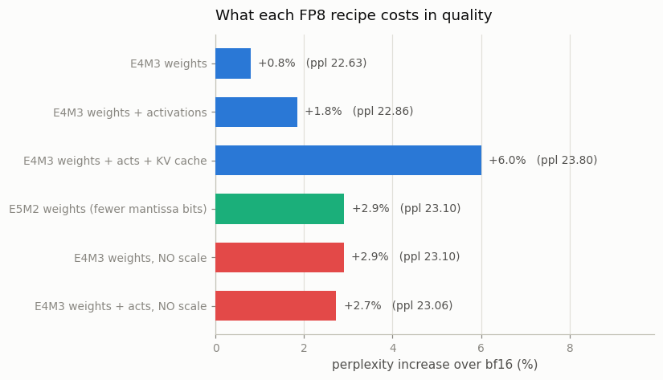
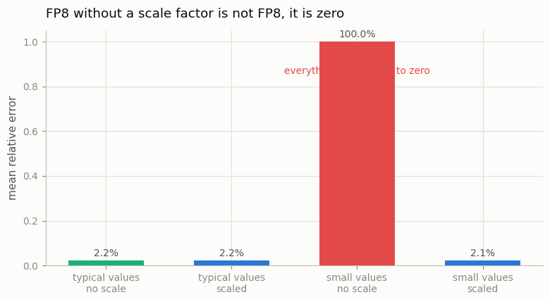
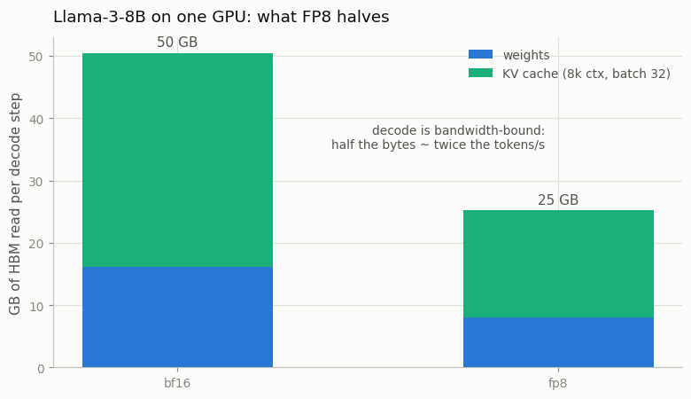

# FP8 Serving

---

> Half the bits of bfloat16, much more throughput on modern GPUs.

---

## ELI5 (Explain Like I'm 5)

- **The Big Idea:** [FP8](/shared/glossary/#fp8) stores every number in 8 bits
  instead of 16. Since decoding is bottlenecked on *reading* numbers out of memory
  (see [project 58](../58-kv-cache-from-scratch/README.md)), halving the bytes
  roughly doubles the ceiling on tokens per second — and
  [Hopper](/shared/glossary/#hopper)/[Blackwell](/shared/glossary/#blackwell) GPUs
  have [tensor cores](/shared/glossary/#tensor-core) that multiply FP8 natively.
- **E4M3 vs E5M2:** eight bits have to be split between *range* (exponent) and
  *precision* (mantissa). E4M3 spends them on precision and is what weights and
  activations use; E5M2 buys range at the cost of precision — and we measure it being
  the worse choice for weights.
- **The catch — and it is the whole project:** FP8's smallest representable number is
  about **0.002**. Any value below that is not "approximated," it is **erased to
  zero**. A per-tensor **scale factor** — multiply the tensor up before rounding,
  divide back after — is what stands between you and a model full of zeros. We show a
  tensor of realistic small activations going to **100% error, 100% of values flushed
  to zero** without one.

## Key Insight

This project converts a model's weights, [activations](/shared/glossary/#activations), and [KV cache](/shared/glossary/#kv-cache) to [FP8](/shared/glossary/#fp8) using NVIDIA's [TransformerEngine](/shared/glossary/#transformerengine), verifies that quality on a small benchmark suite holds up, and measures the latency improvement on a [Hopper](/shared/glossary/#hopper)-class GPU.

## Why This Matters

FP8 halves the memory and the bandwidth read for every parameter compared with [bfloat16](/shared/glossary/#bfloat16), and [Hopper](/shared/glossary/#hopper)- and [Blackwell](/shared/glossary/#blackwell)-class GPUs have dedicated FP8 [Tensor Cores](/shared/glossary/#tensor-core), so the format is rapidly becoming the production default for new serving stacks — a near-free speedup when the hardware supports it.

---

## What's in this directory

| File | Role |
|------|------|
| `fp8.py` | The E4M3/E5M2 rounding itself, patches to put weights / activations / the KV cache into FP8, the quality sweep, and the underflow probe. Reuses [project 59](../59-quantize-a-7b-model/README.md)'s evaluation harness. |

```bash
python3 fp8.py          # ~8 min
python3 fp8.py --plot   # redraw from outputs/results.csv
```

### What we can and cannot measure here

[TransformerEngine](/shared/glossary/#transformerengine) needs a Hopper GPU. This box
has neither, so we do in software exactly what the hardware would do: round every
number to the nearest value E4M3 (or E5M2) can represent, and run the model on those.

That split matters, and it is worth being blunt about:

- **Quality is measured exactly.** The arithmetic the model sees is bit-for-bit what
  FP8 tensor cores would feed it. Every perplexity and MMLU number below is real.
- **Speed is *not* measured.** There are no FP8 units here, so there is no honest
  speedup to report. What we can do — and what section 4 does — is compute the
  bandwidth saving, which is what the speedup comes from on real hardware.

An FP8 number is `sign x 2^exponent x 1.mantissa`. Rounding to it means finding the
binade and rounding the mantissa to 3 bits (E4M3) or 2 (E5M2). That is `fp8_quantize`,
and it is ten lines.

## Results

### 1. FP8 quality, recipe by recipe



| recipe | wikitext ppl | vs baseline | MMLU |
|---|---:|---:|---:|
| bf16 baseline | 22.450 | — | 0.450 |
| E4M3 weights | 22.626 | +0.8% | 0.444 |
| E4M3 weights + activations | 22.865 | +1.8% | 0.439 |
| E4M3 weights + acts + **KV cache** | 23.799 | **+6.0%** | 0.421 |
| E5M2 weights | 23.103 | +2.9% | 0.415 |
| E4M3 weights, no scale factor | 23.100 | +2.9% | 0.468 |
| E4M3 weights + acts, no scale | 23.062 | +2.7% | 0.456 |

**Weights in FP8 are nearly free** (+0.8%), and adding activations costs little more
(+1.8%). This is the result that made FP8 the default for new serving stacks: you
halve the bytes and the model barely notices.

**The KV cache is the expensive one** (+6.0%) — and also the one with the biggest
payoff, because at long context and large batch the cache *is* the memory (project
58's table: 34 GB for an 8B model at batch 32). Keys and values carry large outliers
that a 3-bit mantissa handles poorly, which is why production stacks expose KV-cache
quantization as its own switch: you turn it on when you are memory-bound, not by
default.

**E5M2 is worse than E4M3 for weights** (+2.9% vs +0.8%), exactly as the format's
design predicts. Weights are tightly clustered around zero; they need *precision*,
not the extra exponent range E5M2 buys. (E5M2's range is for gradients during
training, which span many orders of magnitude — a different problem.)

A caution on the MMLU column: at n=171 questions its 95% interval is roughly ±7
points, so the fact that "no scale factor" *scores highest* (0.468) is noise, not a
finding. Perplexity, measured over 8,192 tokens, is the signal here — the same
lesson [project 59](../59-quantize-a-7b-model/README.md) ran into.

### 2. Why the scale factor exists



Here is the whole argument in four numbers. Take a tensor and round it to E4M3, with
and without a per-tensor scale:

| tensor | scale | mean relative error | values flushed to zero |
|---|---|---:|---:|
| typical activations (~1.0) | off | 2.18% | 0% |
| typical activations (~1.0) | on | 2.17% | 0% |
| **small activations (~3e-4)** | **off** | **100.00%** | **100%** |
| small activations (~3e-4) | on | 2.12% | 0% |

E4M3's smallest representable magnitude is `2^-9 ≈ 0.00195`. A tensor whose values
live at `3e-4` sits entirely below that floor, so **every single element rounds to
zero** — the tensor does not lose precision, it ceases to exist. Scale it up by its
own maximum first and the identical format represents it to 2% error.

That is what a "scale factor" is, and why every FP8 recipe in production is really an
FP8-plus-scaling recipe. TransformerEngine tracks a running `amax` per tensor for
exactly this. It is also the same lesson project 25 hit from the training side.

**An honest caveat:** in the table in section 1, turning the scale *off* for this
model costs only +2.9%, not catastrophe. That is because Qwen2.5's activations sit
post-RMSNorm at magnitudes near 1.0 — comfortably inside E4M3's range — so they never
hit the floor. The scale factor is insurance, and this particular model does not
crash without it. Other tensors in other models (attention scores after masking,
expert activations in a sparse MoE, anything post-softmax) live exactly where the
probe above lives. The reason you always scale is not that it always helps; it is
that when it matters, it is the difference between a working model and zeros.

### 3. What FP8 actually buys — and where it comes from



We cannot time it here, so compute it. Take Llama-3-8B at 8k context, batch 32:

| | bf16 | FP8 |
|---|---:|---:|
| weights | 16.1 GB | **8.0 GB** |
| KV cache (8k, batch 32) | 34.4 GB | **17.2 GB** |
| **read per decode step** | **50.5 GB** | **25.2 GB** |

And now the formula from the guide:

```
decode is memory-bandwidth-bound:   tok/s ~ HBM_bandwidth / bytes_read_per_token
```

Halve the bytes, double the ceiling. That is the entire pitch: FP8 is not faster
because the arithmetic is faster (though on Hopper's tensor cores it is), it is faster
because **decode was never arithmetic-bound in the first place**. It was waiting on
memory, and now it waits half as long.

Which also tells you exactly when FP8 will *not* help you: prefill (compute-bound),
tiny models (overhead-bound — see [project 60](../60-speculative-decoding/README.md)),
and any hardware without FP8 units, where you pay the conversion and get nothing back.

## Things to try

- Quantize the KV cache **only** (leave weights and activations in bf16). It is the
  cheapest memory win per unit of quality lost, and it is the switch that lets you
  double your batch size — which, per [project 61](../61-serve-with-vllm/README.md),
  is where throughput actually comes from.
- Replace the per-tensor scale with a **per-channel** one and re-measure the KV-cache
  row. Outliers in K and V are channel-structured; a per-channel scale should recover
  most of that 6%.
- Try E5M2 for the KV cache instead of E4M3. The cache has the outliers, so this is
  the one place the extra exponent range might actually pay.
- Compare FP8-E4M3 weights against INT8 from
  [project 59](../59-quantize-a-7b-model/README.md) — the same 8 bits, spent
  differently (a floating grid versus a uniform one with a scale per group). Which
  wins tells you whether your weights are outlier-heavy or well-behaved.
