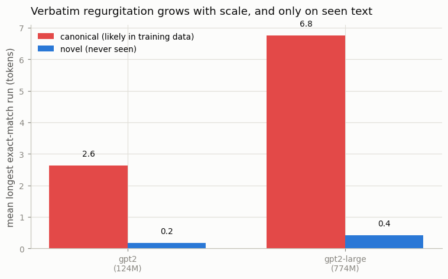
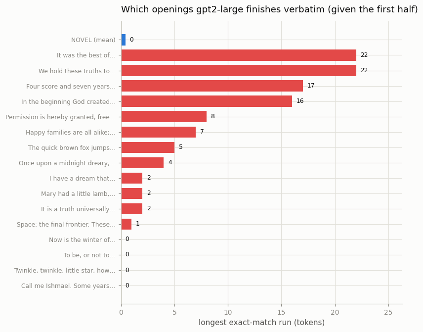

# Memorization Probe

---

> Give the right opening line and the model finishes the page word for word.

---

## ELI5 (Explain Like I'm 5)

- **The Big Idea:** a language model is supposed to *learn patterns*, not
  *memorize* its textbook. But it does memorize some of it. To catch it in the
  act, give it the first half of a famous passage — the Declaration of
  Independence, the opening of *A Tale of Two Cities* — and let it continue.
  If it reproduces the real text word for word, it memorized it.
- **The control:** we also feed it sentences **written fresh for this project**,
  which it has never seen. It can't reproduce those, because there's nothing to
  reproduce — it just makes something up. Comparing the two separates
  *memorization* from *being good at English*.
- **What we find:** GPT-2 Large finishes famous openings **verbatim for up to 22
  tokens** (the Declaration continues "…by their Creator with certain unalienable
  Rights, that among these are Life, Liberty…" exactly). On the never-seen
  sentences it matches **0.4 tokens** on average — essentially nothing.
- **Bigger models memorize more.** The 124M model reproduces ~2.6 tokens of a
  famous passage on average; the 774M model reproduces ~6.8 — and neither
  reproduces the novel text. Memorization is real, it's text-specific, and it
  grows with scale.

## Key Insight

This project feeds an open model the first few sentences of documents from its known [pretraining](/shared/glossary/#pretraining) corpus and counts how often the model continues with the verbatim original text — direct evidence of [memorization](/shared/glossary/#memorization).

## Why This Matters

LLMs reproduce a small but non-trivial fraction of their training data exactly, with consequences for copyright, privacy (leaked PII), and security; knowing how much your model memorizes is a precondition for any deployment that touches sensitive data and a check on whether your [deduplication](/shared/glossary/#deduplication) pipeline is doing its job.

---

## What's in this directory

| File | Role |
|------|------|
| `memorize.py` | Feeds the first half of famous (likely-memorized) texts and of novel (never-seen) texts to GPT-2 and GPT-2 Large, greedily decodes a continuation, and measures the longest exact-match run against the true text. |

```bash
python memorize.py          # ~6 min on CPU (two models, greedy decoding)
python memorize.py --plot   # redraw from outputs/*.csv
```

Both models are queried, never trained. The method is
["extractable memorization"](https://arxiv.org/abs/2012.07805): if a prefix makes
the model emit the true continuation token-for-token, that text is stored in the
weights, recoverable by anyone who knows the opening.

## The setup

- **Canonical set** — 16 short, famous, public-domain passages (the Declaration
  of Independence, the Gettysburg Address, opening lines of *Moby-Dick*,
  *Pride and Prejudice*, *A Tale of Two Cities*, Genesis, the MIT license, …).
  These appear countless times across the web, so they are near-certainly in
  GPT-2's WebText training data — the memorization candidates.
- **Novel set** — 12 original sentences written for this project. No model has
  ever seen them; they are the control.

For each text we split it in half, feed the first half as the prompt, greedily
decode as many tokens as the true continuation, and record the **longest run of
leading tokens that match exactly.** A high number means the model isn't
predicting — it's reciting.

## Results

### Memorization grows with scale, and only on seen text



| model | canonical mean exact-run | novel mean exact-run | canonical ≥ 20-token regurgitation |
|-------|-------------------------:|---------------------:|-----------------------------------:|
| GPT-2 (124M) | 2.6 tokens | 0.2 tokens | 6% |
| GPT-2 Large (774M) | **6.8 tokens** | 0.4 tokens | **12%** |

Two clean signals:

1. **Canonical ≫ novel, for both models.** The gap between the red and blue bars
   *is* memorization. On text it has seen, the larger model recites ~7 tokens on
   average; on text it hasn't, it manages less than one. The novel control barely
   moves — proof that the canonical result is regurgitation, not just fluency.

2. **The bigger model memorizes more.** Doubling-and-more the parameters roughly
   triples the average verbatim run (2.6 → 6.8) and doubles the fraction of
   passages reproduced for 20+ tokens (6% → 12%). This is the well-documented
   scaling of memorization ([Carlini et al. 2022](https://arxiv.org/abs/2202.07646)):
   more capacity, more of the training set stored verbatim.

### Which openings does it recite?



Breaking GPT-2 Large down text by text shows memorization is **highly
text-specific**. Given only the first half:

- **"We hold these truths…"** (Declaration) → **22 tokens** verbatim
- **"It was the best of times…"** (*A Tale of Two Cities*) → **22 tokens**
- **"Four score and seven years ago…"** (Gettysburg) → **17 tokens**
- **"In the beginning God created…"** (Genesis) → **16 tokens**
- …while *"Call me Ishmael…"* and *"To be, or not to be…"* trigger **0** —
  the split point lands somewhere the greedy path diverges.

Every novel sentence sits at essentially zero (mean 0.4). The most-duplicated,
most-canonical texts are exactly the ones stored verbatim — which is precisely
why [deduplication](/shared/glossary/#deduplication) of the training corpus is
the front-line defense: a passage the model saw once is far less likely to be
memorized than one it saw ten thousand times.

## Why this matters in practice

The same mechanism that recites the Declaration will, on a model trained on
un-deduplicated data, recite a leaked API key, a copyrighted page, or a person's
address that appeared often enough in the corpus. The probe here is benign
(public-domain text), but the method is the one used to audit models for
[memorized](/shared/glossary/#memorization) PII and copyrighted content before
release. Mitigations — corpus deduplication, training-data filtering,
differential privacy — all trade a little quality or a lot of compute against
exactly this risk.

## Caveats

- **"Likely in training data" is an inference, not a certainty.** WebText's exact
  contents aren't public; we rely on the fact that these passages are massively
  duplicated online. The novel control is what makes the comparison sound.
- **Greedy decoding is a lower bound on extraction.** Real extraction attacks
  search over sampling temperatures and many prefixes; a text that scores 0 here
  might still be extractable with effort.
- **Short famous texts under-count long-form memorization.** Splitting a 40-token
  quote caps the possible run; models can memorize far longer spans of
  frequently-duplicated documents than this compact set can reveal.
