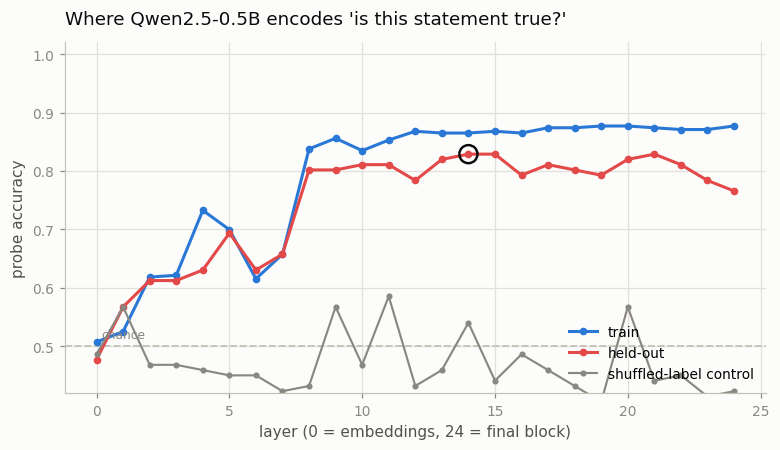

# Linear Probes for Facts

---

> Open the black box one layer at a time and ask "where in here does the model know X?"

---

## ELI5 (Explain Like I'm 5)

- **The Big Idea:** A language model is a stack of layers, and as a sentence
  flows up through them the model builds up an understanding of it. We want to
  know: *by which floor of the building has the model figured out whether a
  statement is true or false?* We can't read its mind directly — but we can
  train a tiny "lie detector" on the model's internal state at each floor and
  see which floor it works best from.
- **The lie detector is a single straight line.** For each layer we take the
  model's [activations](/shared/glossary/#activations) — its internal scratch
  values — and fit the simplest possible classifier
  ([logistic regression](/shared/glossary/#linear-probe)) to split "true"
  statements from "false" ones. If that one line can do it, the fact is sitting
  right there in the activations, easy to read.
- **What we find:** at the input (layer 0) the probe is at chance — the model
  hasn't thought yet. Accuracy stays low for a few layers, then **jumps** around
  layer 8 and settles near **83%** in the middle-to-late layers. The model
  computes "is this true?" and carries the answer around internally, several
  layers *before* it opens its mouth.
- **The honesty check:** we run the whole thing again with the true/false labels
  **shuffled**. Now the probe is stuck at chance at every layer — proof that the
  real curve is reading a genuine signal in the model, not a trick of the probe.

## Key Insight

This project trains a [linear probe](/shared/glossary/#linear-probe) — a single linear classifier — on the hidden [activations](/shared/glossary/#activations) at each [transformer](/shared/glossary/#transformer) layer to recover whether a statement is factually true, mapping out which layers actually encode that knowledge.

## Why This Matters

A working probe is a window into [mechanistic interpretability](/shared/glossary/#mechanistic-interpretability): it shows that the model carries the factuality signal internally before it generates its answer, which is the starting point for explaining *why* and *where* a behavior happens inside the network.

---

## What's in this directory

| File | Role |
|------|------|
| `probe.py` | Builds a labelled true/false statement set, extracts last-token activations from every layer of Qwen2.5-0.5B, trains one logistic-regression [probing classifier](/shared/glossary/#probing-classifier) per layer (from scratch in numpy), and plots accuracy vs. layer. |

```bash
python probe.py          # ~2 min on CPU
python probe.py --plot   # redraw from outputs/probe_acc.csv
```

The language model (`Qwen/Qwen2.5-0.5B-Instruct`, 24 layers) is **frozen**. The
only thing that trains is the probe — a single weight vector per layer. That is
the whole point: if a *linear* readout can recover truth, the model already
represents it; the probe just holds up a mirror.

## The setup

We build **444 statements**, half true and half false, from templates with
unambiguous answers — so the *label* is ground truth and the probe's only job is
to read it back out of the activations:

- **Capitals** — "The capital of Portugal is Lisbon." (true) vs. a wrong city.
- **Continents** — "Vietnam is located in Asia." vs. a wrong continent.
- **Categories** — "Gold is a metal.", "The salmon is a type of fish." vs. wrong category.
- **Arithmetic** — "27 plus 14 equals 41." vs. an answer off by 1–3.
- **Comparisons** — "63 is greater than 12." vs. the reversed (false) claim.

For each statement we run one forward pass and keep the hidden activation at the
**last token** (where the model has read the whole claim), at all 25 layers
(embeddings + 24 blocks). Then we standardize the features and fit a logistic
regression per layer on a fixed 75/25 train/test split shared across layers.

## Results

### Truth is linearly decodable — and it lives in the middle layers



| layer | held-out probe accuracy | shuffled-label control |
|------:|------------------------:|-----------------------:|
| 0 (embeddings) | 0.48 | 0.49 |
| 4 | 0.63 | 0.46 |
| 7 | 0.66 | 0.42 |
| **8** | **0.80** | 0.43 |
| 14 (peak) | **0.83** | 0.54 |
| 24 (final) | 0.77 | 0.42 |

Three things to read off this curve:

1. **The embedding layer is at chance.** Layer 0 is just the tokens looked up in
   a table — no computation has happened, so "true" and "false" statements are
   not yet separable. The probe sits at 0.48, coin-flip.

2. **There is a sharp jump around layer 8.** Accuracy climbs gently through the
   early layers, then leaps from ~0.66 to ~0.80 at layer 8 and plateaus in the
   low-to-mid **0.80s** for the rest of the network. Somewhere in the first
   third of the model, Qwen assembles a representation from which truth is
   linearly readable, and it carries that representation forward — the fact is
   available internally **well before** the model would generate an answer.

3. **The shuffled-label control stays at chance everywhere.** When we shuffle
   the true/false labels and retrain, the probe cannot exceed ~0.5 at any layer.
   This is the control that makes the result trustworthy: an over-eager probe on
   high-dimensional activations could in principle "find" structure that isn't
   there, but with the labels destroyed there is nothing to find. The real
   curve is reading a genuine truth signal, not fitting noise.

### Why a 0.5B model tops out around 83%, not 99%

The probe is only as good as the representation it reads. A 0.5B model genuinely
does not *know* every fact in the set — it is shaky on some capitals and weak on
multi-digit arithmetic — so those items have no clean truth signal to recover,
and the probe caps out in the 80s. This is a feature, not a bug of the method:
probe accuracy tracks what the model actually represents. The truth-probing
literature ([Azaria & Mitchell 2023](https://arxiv.org/abs/2304.13734);
[Marks & Tegmark 2023](https://arxiv.org/abs/2310.06824)) reports higher numbers
precisely because it uses much larger models with sharper internal knowledge.
Run the same probe on a bigger model and the plateau rises.

## The idea in one paragraph

A probe turns "is the fact in there?" into a measurable, layer-by-layer number.
Because the classifier is *linear*, a high score means the fact is stored as a
**direction** in activation space — you could, in principle, read it off, or
push along it to change the model's belief (the basis of activation steering).
This is the first tool of [mechanistic interpretability](/shared/glossary/#mechanistic-interpretability):
before you can explain *why* a model does something, you find *where* the
relevant information lives. The next project, [Tiny SAE](../71-tiny-sae/README.md),
takes the same [residual stream](/shared/glossary/#residual-stream) and tries to
decompose it into thousands of such directions at once.

## Caveats

- **A probe shows correlation, not use.** A layer can *contain* the truth signal
  without the model actually *using* it downstream. Establishing use requires
  causal methods (activation patching), not just a probe.
- **The probe can learn the template, not the concept.** We mitigate this by
  mixing five statement types and using a held-out split, but a probe that
  generalizes across *datasets* (train on capitals, test on arithmetic) is a
  stronger claim than the within-distribution split measured here.
- **Last-token readout** bakes in a choice; probing a different position (or
  mean-pooling) can shift which layer looks best.
