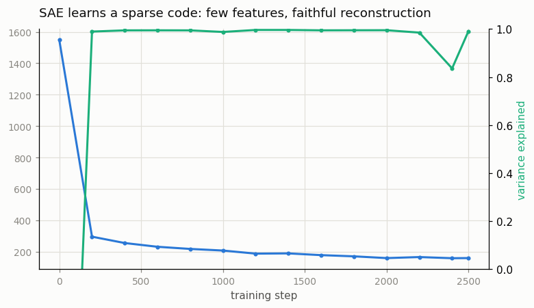
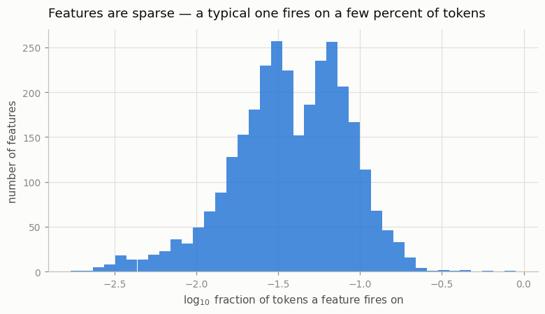

# Tiny SAE

---

> Crack a layer's tangled activations into thousands of single-meaning features.

---

## ELI5 (Explain Like I'm 5)

- **The problem:** inside a transformer, each of the 768 numbers in the
  [residual stream](/shared/glossary/#residual-stream) is a mess — one number
  lights up for many unrelated things at once, because the model has *far more*
  concepts to track than it has numbers to store them in. It crams them
  together, overlapping ([superposition](/shared/glossary/#superposition)). That
  makes the activations almost impossible to read.
- **The trick:** train a [sparse autoencoder](/shared/glossary/#sae) — a little
  network that expands those 768 numbers into 3,072 "features" and then squeezes
  them back, under one rule: **for any given token, almost all features must be
  off.** Forced to explain each activation with just a handful of features, the
  SAE has to give each feature a single, clean job.
- **What comes out:** features you can actually name. In this run, one feature
  fires only on the Wikipedia editorial tag **`[citation needed]`**; another
  only on the **`&`** in "V&A"; another only on the word **"which"**; another on
  the **`/`** in "and/or." The tangle comes apart into readable pieces.
- **The catch:** the SAE reconstructs the original activations almost perfectly
  (**99%** of the variance) using only ~**160 active features per token** out of
  3,072. Sparse *and* faithful — that is the whole trick.

## Key Insight

This project trains a small [sparse autoencoder (SAE)](/shared/glossary/#sae) on the [residual stream](/shared/glossary/#residual-stream) of a small [LLM](/shared/glossary/#llm) and visualizes a handful of the recovered features — directions in activation space that fire for exactly one concept ("Golden Gate Bridge," "is a JSON key," "negation in a clause").

## Why This Matters

SAEs decompose a layer's dense, [polysemantic](/shared/glossary/#polysemantic) activations into a much larger but mostly-zero set of [monosemantic](/shared/glossary/#monosemantic) features, giving the most promising current vocabulary for "what is the model thinking" — the working dictionary that drives interpretability research in 2024–2025.

---

## What's in this directory

| File | Role |
|------|------|
| `sae.py` | Collects GPT-2's layer-6 residual stream over ~1,500 Wikipedia paragraphs, trains a 768→3072→768 sparse autoencoder with an L1 sparsity penalty, then interprets the learned features by their top-activating tokens. |

```bash
python sae.py          # ~5 min on CPU (collect + train + interpret)
python sae.py --plot   # redraw figures from outputs/*.csv
```

GPT-2 is **frozen** — we only read its activations. The SAE is the only thing
trained, and it never touches the language model's weights.

## The setup

1. **Collect activations.** Run GPT-2 over ~1,500 Wikipedia paragraphs
   (the SQuAD corpus reused from [project 43](../43-minimal-rag/README.md)) and
   record the residual stream **after block 6** at every token position —
   40,000 activation vectors of width 768.
2. **Train the SAE.** An encoder `ReLU((x − b_dec) · W_enc + b_enc)` lifts each
   768-vector into 3,072 feature activations; a decoder maps it back. The loss is
   reconstruction MSE **plus an L1 penalty** on the feature activations, which is
   what forces sparsity. Decoder columns are held to unit norm so a feature can't
   dodge the penalty by shrinking its code and inflating its dictionary vector —
   the standard recipe.
3. **Interpret.** Run the trained encoder over every token, and for the most
   selective features, print the tokens that fire them hardest with a little
   surrounding context.

## Results

### Sparse *and* faithful



As training proceeds the L1 penalty drives the number of active features per
token (**L0**) down from ~300 to about **160**, while the reconstruction keeps
**~99% of the variance** in the original activations. That is the deal an SAE
strikes: describe a dense 768-dimensional vector with a *short list* of
named features and almost no loss of information. Of the 3,072 dictionary
features, **3,036 stay alive** (only 36 die), so the capacity is genuinely used.

### The dictionary is readable

Ranking the live features by selectivity and reading off their top-activating
tokens, clean single-meaning features fall out. A sample (full dump in
`outputs/features.txt`):

| Feature | Fires on | Top-activating contexts |
|--------:|----------|-------------------------|
| #2557 | Wikipedia editorial tags | `...Energy Act of 1978`**`[citation needed]`**`On November...` · `...short-lived move.`**`[verification needed]`** |
| #1722 | the `&` in "V&A" | `...The sculpture collection at the V`**`&`**`A...` · `...often abbreviated as the V`**`&`**`A...` |
| #2572 | the `/` in "and/or", units | `...physical and`**`/`**`or psychological injury...` · `...1,000 m3`**`/`**`s...` |
| #2678 | `:` after a language name | `...The Yuan dynasty (Chinese`**`:`**` ...` · `...Political Islam (Arabic`**`:`**` ...` |
| #1737 | the word "same" | `...Wages work in the`**`same`**`way...` · `...produced at the time. The`**`same`**`report...` |
| #959 | the word "which" | `...orthodoxy into`**`which`**`they assimilated...` · `...upon`**`which`**`MSPs are invited...` |
| #653 | the subword `ob` | `...Civil Dis`**`ob`**`edience...` · `...Cyan`**`ob`**`acteria...` · `...audi`**`ob`**`ooks...` |

Read the `#653` row carefully: it is a feature for a **byte-pair fragment** —
the `ob` that GPT-2's tokenizer splits out of *disobedience*, *cyanobacteria*,
*audiobook*. The SAE is finding structure at the level the model actually
operates on, not just whole English words. The `[citation needed]` feature
(#2557) is the crispest of all: a single direction that means "Wikipedia
editorial markup," a concept that only exists because of what GPT-2 was trained
on.

### Most features are rare



The bulk of features activate on only a **few percent** of tokens or fewer — the
distributional signature of specialization. A feature that fired on everything
would explain nothing; a feature that fires on `[citation needed]` and almost
nothing else is exactly what "monosemantic" means.

## The honest caveats

- **A few features stay dense.** The single most active feature in this run
  fires on **62%** of tokens with a huge magnitude — it is doing bias/normalizing
  work, not representing a concept. Real SAEs have these too; the selectivity
  ranking is what filters them out of the showcase. Don't expect *every* feature
  to be a tidy concept.
- **This is a tiny SAE.** 3,072 features on a 124M model, ~160 active per token.
  Production SAEs (Anthropic's, DeepMind's) use *millions* of features at
  L0 ≈ 20–80 and surface far more abstract concepts ("the Golden Gate Bridge,"
  "code that will error"). More features and a stronger sparsity penalty buy
  crisper monosemanticity — at compute cost.
- **Interpretation-by-top-tokens is a first pass.** A feature that looks like
  "the word same" might, on closer inspection, only fire on *"the same"* in
  comparative clauses. Rigorous interpretability validates a feature by
  *intervening* on it (clamp it high, watch the output change) — the basis of
  Anthropic's feature-steering demos — which is the natural next step from here.

## Where this sits

[Project 70](../70-linear-probes-for-facts/README.md) asked *where* a single
known concept (truth) lives, with a supervised probe. An SAE is the unsupervised
counterpart: it hands you a whole **dictionary** of concepts you didn't specify
in advance, discovered directly from the activations. Together they are the two
workhorses of [mechanistic interpretability](/shared/glossary/#mechanistic-interpretability) —
the closest we currently have to reading a model's mind.
