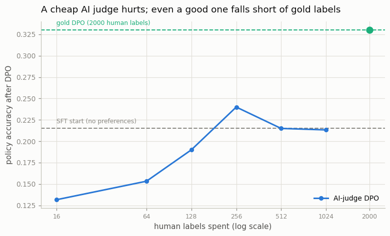
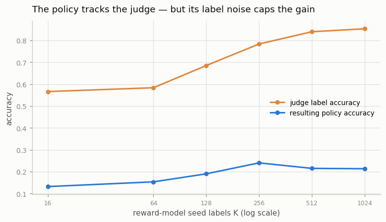

# RLAIF on a Small Task

---

> Replace the human grader with a stronger model and see how close — and how cheap — you can get.

---

## ELI5 (Explain Like I'm 5)

- **The expensive part of alignment is the grading.** To improve a model with
  [DPO](/shared/glossary/#dpo), you show it pairs of answers labelled "this one
  is better." Getting a *human* to label thousands of pairs is slow and costly.
  RLAIF asks: what if an *AI* does the grading instead?
- **The experiment:** we use a task with a known right answer (arithmetic), so we
  can measure everything honestly. The "human" grader is the exact verifier — it
  labels every pair perfectly, but imagine paying for each label. The "AI" grader
  is a small [reward model](/shared/glossary/#reward-model) trained on only **K**
  human labels, then let loose to label the *rest* for free.
- **The trade-off we measure:** how good is the final model, versus how many
  human labels we had to buy? Spend more human labels on the AI grader (bigger K)
  and it grades better, so the final model improves.
- **The catch — two of them:** if the AI grader is trained on too few labels
  (K ≤ 64, grading barely above a coin flip), training on its noisy labels makes
  the model **worse than not training at all**. And even our *best* AI grader
  (85% accurate) leaves the model far short of what perfect human grading
  achieves — that last 15% of label noise is expensive. A cheap grader is worse
  than no grader, and a decent grader is still no substitute for a great one.

## Key Insight

This project trains a small model with [DPO](/shared/glossary/#dpo) using preference labels generated by another LLM rather than by humans — [RLAIF](/shared/glossary/#rlaif) (Reinforcement Learning from AI Feedback) — and compares both the resulting quality and the labeling cost against a human-labeled baseline.

## Why This Matters

Human preference data is the slowest and most expensive part of [RLHF](/shared/glossary/#rlhf); if AI judgments can match human ones on a task, the alignment pipeline gets dramatically cheaper, which is why RLAIF and [Constitutional AI](/shared/glossary/#constitutional-ai) underpin most modern alignment recipes.

---

## What's in this directory

| File | Role |
|------|------|
| `rlaif.py` | Builds a preference pool on the arithmetic task, trains an AI-judge reward model on K seed labels, labels the pool with it, runs DPO, and sweeps K to trace quality against human-label cost. |

```bash
python rlaif.py          # ~8 min on CPU
python rlaif.py --plot   # redraw from outputs/rlaif.csv
```

This reuses the verifiable char-level arithmetic task and the shared library from
[project 28](../28-sft-a-1b-base-model/README.md), the reward model from
[project 31](../31-train-a-reward-model/README.md), and the DPO loss from
[project 33](../33-dpo-from-scratch/README.md). The verifier gives us ground
truth, which is what makes it possible to *measure* how good the AI judge is.

## The setup

1. **A partially-trained policy.** An SFT model stopped short of the sharp
   grokking transition sits at ~22% accuracy — the shared starting point every
   DPO run improves on. (The operand range is kept small, 0–15, so the *judge*
   can actually learn to check the sum from a realistic number of labels.)
2. **A preference pool** of 2,000 pairs, each a correct answer vs. a random wrong
   one. (Random-wrong rejects are the DPO-friendly case; near-miss rejects cause
   a known DPO degeneracy — see [project 33](../33-dpo-from-scratch/README.md) —
   which would confound the comparison, so we avoid them here.)
3. **Two ways to label the pool:**
   - **Gold ("human"):** the exact verifier labels every pair perfectly. Ceiling
     quality, but it costs one human label per pair (2,000 total).
   - **AI (RLAIF):** a reward model trained on only **K** human-labeled seed pairs
     then labels all 2,000 automatically. Human cost is just **K**.
4. **DPO** runs from the same base policy on each label set, and we read off the
   resulting accuracy — plus, for the AI judge, its *labeling accuracy* against
   ground truth.

## Results

### Quality vs. the human-label budget



| labeling | human labels | judge accuracy | policy accuracy after DPO |
|----------|-------------:|---------------:|--------------------------:|
| none (SFT start) | 0 | — | 0.215 |
| AI judge, K=16 | 16 | 0.566 | **0.132** (worse than start) |
| AI judge, K=64 | 64 | 0.584 | 0.153 |
| AI judge, K=128 | 128 | 0.685 | 0.190 |
| AI judge, K=256 | 256 | 0.784 | **0.240** (best AI) |
| AI judge, K=512 | 512 | 0.840 | 0.215 |
| AI judge, K=1024 | 1024 | 0.853 | 0.213 |
| **gold (verifier)** | 2000 | 1.000 | **0.330** |

Read the curve from left to right, and note two failures:

1. **A cheap judge is actively harmful.** At K = 16–64 the reward-model judge
   grades barely above a coin flip (≈0.57), and DPO on those near-random labels
   pushes the policy *below where it started* (0.13 vs. 0.215). Roughly half the
   preference pairs are labelled backwards, and DPO faithfully pulls the model
   toward the wrong answers. Bad supervision is worse than none.

2. **Even a strong judge falls well short of gold.** The best AI judge here is
   85% accurate (K = 1024), yet the policy it produces plateaus around 0.21–0.24
   — it barely clears the SFT starting point and never approaches the 0.330 that
   *perfect* labels achieve. That final 15% of label noise, injected into DPO's
   margin objective, caps the gain. Human-quality alignment needed human-quality
   grading; a decent AI judge did not substitute for it on this task.

### The judge is the bottleneck



The orange curve (judge accuracy) climbs steadily with the seed budget, but the
blue curve (resulting policy) rises only a little and then flattens far below it.
**The policy is bottlenecked by the judge, and the judge here is not good
enough.** RLAIF doesn't manufacture supervision out of nothing — it *propagates*
a judge's labels, noise and all. That is exactly why real RLAIF and
[Constitutional AI](/shared/glossary/#constitutional-ai) don't bootstrap a judge
from a handful of labels: they use a **large, already-capable model** as the
grader, whose zero-shot labels are far more accurate than anything a small reward
model learns from K examples. The lesson this toy makes concrete is the
precondition those methods depend on — *AI feedback only helps when the judge is
much stronger than the student.* When it isn't, you get what you see here:
harmful at low quality, and capped well short of human labels even at its best.

## Caveats

- **Toy task, learned judge.** Real RLAIF uses a large pretrained LLM as a
  zero/few-shot judge, not a small reward model trained from scratch. We use the
  reward-model formulation because the arithmetic task has no natural-language
  content for a big judge to read — but the cost/quality logic is the same:
  AI labels are cheap to scale, capped by judge quality.
- **Random-wrong pairs only.** With near-miss rejects, both gold and AI DPO would
  suffer the margin-collapse degeneracy from [project 33](../33-dpo-from-scratch/README.md);
  isolating the judge-quality effect means keeping the pairs DPO-friendly.
- **The "human cost" is a stand-in.** We count seed labels as the scarce
  resource; in reality human preference labels vary wildly in cost and quality,
  which is the whole reason RLAIF is attractive.
