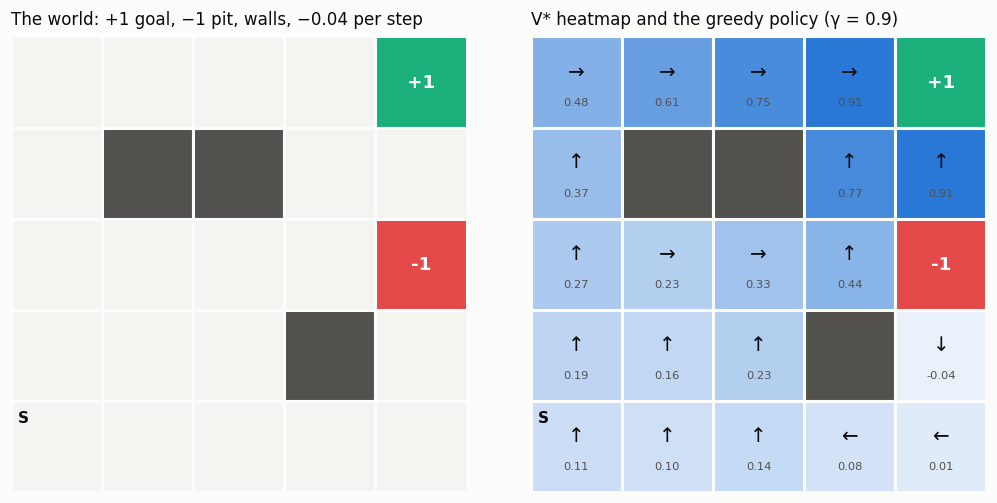

# Build a Gridworld

## Key Insight

A reinforcement-learning problem is fully described by five pieces — states, actions, [transition probabilities](/shared/glossary/#transition-function), a [reward function](/shared/glossary/#reward-function), and a [discount factor](/shared/glossary/#discount-factor) — bundled together as an [MDP](/shared/glossary/#mdp). A [gridworld](/shared/glossary/#gridworld) is the smallest environment where you can write all five down by hand and read them straight off a picture, so it turns abstract symbols into something you can point at. Building one yourself forces you to decide concretely what counts as a *state*, what the transition function does when you walk into a wall, and where the reward actually lives — the three spots where a beginner's mental model is usually fuzziest.

---

## What's in this directory

| File | Role |
|------|------|
| `gridworld.py` | The reusable library: a `Gridworld` class that turns a picture (walls, goals, pits) into explicit `P` and `R` arrays, plus [value iteration](/shared/glossary/#value-iteration) and [policy evaluation](/shared/glossary/#policy-evaluation) implemented as a few lines of numpy on top of those arrays. Imported by projects 02, 04, and 05. |
| `build_gridworld.py` | Builds the 5×5 world, prints and sanity-checks each of the five pieces, then solves it. |
| `plot_style.py` | Shared matplotlib styling for every figure in this phase. |

```bash
python build_gridworld.py     # ~2 s on CPU
```

## The world

A 5×5 grid with a `+1` goal in the top-right corner, a `−1` pit two rows below
it, three walls, a `−0.04` penalty on every step (being alive is mildly
expensive, so dawdling is discouraged), and *slippery* movement: each move goes
where you aimed with probability 0.8 and skids perpendicular with probability
0.1 each way.



## The five pieces, as concrete objects

The whole point of the exercise is that `(S, A, P, R, γ)` stops being notation
and becomes five inspectable Python values:

| Piece | In this code | Shape |
|-------|--------------|-------|
| `S` | `gw.states`, a list of `(row, col)` cells | 22 states |
| `A` | `up, right, down, left` | 4 actions |
| `P` | `gw.P[s, a, s']` = probability of landing in `s'` | `(22, 4, 22)` |
| `R` | `gw.R[s, a]` = *expected* immediate reward | `(22, 4)` |
| `γ` | `gw.gamma` | scalar, 0.9 |

And the three fuzzy spots the Key Insight mentions become explicit decisions
you can point at in `gridworld.py`:

1. **What counts as a state?** A walkable cell. Wall cells are *not* states —
   they simply don't appear in `gw.states`, so `P` has no rows for them. There
   are 25 cells but only 22 states.
2. **What does the transition function do at a wall?** The move fails and you
   stay put (a "bump"). Crucially this is *not* a special case in the
   algorithms — it is just probability mass on `P[s, a, s]`. Once built, `P`
   contains everything; no algorithm ever asks "was that a wall?".
3. **Where does the reward live?** On *arrival*: each transition pays the step
   penalty plus the bonus of the cell being entered, and `R[s, a]` stores the
   *expectation* of that over the slip. Entering a terminal cell ends the
   [episode](/shared/glossary/#episode), which we encode by making terminals
   *absorbing*: every action from them self-loops with reward 0, so the
   discounted [return](/shared/glossary/#return) simply stops growing.

The script prints a few transition distributions worth staring at. Aiming
`right` at the goal from the cell beside it is not a sure thing — and the
expected reward already prices that in:

```
P(s' | s=(0, 3), a=right):
   -> (0, 3): 0.10   <- bump (stayed put; the "up" slip hit the grid edge)
   -> (0, 4): 0.80   <- terminal (+1 goal)
   -> (1, 3): 0.10
R(s, a) = +0.760      = 0.8 · (−0.04 + 1) + 0.2 · (−0.04)
```

Three sanity checks every hand-built MDP should pass (the script asserts all
of them): every `P[s, a, :]` sums to exactly 1, bumping into a wall keeps you
in place, and terminal states absorb with zero reward.

## Solving it

Because `P` and `R` are explicit arrays, computing the optimal
[value function](/shared/glossary/#value-function) needs no interaction, no
samples, and no learning — just repeated application of the
[Bellman](/shared/glossary/#bellman-equation) optimality backup, which is one
line of numpy:

```python
Q = R + gamma * P @ V      # (S, A): value of each action if V were correct
V = Q.max(axis=1)          # the optimality backup
```

Value iteration converges in 43 backups. The right panel of the figure shows
`V*` as a heatmap with the [greedy policy](/shared/glossary/#greedy-policy)'s
arrows on top. Two details reward a close look:

- **The slip shapes the route.** The [optimal policy](/shared/glossary/#optimal-policy)
  avoids walking beside the pit when it can help it: the arrows at `(4, 3)`
  and `(4, 4)` head *away* from the pit column and rejoin the safe corridor,
  because an 80/10/10 move next to a `−1` terminal is a bad bet.
- **Values fade with distance.** `V*` falls from `0.91` beside the goal to
  `0.11` at the start — that is the discount factor compounding over the ~8
  steps the goal is away, plus the accumulated step penalties.

The library also exposes `policy_matrices`, `policy_evaluation_solve`, and
`policy_evaluation_iterative` for evaluating a *fixed*
[policy](/shared/glossary/#policy) — project 02 is built entirely on those.
