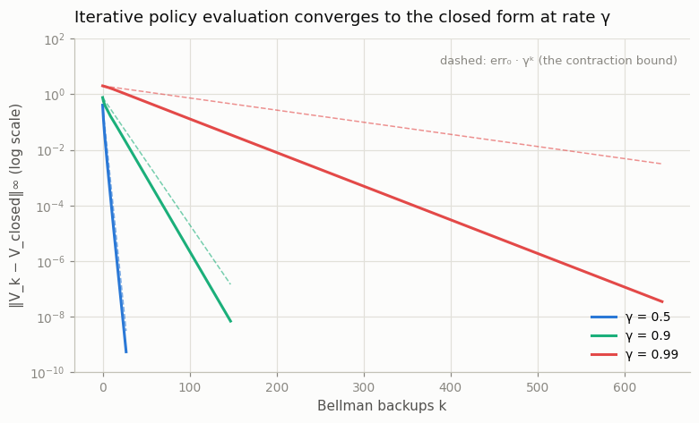
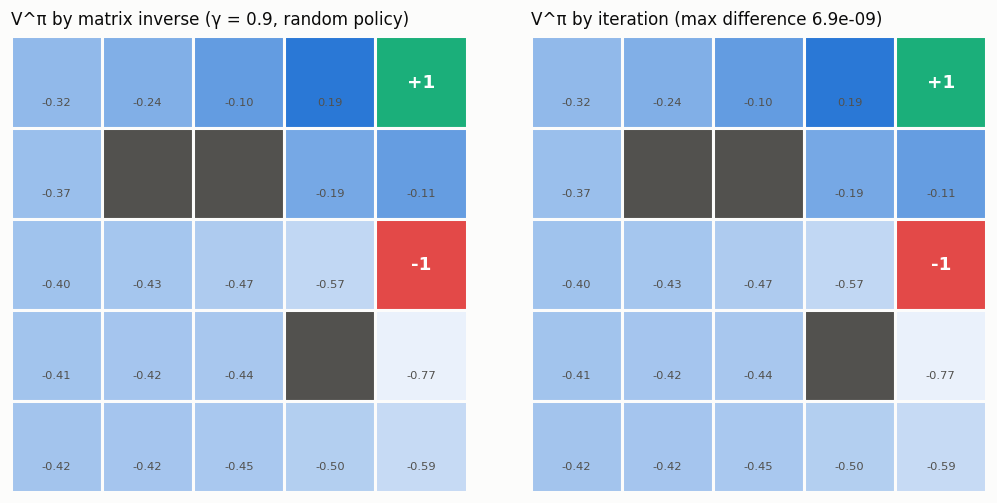

# Policy Evaluation by Matrix Inverse

## Key Insight

When the [policy](/shared/glossary/#policy) is held fixed, the [Bellman equation](/shared/glossary/#bellman-equation) stops being scary: it becomes an ordinary set of linear equations, one per state, that you can solve in a single shot with the [matrix inverse](/shared/glossary/#matrix-inverse) `V = (I − γPπ)⁻¹ rπ`. This [policy evaluation](/shared/glossary/#policy-evaluation) step — computing the [value function](/shared/glossary/#value-function) of a *given* policy — is the easy half of RL; the hard half is improving the policy afterwards. Solving it once by matrix inverse and again by repeated [Bellman backups](/shared/glossary/#bellman-operator) shows that the slow iterative method everyone uses in practice is simply converging to this exact closed-form answer.

---

## What's in this directory

| File | Role |
|------|------|
| `matrix_inverse_eval.py` | Evaluates a uniform-random policy on project 01's 5×5 gridworld both ways — one linear solve vs iterated backups — verifies they agree to `1e-7`, and plots the convergence. |

```bash
python matrix_inverse_eval.py     # ~5 s on CPU
```

## Why this is a linear system

For a fixed policy `π` the Bellman equation has no `max` in it, so nothing is
nonlinear. First collapse the action dimension out of the
[MDP](/shared/glossary/#mdp): under `π`, the world is just a Markov chain with

```python
P_pi = np.einsum("sa,sat->st", pi, P)   # (S, S): where π actually goes
r_pi = np.einsum("sa,sa->s",   pi, R)   # (S,):   what π actually earns
```

The Bellman equation `V = r_pi + γ P_pi V` is then `S` equations in `S`
unknowns. Move everything to one side, `(I − γ P_pi) V = r_pi`, and solve:

```python
V = np.linalg.solve(np.eye(S) - gamma * P_pi, r_pi)
```

(`np.linalg.solve` is the numerically sane way to apply the matrix inverse
without forming it.) The matrix `I − γ P_pi` is always invertible when
`γ` is below 1 — the same geometric-series fact that makes the discounted
[return](/shared/glossary/#return) finite.

## Iterative evaluation converges to exactly this vector

The iterative method starts from `V = 0` and repeatedly applies the expectation
backup `V ← r_pi + γ P_pi V`. Because the backup is a
[contraction mapping](/shared/glossary/#contraction-mapping), the gap to the
closed-form answer must shrink by at least a factor of γ every sweep — a
straight line on a log plot:



| γ | backups to reach `1e-9` | predicted from `err₀ · γᵏ` | linear solve | iterating |
|------|------|------|------|------|
| 0.5 | 27 | ~28 | 0.1 ms | 0.4 ms |
| 0.9 | 147 | ~193 | 0.06 ms | 1.2 ms |
| 0.99 | 643 | ~2131 | 0.05 ms | 4.7 ms |

Two things in that table are worth internalizing:

- **γ is the price of patience.** The iteration count scales like
  `log(tol) / log(γ)` — pushing γ from 0.9 to 0.99 made evaluation ~4× slower,
  and nothing about the world changed. This cost follows every bootstrapped
  method in the book, all the way up to deep RL.
- **The bound is a worst case.** For γ = 0.99 the actual run (643) beat the
  contraction prediction (~2131) by 3× — the dashed and solid lines in the
  figure visibly diverge. The reason: this world has absorbing terminals, so a
  random walk keeps leaking probability into states whose value is already
  exact, and the *effective* contraction is faster than γ. The γ-rate is a
  guarantee, not a speed limit.

And the two answers are the same answer, down to the solver's tolerance:



The heatmap itself is a nice read: under a uniform-random policy almost every
state has *negative* value — a drunkard's walk pays `−0.04` per step and falls
into the `−1` pit far too often, so only the cells hugging the `+1` goal come
out ahead. Evaluation tells you how good the policy you *have* is, not how
good the world could be (compare `V*` from project 01, which is positive
everywhere).

## Why anyone bothers iterating

At 22 states the linear solve wins on every axis, so why does the rest of RL
iterate? Because `np.linalg.solve` is `O(S³)` and needs `P` as an explicit
matrix. At the state counts where deep RL lives (Atari's pixel space, roughly
`256^(84×84)` screens) you can neither store `P_pi` nor cube it — but you *can*
sample transitions and apply the backup at the sampled states, which is what
[TD learning](/shared/glossary/#temporal-difference-learning) and
[Q-learning](/shared/glossary/#q-learning) do. The closed form is not the
method; it is the ground truth the methods are all crawling toward.
