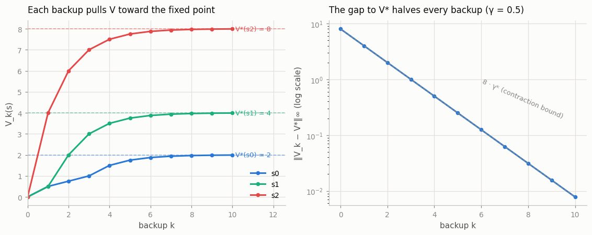

# Hand-Trace Bellman Backups

## Key Insight

A [Bellman backup](/shared/glossary/#bellman-operator) replaces each state's current value estimate with "reward now plus discounted value of where you land next," and applying it over and over is guaranteed to converge because the backup is a [contraction mapping](/shared/glossary/#contraction-mapping) — every pass shrinks the gap to the true [value function](/shared/glossary/#value-function) by at least a factor of the [discount factor](/shared/glossary/#discount-factor) γ. Doing ten backups by hand on a three-state [MDP](/shared/glossary/#mdp) — a toy world with only three possible situations the agent can be in, small enough that you can write down and update every state's value on paper — makes that abstract guarantee concrete: you literally watch the numbers stop moving. This is the mechanism underneath [value iteration](/shared/glossary/#value-iteration) and, in disguise, underneath every value-based deep-RL algorithm.

---

## What's in this directory

| File | Role |
|------|------|
| `hand_trace.py` | Defines the 3-state MDP, verifies `V* = (2, 4, 8)` is the exact fixed point, runs the ten backups, prints the trace table, and checks the error really shrinks by γ every pass. |

```bash
python hand_trace.py     # ~2 s on CPU
```

## The MDP (designed for mental arithmetic)

Everything is deterministic and `γ = 0.5`, so every backup is halving. Three
states in a row, `s0 → s1 → s2`, and two actions everywhere:

| state | `stay` (self-loop) | `advance` |
|-------|--------------------|-----------|
| `s0` | reward +0.5 | go to `s1`, reward 0 |
| `s1` | reward +0.5 | go to `s2`, reward 0 |
| `s2` | reward +0.5 | stay at `s2`, reward **+4** |

Each state offers a lazy self-loop paying `+0.5`, or `advance` toward `s2`,
where advancing pays `+4` forever. The true
[optimal values](/shared/glossary/#optimal-policy) are round numbers you can
verify in your head with the geometric series `4/(1−0.5) = 8`:

```
V*(s2) = 4 + 0.5·8 = 8      V*(s1) = 0 + 0.5·8 = 4      V*(s0) = 0 + 0.5·4 = 2
```

## The trace, by hand

One synchronous backup computes, for every state, the value of each action
using the *previous* column's numbers, then keeps the max:

```
V_k+1(s) = max_a [ R(s, a) + 0.5 · V_k(next state) ]
```

Backup 1, starting from `V = (0, 0, 0)`:

```
s0:  max( stay: 0.5 + 0.5·0 = 0.5 ,  advance: 0 + 0.5·0 = 0 )  = 0.5
s1:  max( 0.5 ,  0 )                                            = 0.5
s2:  max( 0.5 ,  advance: 4 + 0.5·0 = 4 )                       = 4
```

Backup 2, now reading from `V = (0.5, 0.5, 4)`:

```
s0:  max( 0.5 + 0.25 = 0.75 ,  0 + 0.5·0.5 = 0.25 )   = 0.75
s1:  max( 0.75 ,  0 + 0.5·4 = 2 )                      = 2
s2:  max( 0.5 + 2 = 2.5 ,  4 + 2 = 6 )                 = 6
```

Continuing (the script prints this table; every entry is checkable by hand):

| k | V(s0) | V(s1) | V(s2) | greedy actions | ‖V_k − V*‖∞ |
|---|-------|-------|-------|----------------|--------------|
| 0 | 0 | 0 | 0 | — | 8 |
| 1 | 0.5 | 0.5 | 4 | stay, stay, advance | 4 |
| 2 | 0.75 | 2 | 6 | stay, advance, advance | 2 |
| 3 | 1 | 3 | 7 | advance, advance, advance | 1 |
| 4 | 1.5 | 3.5 | 7.5 | advance, advance, advance | 0.5 |
| 5 | 1.75 | 3.75 | 7.75 | advance, advance, advance | 0.25 |
| 6 | 1.875 | 3.875 | 7.875 | advance, advance, advance | 0.125 |
| 7 | 1.9375 | 3.9375 | 7.9375 | advance, advance, advance | 0.0625 |
| 8 | 1.96875 | 3.96875 | 7.96875 | advance, advance, advance | 0.03125 |
| 9 | 1.984375 | 3.984375 | 7.984375 | advance, advance, advance | 0.015625 |
| 10 | 1.9921875 | 3.9921875 | 7.9921875 | advance, advance, advance | 0.0078125 |



## What the trace teaches

- **The error column halves exactly.** The script asserts the ratio of
  consecutive errors: it is `0.500` on *every* backup, never above γ. That is
  the contraction property, watched happening rather than proved. Ten backups
  cut the initial gap of 8 down by `0.5¹⁰ ≈ 0.001`, to under 0.008.
- **Information flows backwards one hop per backup.** After backup 1 only `s2`
  knows about the `+4`; after backup 2 the news has reached `s1` (via
  `0.5 · 4 = 2`); after backup 3 it reaches `s0`. A backup propagates value
  exactly one transition upstream, which is why value iteration on a chain of
  length `n` needs at least `n` sweeps — and why the sparse, delayed rewards of
  later phases make bootstrapped methods slow.
- **The [greedy policy](/shared/glossary/#greedy-policy) converges before the
  values do.** Watch the "greedy actions" column: `s0` still prefers the lazy
  `stay` at backups 1–2 (the distant `+4` hasn't reached it, so `+0.5` now
  looks great) and flips to `advance` at backup 3. From then on the *policy*
  never changes even though the *values* still have an error of 1.0 that decays
  for the rest of the trace. Acting only needs the argmax to be right, not the
  numbers — the observation behind [policy iteration](/shared/glossary/#policy-iteration)
  in the next phase, which stops evaluating early and improves the policy
  instead.
- **The fixed point checks itself.** Plug `V* = (2, 4, 8)` into the backup and
  it returns `(2, 4, 8)`: the [Bellman equation](/shared/glossary/#bellman-equation)
  is a consistency condition, and the script asserts it before tracing.
