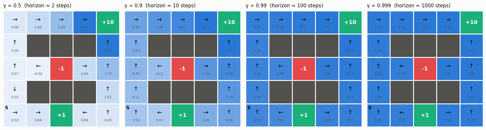
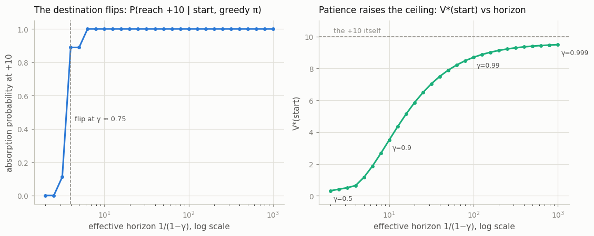

# Discount Factor Study

## Key Insight

The [discount factor](/shared/glossary/#discount-factor) γ controls how far into the future the agent bothers to look: a small γ makes it grab immediate reward, while a γ near 1 makes it patient, and the rough rule is that it plans over an [effective horizon](/shared/glossary/#effective-horizon) of about `1/(1−γ)` steps (γ = 0.99 gives `1/0.01` ≈ 100 steps). Sweeping γ on one fixed task and watching the [optimal policy](/shared/glossary/#optimal-policy) flip — from grabbing a nearby small reward to walking to a distant large one — shows that γ is not just a numerical knob for convergence but a genuine part of the problem definition. Change γ and you have literally changed what "optimal" means.

---

## What's in this directory

| File | Role |
|------|------|
| `discount_study.py` | Solves the same 5×5 world with [value iteration](/shared/glossary/#value-iteration) at `γ ∈ {0.5, 0.9, 0.99, 0.999}`, then runs a fine sweep of 28 γ values to locate the exact flip point. |

```bash
python discount_study.py     # ~10 s on CPU
```

## The task (fixed) and the knob (γ)

The start sits in the bottom-left corner. A `+1` goal is **2 steps** away along
the bottom row; a `+10` goal is **8 steps** away, reachable only through a
walled corridor that goes up the left side and across the top, with a `−1` pit
lurking mid-map. Steps cost `−0.04` and moves slip 20% of the time — the world
is identical in every run. Only γ changes.

Back-of-envelope, ignoring slip and step costs, the near goal pays `γ² · 1` and
the far one pays `γ⁸ · 10`, so the far goal should win once
`γ⁶ ≥ 1/10`, i.e. `γ ≳ 0.68`.

## The optimal policy flips



| γ | horizon ≈ `1/(1−γ)` | `V*(start)` | P(greedy reaches +10) | VI backups |
|-------|------|-------|-------|------|
| 0.5 | 2 | 0.32 | 0.00 | 23 |
| 0.9 | 10 | 3.51 | 1.00 | 41 |
| 0.99 | 100 | 8.70 | 1.00 | 46 |
| 0.999 | 1000 | 9.49 | 1.00 | 47 |

At γ = 0.5 the start's arrow points **right**, to the `+1`. At γ = 0.9 it
points **up**, into the corridor toward the `+10`. Same map, same rewards, same
physics — a different definition of optimal. The γ = 0.5 panel hides a lovely
detail: walk up the left corridor cell by cell and the arrows *reverse
direction* partway — cells near the bottom head back down to the `+1`, while
cells that are already most of the way up continue to the `+10`, because from
*there* the big reward is finally inside the 2-step horizon. A myopic γ doesn't
make the agent ignore the `+10`; it makes the `+10` visible only from close up,
which splits the map into two watersheds.

Whether the greedy policy ends at the `+10` is computed exactly, not by
rollouts: for an absorbing Markov chain, the absorption probabilities solve a
small linear system (`absorption_prob` in the script) — the same
"linear-algebra-on-`P`" trick as project 02.

## Where exactly is the flip?

The fine sweep brackets the flip at **γ ≈ 0.75**, visibly above the
back-of-envelope 0.68. The gap is instructive: the `−0.04` step cost and the
20% slip both tax the long route more than the short one (more steps in which
to pay, more chances to skid), so patience has to overcome not just the
distance but the friction. The analytic estimate needed only the two path
lengths; the true threshold needed the whole MDP.



The right panel shows `V*(start)` climbing from 0.32 toward the raw `+10` as
the horizon grows: at γ = 0.9 discounting still burns ~65% of the prize, while
by γ = 0.999 the 8-step walk is essentially free. Meanwhile the *policy*
saturates much earlier: once the effective horizon comfortably covers the map,
extra patience no longer changes what the agent does, only how the same walk
is scored. That is why the γ = 0.99 and γ = 0.999 panels show identical
arrows — on a map you can cross in 8 steps, a 100-step and a 1000-step planner
want the same things.

## Two honest footnotes

- **Convergence cost.** The classic warning is that value iteration needs
  `~1/(1−γ)` times more sweeps as γ → 1, yet the table shows backups barely
  growing (23 → 47). That's because this world is episodic and the *optimal*
  policy terminates within ~8 steps, so error stops propagating once the
  policy's paths are settled; the blow-up shows up when evaluation has to track
  long-lived wandering, as in project 02's random policy (27 → 643 backups over
  the same γ range). Worth knowing both regimes exist.
- **γ is part of the problem, not a trick.** It's tempting to treat γ as a
  numerical convenience for making sums converge. This sweep is the
  counterexample: every γ row in the table is a *different task* wearing the
  same map. When a paper reports "γ = 0.99" it is telling you what the agent
  was actually asked to optimize.
