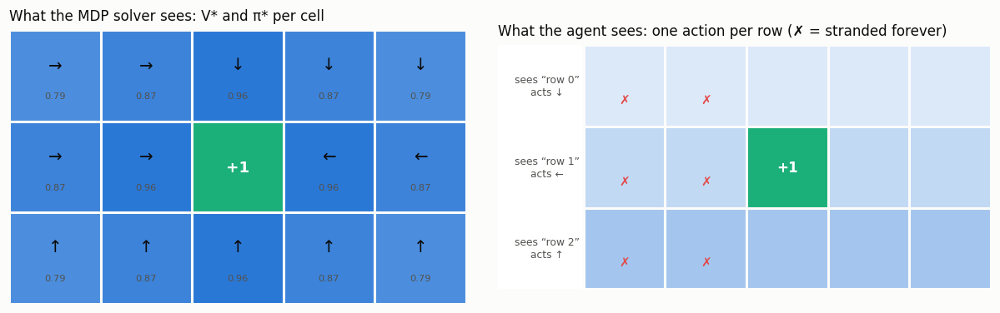
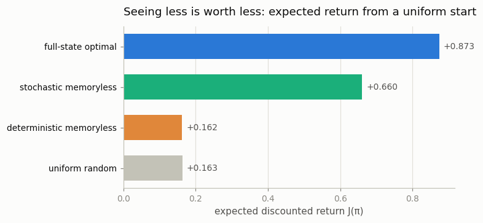

# POMDP Exercise

## Key Insight

Every algorithm in this phase secretly assumes the [Markov property](/shared/glossary/#markov-property): that the current state holds everything you need to act well, so the past can be forgotten. When the agent can only see part of the state — here, its grid row but not its column — that assumption breaks and the problem becomes a [POMDP](/shared/glossary/#pomdp), where the best possible *memoryless* [policy](/shared/glossary/#policy) is provably worse than one that remembers. Building this on purpose teaches the failure mode behind a huge fraction of real-world RL bugs: the "state" you fed the agent was never actually Markov.

---

## What's in this directory

| File | Role |
|------|------|
| `pomdp.py` | Builds the 3×5 world, computes the full-state optimum by [value iteration](/shared/glossary/#value-iteration), enumerates **all 64** deterministic row-observation policies, gradient-ascends to the best *stochastic* one, and verifies the ordering the Key Insight promises. |

```bash
python pomdp.py     # ~3 s on CPU
```

No learning, no sampling: every number below is computed exactly with the
linear-solve [policy evaluation](/shared/glossary/#policy-evaluation) from
project 02, averaged over a uniform distribution of start cells.

## The world, seen two ways

A 3×5 grid, a `+1` goal in the exact center, `−0.04` per step, γ = 0.95, no
slip. As an [MDP](/shared/glossary/#mdp) this is the easiest world in the
phase. But the agent's *observation* is only its row — three possible
percepts for fifteen cells — so all five cells of a row are **aliased**: they
look identical and a memoryless policy must treat them identically. From
"row 1" the goal might be two cells to the left or two cells to the right, and
nothing in the percept says which.



The right panel shows the best deterministic observation policy found by
exhaustively evaluating all `4³ = 64` of them: go `down`/`up` toward the middle
row, then always `left`. It is a genuinely sensible compromise — and it
permanently strands every cell in the two left columns (marked ✗), which walk
`left` into the wall forever, paying `−0.04` a step for eternity. Committing to
`right` instead merely strands the right columns; no assignment of one action
per row can serve both sides of an aliased row.

## Results: the POMDP ordering



| policy | sees | expected return J |
|--------|------|------------------|
| optimal, full state | `(row, col)` | **+0.873** |
| best stochastic memoryless | row only | **+0.660** |
| best deterministic memoryless | row only | **+0.162** |
| uniform random | nothing | +0.163 |

The script asserts both gaps: the best memoryless policy — even allowed
arbitrary randomization and optimized directly against the *exact* value of
the underlying MDP — falls well short of the full-state optimum. That is the
"provably suboptimal" of the Key Insight, established here by exhaustion
rather than by theorem: there are only 64 deterministic candidates, we scored
every one, and none comes close.

Two details of the table deserve a stare:

- **The best deterministic memoryless policy ties a coin-flipping baseline.**
  Committing to *some* answer in an aliased world bought nothing over acting
  uniformly at random (+0.162 vs +0.163). Confident wrongness half the time
  cancels confident rightness the other half.
- **Randomness is worth +0.5 of return.** The optimized stochastic policy
  recovers most of the gap to the optimum. Look at what the optimizer chose
  for the aliased middle row:

  ```
  row 0: up 0.04, right 0.04, down 0.91
  row 1: right 0.49, left 0.50                        <- a learned coin flip
  row 2: up 0.91, right 0.05, down 0.02, left 0.03
  ```

  It funnels into the goal row deterministically, then *flips a coin between
  left and right* every step. A random walk along the row eventually finds the
  goal from either side — slower than knowing, but never stranded. This is a
  classic and initially shocking fact about POMDPs: with aliased states the
  best memoryless policy can be *genuinely stochastic*, whereas in a true MDP
  a deterministic [optimal policy](/shared/glossary/#optimal-policy) always
  exists. When you see a policy-gradient agent refuse to become deterministic,
  remember this row.

## The real fix is memory, not randomness

The coin flip is a patch, not a cure; the +0.21 still missing versus the
full-state optimum is the price of forgetting. An agent that remembered its
past — even trivially, "I entered this row from the left" — could act exactly
like the full-state optimum here, because history pins down the missing
column. The principled version of that idea is the
[belief state](/shared/glossary/#belief-state): a probability distribution
over where you might be, updated with every observation, which restores the
Markov property at the price of tracking it. Deep RL's recurrent policies and
frame-stacking are both approximations of the same move. The practical lesson
cuts the other way too: before reaching for memory, check whether your
"state" was quietly missing a column all along — velocity dropped from a
position-only observation, opponent intent, a sensor you downsampled away.
