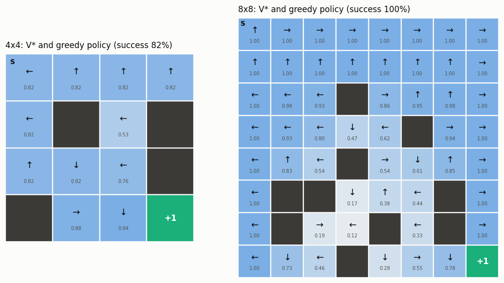
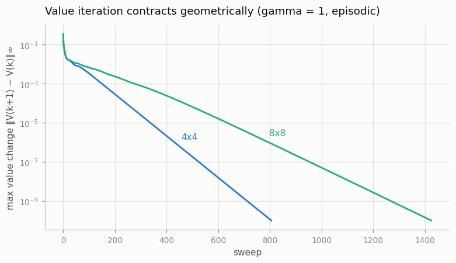

# Value Iteration on FrozenLake

## Key Insight

[FrozenLake](/shared/glossary/#frozenlake) is the smallest [Gymnasium](/shared/glossary/#gymnasium) environment whose dynamics are fully known, which is exactly what [value iteration](/shared/glossary/#value-iteration) needs: when the [transition probabilities](/shared/glossary/#transition-function) and [rewards](/shared/glossary/#reward-function) are written down, you can compute the optimal [value function](/shared/glossary/#value-function) `V*` by *planning* — repeatedly applying the optimality [Bellman backup](/shared/glossary/#bellman-operator) — instead of *learning* it from trial and error. Because the ice is slippery, the agent sometimes slides sideways instead of where it aimed, so the [optimal policy](/shared/glossary/#optimal-policy) must respect those random [transitions](/shared/glossary/#transition-function) and often points *away* from the nearest hole rather than straight at the goal. Visualizing `V*` as a heatmap over the grid and the [greedy policy](/shared/glossary/#greedy-policy) as arrows turns the abstract fixed-point computation into something you can see at a glance.

---

## What's in this directory

| File | Role |
|------|------|
| `frozenlake_lib.py` | The reusable library: extract dense `P (S, A, S')` and `R (S, A)` arrays from any Gymnasium toy-text env, value iteration, exact [policy evaluation](/shared/glossary/#policy-evaluation) by linear solve, rollout evaluation, and the lake-drawing helper. Imported by projects 07 and 09. |
| `value_iteration_frozenlake.py` | Solves the slippery 4×4 and 8×8 lakes, draws `V*` + policy, checks the answer against 20,000 rollouts, and sweeps the [discount factor](/shared/glossary/#discount-factor). |

```bash
python value_iteration_frozenlake.py     # ~30 s (the rollout check dominates)
```

## From a black box to `(P, R)`

Gymnasium's toy-text environments carry their own dynamics tables:
`env.unwrapped.P[s][a]` is a list of `(probability, next_state, reward,
terminated)` tuples. `mdp_arrays` flattens that into the same explicit
`P (S, A, S')` and `R (S, A)` arrays project 01 built by hand, and from there
the whole [MDP](/shared/glossary/#mdp) machinery of Phase 1 applies
unchanged. The slip model it reveals: each move goes where you aimed with
probability 1/3 and slides to each *perpendicular* direction with
probability 1/3 — never backwards — and holes and the goal are absorbing.

## With `gamma = 1`, `V*` is literally a probability

FrozenLake pays +1 for reaching the goal and nothing anywhere else, and the
[episode](/shared/glossary/#episode) ends at every hole or goal. So with
`gamma = 1` the expected [return](/shared/glossary/#return) from a state *is*
the probability of eventually reaching the goal — the heatmap below reads as
"chance of making it home from here", and the number in the start cell is a
prediction the environment itself can grade:

| map | `V*(start)` (planned) | measured success, 20k greedy rollouts |
|-----|----------------------|----------------------------------------|
| 4×4 | 0.8235 | 0.8220 |
| 8×8 | 1.0000 | 1.0000 |

Two details make the check honest. The episode step limit is raised to 2000
(the default limit of 100 truncates a few slow-but-successful episodes and
would bias the measurement down), and successful 4×4 episodes take **49
steps on average** — the optimal policy is in no hurry, because with
`gamma = 1` wasted time costs nothing while stepping near a hole costs
everything.



The arrows repay a close look:

- **The policy fears holes, not distance.** On the 4×4 map, the cell left of
  the first hole points `←` — *away* from both the hole and the goal. Aiming
  left on the left edge can at worst slip up or down, never into the hole:
  the policy deliberately bumps into walls to censor the slip's bad
  outcomes.
- **The 8×8 lake has a certain route.** `V* = 1.0` along the top and left
  edges: by hugging edges and corners the agent keeps every hole out of all
  three possible outcomes of each move, so an optimal player *never* drowns
  on this map. You would be unlikely to guess that from staring at the
  layout — planning proves it.

## Convergence



Even at `gamma = 1`, where the generic
[contraction](/shared/glossary/#contraction-mapping) argument promises
nothing, the backup converges geometrically: every sweep leaks value-error
mass into the absorbing terminals — the same episodic effect project 02
measured. The 8×8 map needs more sweeps per decimal digit because
information must propagate across twice as many cells.

## What the discount changes

Re-solving the 4×4 map at `gamma ∈ {1.0, 0.9, 0.5}` (the script prints the
full arrow table) shows the policy is *mostly* stable, but at `gamma = 0.5`
the start-cell arrow flips from the patient `←` (wait against the wall,
drift down safely) to the direct `↓`: heavy discounting makes the slow safe
route no longer worth its delay. The discount factor is not a numerical
knob — it changes which behavior counts as optimal (project 04 studies
exactly this).
