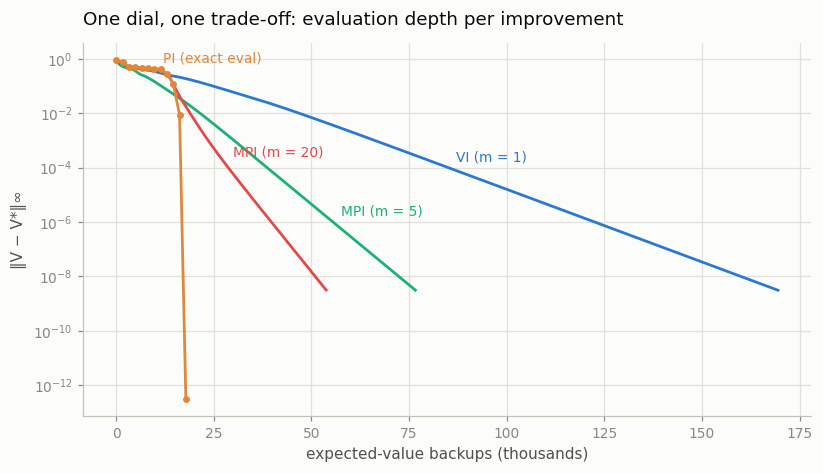

# Policy Iteration vs Value Iteration

## Key Insight

[Policy iteration](/shared/glossary/#policy-iteration) and [value iteration](/shared/glossary/#value-iteration) are the two classic [dynamic-programming](/shared/glossary/#dynamic-programming) ways to solve a known [MDP](/shared/glossary/#mdp), and they sit at opposite ends of one trade-off. Policy iteration fully evaluates the current [policy](/shared/glossary/#policy) — solving for its [value function](/shared/glossary/#value-function) exactly — before improving it, so each iteration requires multiple sweeps over all states to compute the values before making a policy update. Value iteration merges these steps: it performs just one sweep of [Bellman backups](/shared/glossary/#bellman-operator) over all states to update the values and immediately updates the policy, without waiting for the evaluation to converge.

Think of finding the best route to work: policy iteration is like driving one specific route every day for a month until you perfectly know its average time, then choosing a new route to test; value iteration is like driving a route once and immediately updating your guess for the best path at every turn. Running both on the same task and counting the total number of updates to convergence shows they reach the *identical* [optimal policy](/shared/glossary/#optimal-policy) by different routes — which is the whole point of [generalized policy iteration](/shared/glossary/#generalized-policy-iteration): evaluation and improvement can be interleaved in any proportion and still converge.

---

## What's in this directory

| File | Role |
|------|------|
| `pi_vs_vi.py` | Runs value iteration, classic policy iteration, and *modified* policy iteration (the dial in between) on slippery FrozenLake 8×8, with a fair cost accounting. Imports project 06's `frozenlake_lib`. |

```bash
python pi_vs_vi.py     # ~1 s
```

## Counting fairly: the backup as the unit of work

"Iterations to convergence" is a rigged comparison — one policy-iteration
step (an exact linear solve over all states) does far more work than one
value-iteration sweep. So the script counts **expected-value backups**: one
backup = computing `r + gamma * sum_s' P(s'|s,a) V(s')` for a single
`(s, a)` pair.

- a value-iteration sweep, or a policy-improvement step: `S * A` backups
- one sweep of fixed-policy [evaluation](/shared/glossary/#policy-evaluation):
  `S` backups (one action per state)
- an exact linear solve: priced at its Gaussian-elimination equivalent,
  about `S^2 / 3` backup-sized row operations

`gamma = 0.99` rather than 1, so the evaluation system stays solvable even
for the terrible initial policy (a policy that never reaches a terminal
makes the `gamma = 1` linear system singular — the matrix `I − P_pi` loses
rank exactly when some states can wander forever).

## Head-to-head

| method | improvements | backups | wall time |
|--------|--------------|---------|-----------|
| value iteration | 662 sweeps | 169,472 | 15 ms |
| policy iteration | **11** | **17,831** | 16 ms |

Policy iteration needs only 11 policy improvements — after the 11th, the
greedy policy stops changing and the loop exits — versus 662 sweeps for
value iteration to squeeze the value error below `1e-10`. And the answers
agree the way the theory says they must:

```
max |V_PI − V_VI|        = 3.1e-09
greedy policies agree on   63/64 states
...and where they differ the Q-gap is < 6.9e-18   (a tie between two
                                                   equally good actions)
```

The one disagreeing state is not an error: two actions there have
*identical* value, and the two algorithms broke the tie in different
directions. Comparing policies action-by-action is the wrong test —
comparing their values is the right one. (Project 04 hit the same lesson
with two discount factors.)

## The GPI spectrum

Modified policy iteration evaluates with `m` cheap sweeps instead of an
exact solve — `m = 1` *is* value iteration, `m = infinity` *is* policy
iteration, and anything between is a legal member of the
[generalized-policy-iteration](/shared/glossary/#generalized-policy-iteration)
family:



Read left to right: policy iteration (orange) crawls through its expensive
solves and then *plunges* — once the policy is optimal, one exact evaluation
lands on `V*` in a single step. Value iteration (blue) makes steady but
slow-per-backup progress because every one of its sweeps pays for all 4
actions in all 64 states just to move values one step. The `m = 5` and
`m = 20` variants interpolate: a handful of cheap one-action evaluation
sweeps between improvements cuts value iteration's bill by 2–3× without any
linear algebra. On this 64-state problem exact policy iteration is cheapest
outright — but its per-improvement solve cost grows like `S^2` while a sweep
grows like `S`, so the dial's sweet spot shifts toward small `m` as the
state space grows. The durable lesson isn't a winner; it's that every
setting of the dial converges to the same place.
