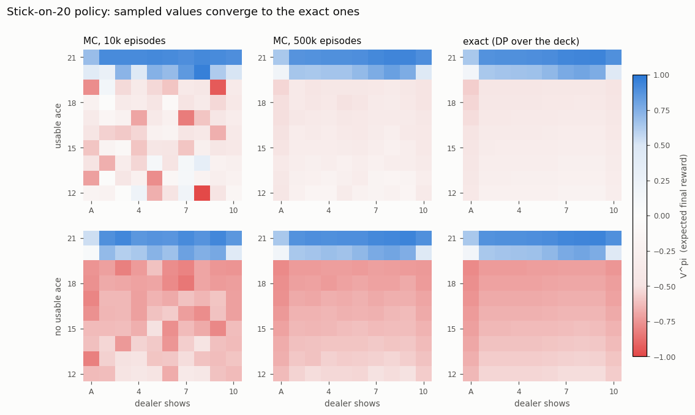
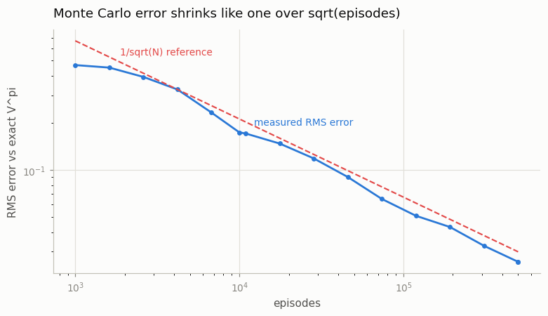

# First-Visit Monte Carlo

## Key Insight

[Monte Carlo](/shared/glossary/#monte-carlo-method) value estimation throws away the need to know the environment's dynamics: instead of computing expected [returns](/shared/glossary/#return) from a model, you simply play many full episodes and average the actual returns that followed each state. The *first-visit* variant counts, within each episode, only the first time a state is reached — which keeps the averaged samples independent and gives an [unbiased](/shared/glossary/#bias-variance-tradeoff) estimate of the [policy](/shared/glossary/#policy)'s [value function](/shared/glossary/#value-function) `V^π`. Think of reviewing a restaurant: if you order the same burger three times in one meal, "first-visit" means your review only counts the very first bite to judge the burger, ignoring the rest so you don't over-count a single experience. [Blackjack](/shared/glossary/#blackjack) is the ideal first environment because its rules make the true value of some states easy to work out by hand, so you can check your sampled estimate against an analytic answer — and feel directly how Monte Carlo estimates are unbiased yet [jump around a lot](/shared/glossary/#bias-variance-tradeoff) until you have averaged thousands of episodes.

---

## What's in this directory

| File | Role |
|------|------|
| `blackjack_mc.py` | First-visit MC over 500,000 `Blackjack-v1` episodes for the classic *stick-on-20* policy, an exact analytic `V^π` computed by dynamic programming over the deck, the comparison figures, and a demo of why the env's default rule set was switched off. |

```bash
python blackjack_mc.py     # ~90 s
```

## The setup

The policy is Sutton & Barto's Example 5.1: **stick on a player sum of 20 or
21, otherwise hit**. The env is created as
`gym.make("Blackjack-v1", sab=False, natural=False)` — payoff is the pure
win/lose/draw comparison (+1/−1/0). Because episodes pay a single terminal
reward and `gamma = 1`, the return that follows *every* state in an episode
is just the final reward, and MC estimation is bookkeeping: for each state,
average the final rewards of the episodes that first visited it.

## The analytic answer that grades the estimate

`Blackjack-v1` deals with replacement — an infinite deck where every draw is
1–9 with probability 1/13 each and 10 with probability 4/13. That makes the
*exact* `V^π` computable by a short recursion (`exact_v` in the script, ~60
lines): a closed dealer recursion gives the distribution of the dealer's
final sum for each upcard, and a player recursion follows the policy through
every reachable `(sum, usable-ace)` configuration. No simulation, no
approximation — this is the same "planning when you know the model" move as
projects 06–07, done on a card game.



At 10k episodes the sampled surface is recognizably the right shape but
speckled — rare states like `(12, dealer 8, usable ace)` have been visited
only a few dozen times. At 500k episodes it is visually indistinguishable
from the exact panel. The structure worth reading: value jumps at 20–21
(the policy finally sticks), the dealer's ace and 10 are terrible news
(left and right columns), and the usable ace lifts the whole surface (a
free second chance on every hit).

Sampled against exact, with proper error bars (±1.96 SE):

```
sum=20 dealer=10 no ace : +0.4385 ± 0.0077   exact +0.4350   (n=30,151)
sum=16 dealer=10 no ace : −0.6813 ± 0.0096   exact −0.6807   (n=20,458)
sum=21 dealer=A  usable : +0.6406 ± 0.0195   exact +0.6384   (n=2,315)
sum=13 dealer=2  usable : −0.2561 ± 0.0836   exact −0.2772   (n=488)
```

Every estimate brackets its exact value — unbiased, with a spread set
entirely by the visit count. The RMS error over all 200 plotted states
follows the Monte Carlo law:



That `1/sqrt(N)` line is the whole personality of Monte Carlo: another
digit of accuracy always costs 100× more episodes.

## First-visit vs every-visit: zero repeats, provably

The script counts how often a state recurs within an episode: **0 times in
500,000 episodes**. That's not luck. Write a hand as
`raw = sum − 10·usable`; every hit adds a card worth at least 1 to `raw`,
and the observed `(sum, usable)` determines `raw` — so no observed state can
ever repeat inside an episode, and first-visit and every-visit MC are *the
same algorithm* on Blackjack. The distinction matters in environments with
loops (project 11's random walk has plenty).

## A debugging war story: the non-Markov state

The first run of this project used `Blackjack-v1` with default settings, and
one state refused to converge: `(21, dealer ace, usable)` sat 4.5 standard
errors above the analytic value while every other state matched. The cause:
the v1 **default** is `sab=True`, under which a *natural* (a 21 dealt as the
first two cards) automatically beats a dealer 21, while a 21 you hit your
way into does not. That rule makes the value depend on information the
observed state `(sum, upcard, usable)` does not contain — the observed state
violates the [Markov property](/shared/glossary/#markov-property), and no
value *function* of it can be correct. The script measures the gap directly:

```
sab=True :  dealt (natural): +0.952    hit into: +0.887   <- same state, two values
sab=False:  dealt (natural): +0.883    hit into: +0.887   <- Markov again
```

MC never crashed and never warned — it faithfully estimated the *average*
over the two histories. When a sampled value refuses to meet an analytic
one, check the state definition before blaming the estimator.
