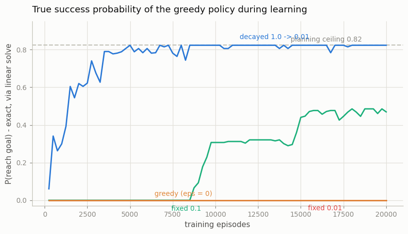
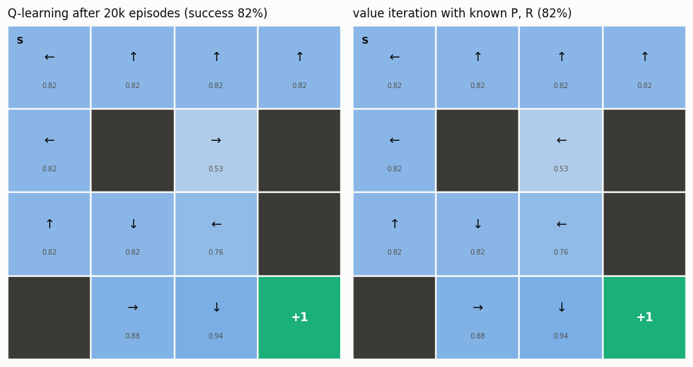

# Q-Learning on FrozenLake

## Key Insight

[Q-learning](/shared/glossary/#q-learning) is the first algorithm in this guide that learns purely from experience without a model (meaning it doesn't know the rules of the world beforehand, like a child learning to ride a bike by falling and balancing rather than reading a physics textbook): it watches `(state, action, reward, next-state)` [transitions](/shared/glossary/#transition-function) and nudges its [action-value](/shared/glossary/#value-function) estimate `Q(s, a)` toward "reward now plus the [discounted](/shared/glossary/#discount-factor) value of the *best* next action." That "best next action" inside the target — rather than the action actually taken — is what makes Q-learning [off-policy](/shared/glossary/#off-policy): it learns the [optimal policy](/shared/glossary/#optimal-policy) while still wandering randomly through [ε-greedy](/shared/glossary/#epsilon-greedy) action selection, with ε decayed over time so the agent explores early and exploits later. On slippery [FrozenLake](/shared/glossary/#frozenlake), tracking the final [greedy policy](/shared/glossary/#greedy-policy)'s success rate shows tabular Q-learning recovering a near-optimal policy from nothing but sampled rewards.

---

## What's in this directory

| File | Role |
|------|------|
| `q_learning_frozenlake.py` | Tabular Q-learning on the slippery 4×4 lake (`alpha = 0.1`, `gamma = 0.99`, 20,000 episodes), an exploration-schedule ablation over four ε settings, and figures. Imports project 06's `frozenlake_lib`. |

```bash
python q_learning_frozenlake.py     # ~2.5 min (4 schedules x 5 seeds)
```

## Grading the learner with the planner's tools

The usual way to plot a Q-learning curve is to average noisy training
returns. This project can do better: project 06 already extracted the exact
dynamics `(P, R)`, so every 250 episodes the current greedy policy is graded
**exactly** — one linear solve at `gamma = 1` yields its true success
probability, with zero evaluation noise. The learner stays
[model-free](/shared/glossary/#model-free-rl) (it never sees `P` or `R`);
only the report card uses the model. The y-axis below is therefore the real
quantity of interest, not a smoothed proxy.



## What the curves say

Per-seed final success probabilities (optimal = 0.8235):

| ε schedule | per-seed finals | mean |
|------------|-----------------|------|
| decayed `1.0 -> 0.01` over 10k episodes | 0.82, 0.82, 0.82, 0.82, 0.82 | **0.8235** |
| fixed 0.1 | 0.82, 0.70, 0.00, 0.82, 0.00 | 0.47 |
| fixed 0.01 | all 0.00 | 0.00 |
| greedy (ε = 0) | all 0.00 | 0.00 |

- **Decayed ε reaches the planning ceiling exactly.** All five seeds land on
  0.8235 — the same success probability value iteration proves optimal. A
  learner that only ever saw `(s, a, r, s')` samples ends up
  indistinguishable, on this small table, from a planner that read the
  simulator's source code.
- **ε = 0 is the pure greedy trap.** `Q` starts at zero, so argmax always
  picks action 0 (`left`), the goal is never found, no reward ever arrives,
  and `Q` stays exactly zero forever. Without
  [exploration](/shared/glossary/#exploration-vs-exploitation) there is
  nothing to exploit. ε = 0.01 is the same story in slow motion: 20k
  episodes of nearly-greedy wandering never propagate a single success into
  a useful policy, because the reward is
  [sparse](/shared/glossary/#sparse-reward) — one +1, eight moves deep, on
  the far side of four holes.
- **Fixed ε = 0.1 is a coin flip.** Its curves show the discovery moment
  vividly: flat zero for thousands of episodes, then a jump when a lucky
  success finally back-propagates. Three of five seeds make the jump, two
  never do. The decayed schedule works because it front-loads the gambling
  (ε near 1 finds the goal in the first few hundred episodes) and then
  stops paying the exploration tax.

## The learned solution vs the planned one



After 20k episodes the learned greedy policy matches value iteration's on
15/16 states — and the one disagreement is a tie, a state where two actions
have identical value (both panels show 0.53 there). Same values, same
success probability, different tiebreak: exactly the "identical up to ties"
agreement project 07 found between two planners, now between a planner and a
learner. Measured over 20k rollouts the learned policy succeeds 82.0% of the
time, matching its exact grade of 0.8235.

One habit worth keeping from this project: whenever a tabular method seems
"almost right", solve the same problem with the model
([value iteration](/shared/glossary/#value-iteration) is ~10 lines given
`P, R`) and compare *values*, not arrows — most policy disagreements are
ties, and the ones that aren't show up as a value gap you can size.
