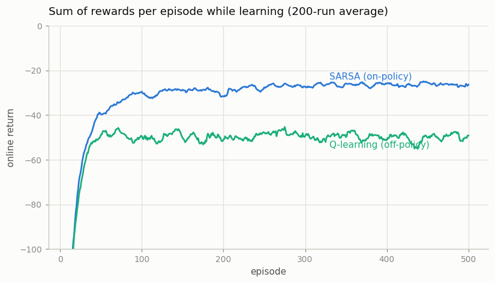
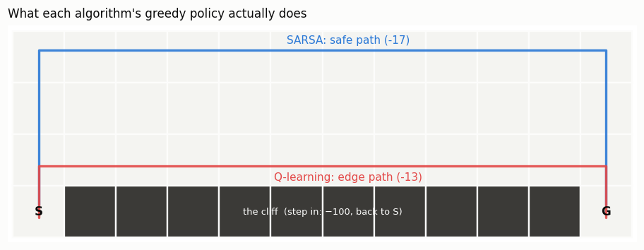

# SARSA vs Q-Learning on Cliff Walking

## Key Insight

[SARSA](/shared/glossary/#sarsa) and [Q-learning](/shared/glossary/#q-learning) differ in exactly one spot — which next action they put into the [TD target](/shared/glossary/#td-error) — and [Cliff Walking](/shared/glossary/#cliff-walking) is the environment designed to make that one difference visible. SARSA is [on-policy](/shared/glossary/#on-policy): its target uses the action the [ε-greedy](/shared/glossary/#epsilon-greedy) policy *actually* takes next, so it "knows" it will sometimes explore and step off the cliff, and it learns a safer path that gives the edge a wide berth. Q-learning is [off-policy](/shared/glossary/#off-policy): its target uses the *greedy* next action, so it learns the optimal cliff-edge path yet earns *lower* reward during training because exploration occasionally shoves it over the edge.

This highlights a key lesson: the theoretically optimal policy (Q-learning) and the policy that actually performs best *while still exploring* (SARSA) are not always the same. Because Q-learning ignores its own exploration, it hugs the risky edge and frequently falls. SARSA, however, learns to expect its own exploratory steps (like anticipating that it might occasionally "trip") and chooses a safer path further inland. Reproducing Sutton & Barto's Figure 6.5 makes this lesson concrete.

---

## What's in this directory

| File | Role |
|------|------|
| `cliff_sarsa_q.py` | Both algorithms with the book's settings (`alpha = 0.5`, `gamma = 1`, fixed `eps = 0.1`, 500 episodes), averaged over 200 independent runs; the Figure 6.5 reproduction, the two greedy routes, and a decayed-ε follow-up. |

```bash
python cliff_sarsa_q.py     # ~17 s
```

One implementation note: `CliffWalking-v1` is deterministic, so its dynamics
are read once into flat arrays (`next_state[s, a]`, `reward[s, a]`) and
training steps become plain lookups — the same MDP, ~50× faster than
stepping the wrapped env, which is what makes a 200-run average cheap.
Stepping into the cliff costs −100 and teleports the
[agent](/shared/glossary/#agent) back to the start (the episode does *not*
end); every other move costs −1.

## The one-line difference

```python
# SARSA (on-policy): bootstrap from the action actually taken next
target = r + gamma * Q[s2, a2]          # a2 ~ eps-greedy, cliff risk included

# Q-learning (off-policy): bootstrap from the best action, taken or not
target = r + gamma * Q[s2].max()        # pretends exploration doesn't exist
```

## Figure 6.5, reproduced



Averaged over the last 100 episodes: **SARSA −26.4, Q-learning −50.1** —
matching the book. Q-learning *knows* the better path (its greedy return is
−13 to SARSA's −17, next figure) yet earns about half the online reward,
because an ε-greedy walker on the cliff edge falls off roughly every other
episode: twelve edge cells × 0.1 exploration × a 1-in-4 chance the random
action is "down" gives about a 26% fall rate per crossing before compounding.
SARSA's estimates *contain* that risk — `Q[s2, a2]` occasionally samples the
−100 — so cells near the edge look bad to it and its greedy policy retreats
one row per unit of danger.

## What each one actually learned



The learned Q-tables, followed greedily: Q-learning marches along the edge
(return −13, the optimal path; all 200/200 runs produce it), SARSA takes the
top-row detour (return −17; 173/200 runs — in the rest, 500 episodes of
fixed-ε data leave a greedy cycle that never reaches the goal, a reminder
that SARSA's greedy readout is not what it optimizes).

## Does SARSA drop the caution when exploration stops?

In theory, as `eps -> 0` SARSA's target converges to Q-learning's, so
decaying ε should erase the difference. Measured: decay ε from 0.1 to 0 over
1000 episodes, then train 1000 more fully greedy — SARSA's greedy return
stays **−17 in all 5 seeds**. Once exploration stops, it also stops
gathering the evidence that the edge is safe for a greedy walker, so the
safe path is self-sealing. Actually converging to the optimal policy
requires exploration that vanishes *slowly* (the GLIE condition — greedy in
the limit with infinite exploration, e.g. `eps = 1/k`) and far more
episodes than this budget. The gap between "converges in the limit" and
"converges in your experiment" is a recurring RL theme — this is its first
clean appearance.
